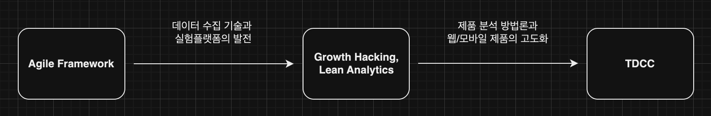
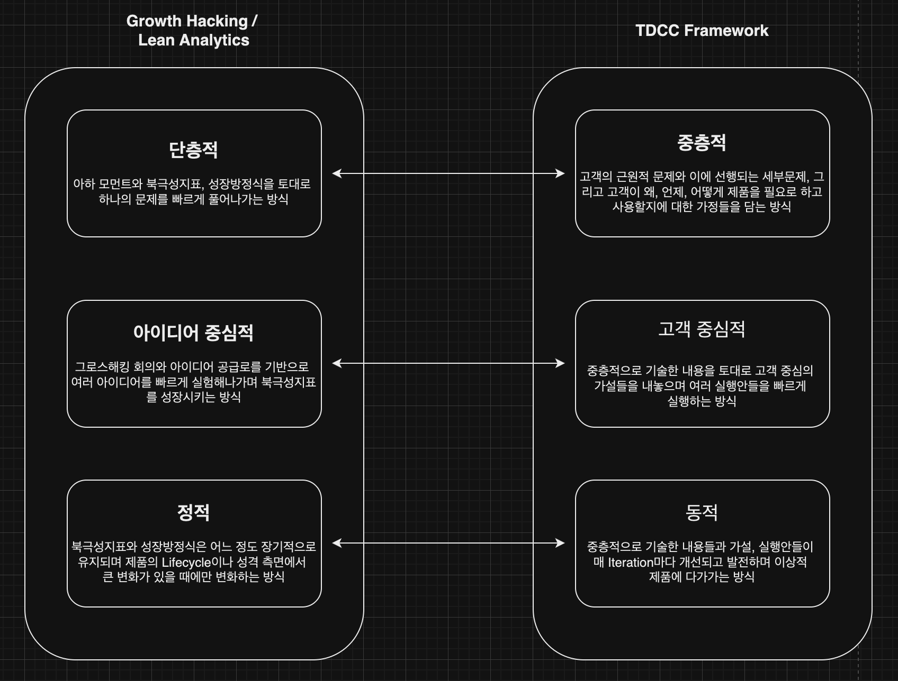

# TDCC 소개

# 배경

TDCC(Thick-Dynamic-Customer Centric Framework) Framework는 데이터에 기반하여 성공적인 모바일/웹 제품을 만들기 위한 Framework입니다.

이전에도 모바일/웹 제품을 개발하고 발전시키기 위한 프레임워크는 여러 가지가 존재했습니다. 가장 먼저 90년대부터 태동한 Agile Framework는 유연해진 배포와 롤백이라는 기반 속에서 사람들이 필요로 할 것으로 예상되는 제품을 빠르게 구상하고, 배포하고, 회고하는 과정을 반복하며 좋은 제품을 만들어나가는 방식이었습니다. 이후, 데이터 수집 및 분석 기술과 실험플랫폼이 발전하며 Growth Hacking, Lean Analytics가 대두되며 북극성 지표와 성장방정식을 토대로 일련의 실험을 통해 제품의 빠른 성장을 도모하는 방식이 주류가 되었습니다. 이후 제품 분석 방법론이 발전하고 웹/모바일 제품들이 전반적으로 고도화되며 복잡해진 환경 속에서 고객을 위해 더 좋은 제품을 제공하기 위해서는 더 발전된 프레임워크가 필요하다고 저희는 생각하게 되었습니다.

TDCC는 이러한 Agile Framework와 Grwoth Hacking, Lean Analytics의 철학을 계승합니다. 고객을 위한 모바일/웹 제품을 만들어내는 데 있어 가장 효과적인 방법은 구상을 토대로 한 빠른 배포와 개선, 실험, 그리고 회고라는 것입니다. 하지만 TDCC에서는 이에 더해 구상 측면에서 문제에 대한 정의와 고객에 대한 가정이 필요하다고 보고 있습니다. 또한, 배포와 개선, 실험 단계가 산발적인 아이디어에서 기인하는 것이 아닌, 구상을 토대로 보다 고객 중심적으로 진행되어야 한다고 생각합니다. 그리고, 회고를 통해 이 모든 것들이 동적으로 발전해야 한다고 봅니다. 그렇기에 TDCC는 중층적 구상을 토대로 한 빠르고 반복적인 실행을 통해 이루어진 고객과 제품에 대한 이해가 동적으로 발전하고 적용될 때 좋은 제품을 가장 빠르게 만들 수 있다는 것을 Framework의 철학으로 가지고 있습니다.

# TDCC(Thick-Dynamic-Customer Centric Framework)

이전의 Framework와는 다르게, TDCC Framework는 중층적, 고객 중심적, 동적이라는 세 가지 가치를 중심으로 두고 있습니다. TDCC의 특징을 가장 잘 설명해줄 수 있는 방법은 최근의 Product Growth Framework인 Grwoth Hacking, Lean Analytics과 비교해보는 것입니다. 이 둘을 비교하면 아래와 같습니다.

Growth Hacking, Lean Analytics는 단층적, 아이디어 중심적, 정적이라는 특징을 가지고 있습니다. 단층적이라 함은 북극성 지표와 성장방정식만을 기준으로 한 단순하고 파괴적인 방식으로 제품과 기능을 구상하고 하나의 문제를 빠르게 풀어나가는 것을 의미하며, 아이디어 중심적이라는 것은 북극성 지표를 올리기 위한 아이디어들을 중심으로 빠르게 실험하는 것을 말합니다. 이 기반에는 그로스해킹 회의와 이 회의에서 만들어지는 아이디어 공급로가 있습니다. 그리고, 정적이라는 의미는 한 번 잡힌 북극성 지표와 성장방정식은 제품의 성질이나 단계가 완전히 변화하기 전까지는 지속적으로 유지되며 크게 변화하지 않는다는 것을 의미합니다. 

하지만 이러한 방식에도 어느 정도 한계는 존재했습니다. 우선 단층적이라는 특성은 여러 맥락과 복잡한 구조를 가진 제품의 성장을 담보하는 데에는 한계가 있으며, 아이디어 중심의 특성은 고객 중심 관점에서 지속적으로 좋은 실행안, 체계적으로 제공하는 데 있어 한계를 가지고 있었습니다. 그리고, 정적이기에 고객의 문제와 제품에 대한 반응에 따라 빠르게 북극성지표나 성장 방정식을 개선, 발전시켜나가는 과정이 지속적, 연속적이로 이루어지지 못하는 문제가 있었습니다. 그래서 TDCC는 중층적, 고객 중심적, 동적이라는 세 가지 가치를 통해 이전 프레임워크의 한계를 극복하며 제품 개발을 위한 다음 세대의 방법론을 제안하고자 합니다. TDCC의 세 요소인 중층적, 고객 중심적, 동적은 아래와 같이 자세하게 설명이 가능합니다

중층적

- 중층적은 ‘중층 기술(Thick Description)’에서 기인한 것으로 이는 어떤 인간행동을 설명할 때, 그 행동 뿐만 아니라 그 행동의 배경과 맥락도 함께 기술하는 것을 의미합니다.
- 보통 제품에는 제품을 통해 해결하고자 하는, 혹은 제품에서 해결하고자 하는 근원적인 문제가 있고 이 문제를 해결하기 위해 선행적으로 풀어내야 하는 세부 문제가 있습니다. 그리고, 이 문제를 풀기 위해 가정한 고객의 필요와 그에 따른 행동양상이 있을 것입니다.
- 중층적이라 함은 이러한 모든 요소와 맥락을 담고 이를 토대로 제품을 성장시키기 위한 구상을 해나갈 수 있도록 하는 것입니다. 이를 통해 초기의 단순한 제품 뿐만 아니라, 성숙한 단계의 복잡한 제품도 발전시키기 위한 기획을 할 수 있는 토대를 마련할 수 있습니다.

고객 중심적

- 고객 중심적은 제품을 실제로 개선하기 위한 가설과 실행안을 만들어낼 때, 중층적이라는 가치에 맞춰 생각한 고객의 문제와 고객의 필요, 행동양상을 토대로 이러한 가설과 실행안이 만들어지고 개선계획이 수행되는 것을 말합니다.
- 이를 통해 단순히 특정 지표를 올리기 위한 아이디어를 생각해내는 것을 넘어, 보다 영향력있는 가설과 실행안을 구상할 수 있고, 고객에게 보다 체계적으로 접근하여 효과가 있는 것은 발전시키고, 없는 것은 소거해나갈 수 있습니다.

동적

- 중층적으로 제품과 고객을 설명하기 위해 만들어낸 문제와 세부문제, 그리고 고객에 대한 가정들과 고객 중식적이라는 가치를 토대로 나온 가설과 실행안들은 Iteration을 거치며 빠르게, 동적으로 변화하고 발전해야 합니다.
- 이는 정의한 문제나 고객에 대한 가정들 등이 잘못되었을 수도 있고, 잘못되지는 않더라도 그보다 더 좋은 것들로 대체될 수 있기 때문입니다.
- TDCC는 피드백을 통해 동적으로 문제와 가정들, 가설과 실행안이 개선되고 발전하며, 비록 처음에는 다소 초점이 맞지 않았더라도 빠르게 고객을 중심으로 초점이 맞아갈 수 있도록 하는 것을 목표로 하고 있습니다.

# 구성

TDCC Framework는 크게 Framework와 해당 Framework의 구성요소를 작성하는 방법을 담은 Guide로 구성되어 있습니다. 이 중에서 Framework는 현재 노션을 통해, Guide는 본 Repository를 통해 제공되고 있습니다.

Framework

- [템플릿 노션:](https://www.notion.so/TDCC-793699ffc34f4fa59dca40740ee8a689) 복제해서 사용할 수 있는 예시 Framework를 담고 있는 노션 페이지입니다.

Guide

- [Overview:](https://github.com/tdcc-framework/tdcc-framework/blob/main/guide/overview/%EA%B0%9C%EC%9A%94.md) Framework 전반과 그 구조에 대한 설명입니다.
- [init Guide:](https://github.com/tdcc-framework/tdcc-framework/blob/main/guide/init/%EC%8B%9C%EC%9E%91%ED%95%98%EA%B8%B0.md) 애자일 팀이 어떻게 Framework를 시작할지 예시를 통해 설명합니다.
- Object Guide: Framework를 구성하는 Object들을 어떻게 작성할지에 대한 내용을 담고 있습니다.
    - [문제](https://github.com/tdcc-framework/tdcc-framework/blob/main/guide/object/%EB%AC%B8%EC%A0%9C.md)
    - [세부문제](https://github.com/tdcc-framework/tdcc-framework/blob/main/guide/object/%EC%84%B8%EB%B6%80%EB%AC%B8%EC%A0%9C.md)
    - [멘탈모델](https://github.com/tdcc-framework/tdcc-framework/blob/main/guide/object/%EB%A9%98%ED%83%88%EB%AA%A8%EB%8D%B8.md)
    - [가설](https://github.com/tdcc-framework/tdcc-framework/blob/main/guide/object/%EA%B0%80%EC%84%A4.md)
    - [실행안](https://github.com/tdcc-framework/tdcc-framework/blob/main/guide/object/%EC%8B%A4%ED%96%89%EC%95%88.md)
    - [분석](https://github.com/tdcc-framework/tdcc-framework/blob/main/guide/object/%EB%B6%84%EC%84%9D.md)
    - [피드백](https://github.com/tdcc-framework/tdcc-framework/blob/main/guide/object/%ED%94%BC%EB%93%9C%EB%B0%B1.md)
- [Proposal Guide:](https://github.com/tdcc-framework/tdcc-framework/blob/main/guide/proposal/Proposal.md) Framework 내 Object들을 지속적으로 개선하고 발전시키는 방법에 대한 가이드입니다.