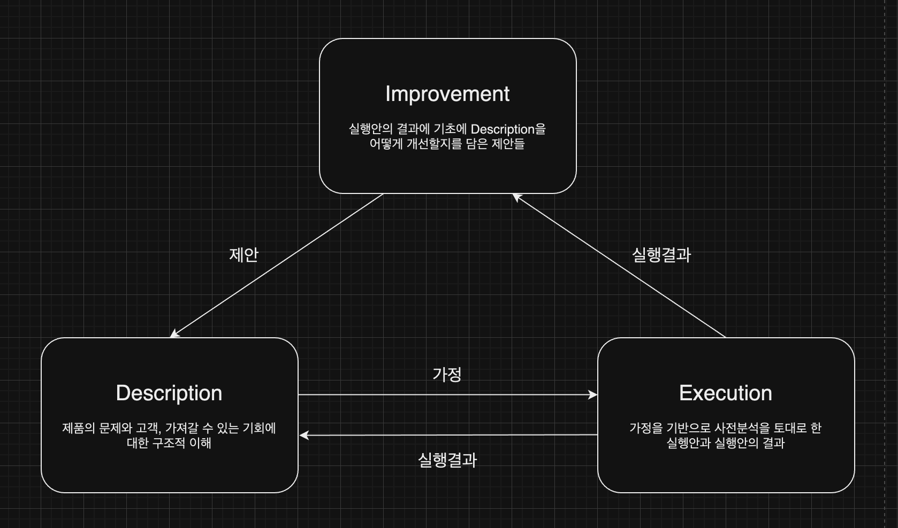
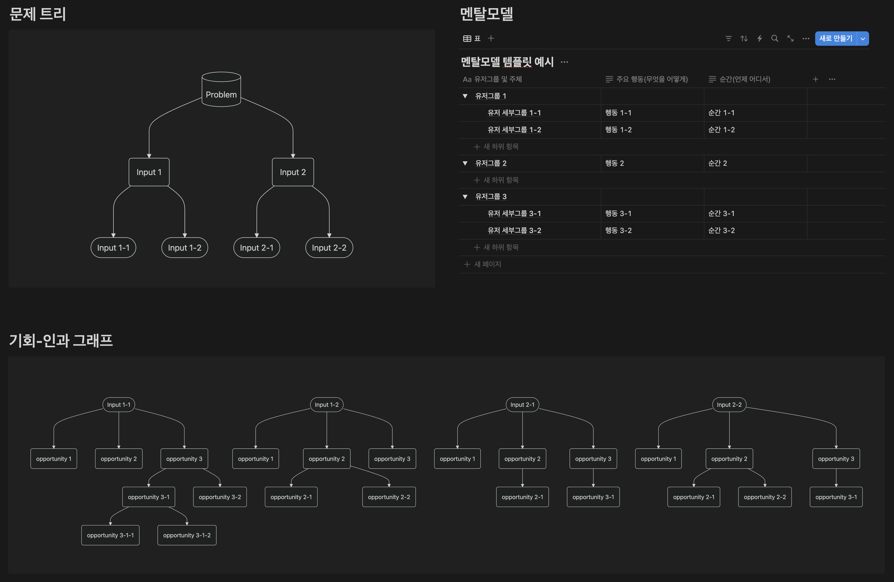
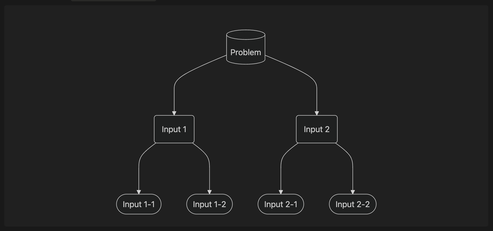
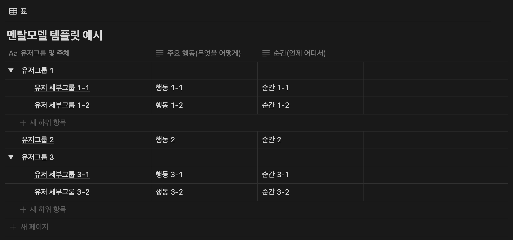
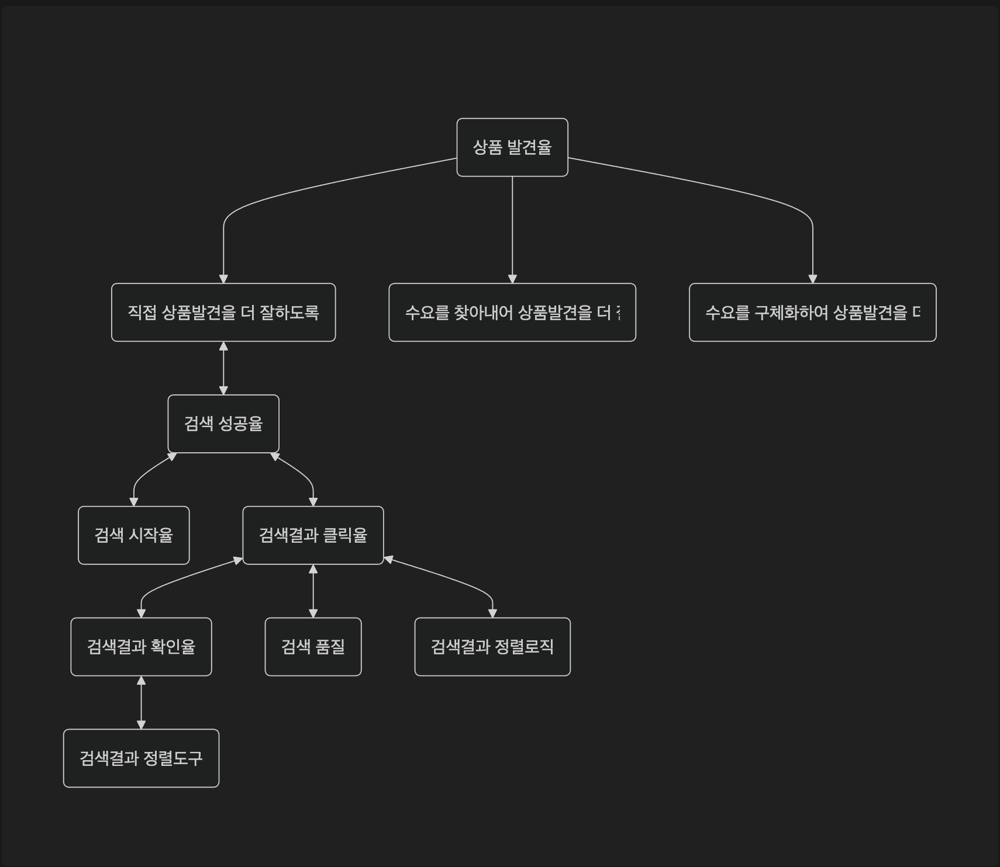
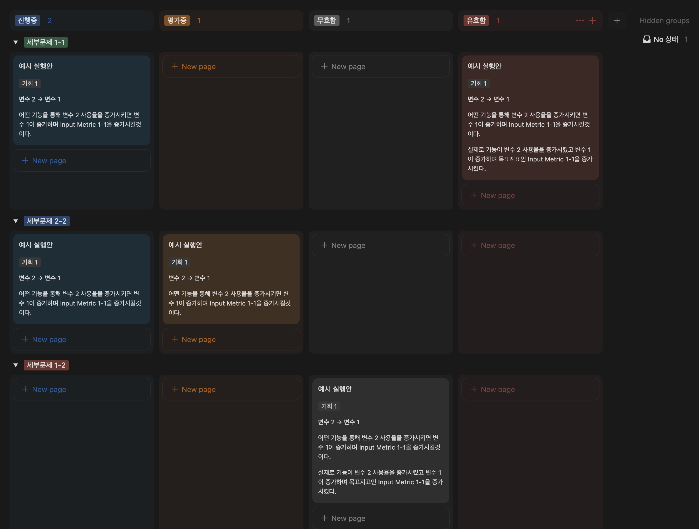
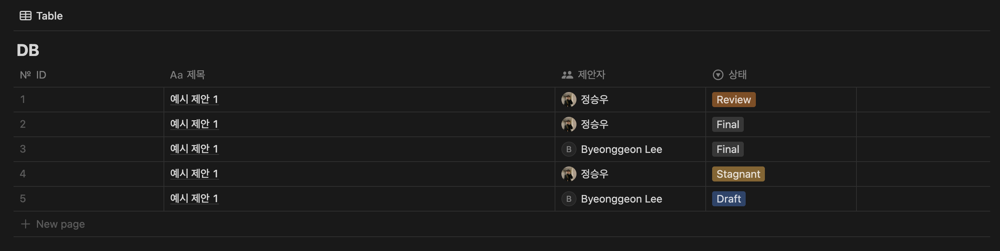
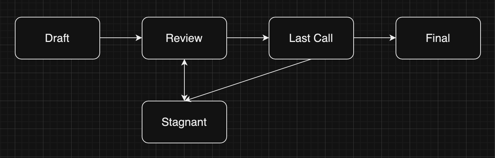
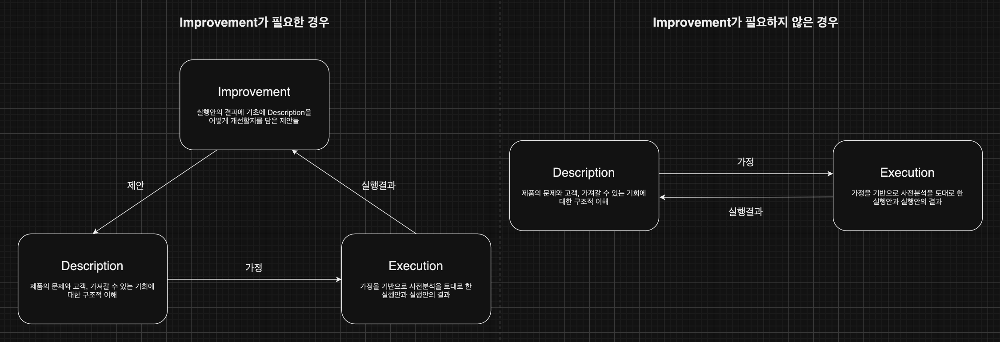

# TDCC 소개 및 구성

# 배경

TDCC(Thick-Dynamic-Customer Centric Framework) Framework는 데이터에 기반하여 성공적인 모바일/웹 제품을 만들기 위한 Framework입니다.

Growth Framework의 발전 맥락

이전에도 모바일/웹 제품을 개발하고 발전시키기 위한 프레임워크는 여러 가지가 존재했습니다. 가장 먼저 90년대부터 태동한 Agile Framework는 유연해진 배포와 롤백이라는 웹의 특성을 토대로 사람들이 필요로 할 것으로 예상되는 제품을 빠르게 구상하고, 배포하고, 회고하는 과정을 반복하며 좋은 제품을 만들어나가는 방식이었습니다. 이후, 데이터 수집 및 분석 기술과 실험플랫폼이 발전하며 Growth Hacking, Lean Analytics가 대두되었고 북극성 지표와 성장방정식을 토대로 일련의 실험을 통해 제품의 빠른 성장을 도모하는 방식이 주류가 되었습니다. 이후 제품 분석 방법론이 발전하고 웹/모바일 제품들이 전반적으로 고도화되고 복잡해진 환경 속에서 고객을 위해 더 좋은 제품을 제공하기 위해서는 더 발전된 그로스 프레임워크가 필요하다고 저희는 생각하게 되었습니다.

이러한 문제의식은 이미 2022년 Teresa Torres가 그녀의 저서 “Continuous Discovery Habits”에서 주창한 것과도 맞닿아 있습니다. Continuous Discovery Habits는 단순히 Agile과 Lean방법을 통해 제품을 빠르게 개발하고 배포하는 것을 넘어, 어떻게 고객의 문제와 수요를 계속해서 파악하고 이를 반영한 결과를 토대로 더 나은 문제 해결 과정이 지속할 수 있을지에 대한 고민의 결과를 담고 있습니다. 이는 목표설정-경험 지도와 기회 솔루션 트리-고객 인터뷰-타겟 기회-기회기반 아이디어 탐색-숨은 가정 확인-가정 테스트 과정으로 구성되며 단순히 아이디어를 기반으로 빠르게 실험하는 것이 아닌, 기회와 문제, 그리고 고객에 대한 이해를 근간으로 가정을 테스트하는 과정을 반복하며 고객의 문제를 풀어낼 수 있는 이상적인 제품에 지속적으로 다가가는 것을 목표로 합니다.

TDCC는 이러한 Agile Framework와 Growth Hacking, Lean Analytics의 철학을 계승하는 동시에 이들의 한계점을 극복하고 Continuous Discovery Habits 개념을 더하고자 합니다. TDCC에서는 제품의 근간에 문제에 대한 정의와 고객에 대한 멘탈 모델, 이를 토대로 정리된 인과와 가정들이 필요하다고 보고 있습니다. 또한, 배포와 개선, 실험 단계가 산발적인 아이디어에서 기인하는 것이 아닌, 위 근간을 토대로 보다 고객 중심적으로 진행되어야 한다고 생각합니다. 그리고, 회고를 통해 이 모든 것들이 동적으로 발전해야 한다고 봅니다. 그렇기에 TDCC는 “중층적 구상을 토대로 한 빠르고 반복적인 실행을 통해 이루어진 고객과 제품에 대한 이해가 동적으로 발전하고 적용될 때 좋은 제품을 가장 빠르게 만들 수 있다”는 것을 Framework의 철학으로 삼고 있습니다.

# TDCC(Thick-Dynamic-Customer Centric Framework)

## TDCC란?

이전의 Framework와는 다르게, TDCC Framework는 중층적, 고객 중심적, 동적이라는 세 가지 가치를 중심으로 두고 있습니다. TDCC의 특징을 가장 잘 설명해줄 수 있는 방법은 최근의 Product Growth Framework인 Grwoth Hacking, Lean Analytics과 비교해보는 것입니다. 이 둘을 비교하면 아래와 같습니다.

Growth Hacking / Lean Analytics와 TDCC의 비교

Growth Hacking, Lean Analytics는 단층적, 아이디어 중심적, 정적이라는 특징을 가지고 있습니다. 단층적이라 함은 북극성 지표와 성장방정식만을 기준으로 한 단순하고 파괴적인 방식으로 제품과 기능을 구상하고 하나의 문제를 빠르게 풀어나가는 것을 의미하며, 아이디어 중심적이라는 것은 북극성 지표를 올리기 위한 아이디어들을 중심으로 빠르게 실험하는 것을 말합니다. 이 기반에는 그로스해킹 회의와 이 회의에서 만들어지는 아이디어 공급로가 있습니다. 그리고, 정적이라는 의미는 한 번 잡힌 북극성 지표와 성장방정식은 제품의 성질이나 단계가 완전히 변화하기 전까지는 지속적으로 유지되며 크게 변화하지 않는다는 것을 의미합니다. 

하지만 이러한 방식에도 한계는 존재했습니다. 우선 단층적이라는 특성은 여러 맥락과 복잡한 구조를 가진 제품의 성장을 담보하는 데에는 한계가 있으며, 아이디어 중심의 특성은 고객 중심 관점에서 지속적으로 좋은 실행안과 가설을 체계적으로 제공하는 데 있어 한계를 가지고 있었습니다. 그리고, 정적이기에 배포와 개선에 대한 고객의 반응에 따라 빠르게 북극성지표나 성장 방정식을 개선, 발전시켜나가는 과정이 지속적, 연속적이로 이루어지지 못하는 문제가 있었습니다. 그래서 TDCC는 중층적, 고객 중심적, 동적이라는 세 가지 가치를 통해 이전 프레임워크의 한계를 극복하며 제품 개발을 위한 다음 세대의 방법론을 제안하고자 합니다.

## 핵심 가치들 및 주요 요소

TDCC의 핵심 가치인 중층적, 고객 중심적, 동적을 만족시키기 위해 저희는 프레임워크가 각 핵심가치들을 달성하기 위해 필요한 요소들을 가져야 한다고 보았습니다. 여기서는 각 핵심 가치가 무엇을 의미하는지를 자세히 설명하고 그에 따라 핵심 가치가 가져야 할 요소들을 설명합니다.

### 중층적

중층적은 ‘중층 기술(Thick Description)’에서 기인한 것으로 이는 어떤 인간행동을 설명할 때, 그 행동 뿐만 아니라 그 행동의 배경과 맥락도 함께 기술하는 것을 의미합니다. 보통 제품에는 제품을 통해 해결하고자 하는, 혹은 제품에서 해결하고자 하는 근원적인 문제가 있고 이 문제를 해결하기 위해 선행적으로 풀어내야 하는 세부 문제가 있습니다. 그리고, 이 문제를 풀기 위해 가정한 고객의 필요와 그에 따른 행동양상과 팀이 가져갈 수 있는 기회가 있을 것입니다. 중층적이라 함은 이러한 모든 요소와 맥락을 담고 이를 토대로 제품을 성장시키기 위한 구상을 해나갈 수 있도록 하는 것입니다. 이를 통해 초기의 단순한 제품 뿐만 아니라, 성숙한 단계의 복잡한 제품도 발전시키기 위한 기획을 할 수 있는 토대를 마련할 수 있습니다. 중층 기술에 포함되어야 하는 요소들은 아래와 같습니다.

| **요소** | **설명** |
| --- | --- |
| 문제 | 제품을 통해 해결하고자 하는 가장 핵심적인 문제를 의미합니다. |
| 세부문제 | 핵심적인 문제를 해결하기 위해 선행적으로 해결되어야 하는 세부 문제들입니다. |
| 멘탈모델 | 세부 문제에 대해 고객은 어떻게 생각하고 어떻게 행동할까에 대한 생각을 담은 항목입니다. |
| 기회 | 세부문제를 풀어내기 위해 팀이 가져갈 수 있는 기회들을 나열해 본 것입니다. 멘탈모델에 기반합니다. |
| 인과 | 기회를 잡아내는 데 중요한  변수들과 그 변수들간의 관계를 연결한 것입니다. |

이 요소들은 순서를 가지고 있습니다. 이는 위 요소들이 문제 → 세부문제 → 멘탈모델 → 기회-인과 그래프의 순서로 기술되어야 한다는 것을 의미합니다. 이렇게 순서를 가지는 이유는 문제가 있어야 이를 세부문제로 나눌 수 있고, 문제가 있어야 문제를 풀기 위해 고객에 대한 멘탈모델을 세우는 것이 의미가 있기 때문입니다. 하나의 과정만 누락되더라도 중층 기술이 제공하는 가치는 크게 훼손될 수 있습니다. 이렇게 중층적으로, 온전히 기술된 요소들의 기초 위에서 고객 중심적인 실행안을 담보하는 가정이 나올 수 있습니다.

### 고객 중심적

고객 중심적은 제품을 실제로 개선하기 위한 실행안을 만들어낼 때, 중층적으로 기술한 고객의 문제와 고객의 필요, 행동양상, 기회를 토대로 나온 가정을 통해 이러한 가설과 실행안이 만들어지고 제품 개선 작업이 진행되는 것을 말합니다. 이를 통해 단순히 특정 지표를 올리기 위한 아이디어를 생각해내는 것을 넘어, 보다 영향력있는 실행안을 구상할 수 있고, 고객에게 보다 체계적으로 접근하여 효과가 있는 가정과 기회는 발전시키고, 없는 것은 소거해나갈 수 있습니다. 고객 중심적에 포함되는 요소들은 아래와 같습니다.

| **요소** | **설명** |
| --- | --- |
| 가정 | 어떠한 기능이나 제품을 제공한다면 고객의 행동은 이렇게 변화할 것이다라는 생각을 담은 것입니다. 이는 기회-인과 그래프의 기회와 변수들에 대한 내용을 토대로 합니다. |
| 사전분석 | 가정을 토대로 실행안을 구상하는 과정에서 구체적이고 효과적인 실행안을 만들어내기 위해 사전에 분석을 진행해보는 과정입니다. |
| 실행안 | 가정을 테스트하기 위해 구체적으로 어떻게 기능을 개발하고 제품을 출시할지에 대한 안입니다. |
| 분석 | 실행안을 실행한 결과를 담고 있는 요소입니다. 분석은 이후 피드백 과정의 중요 근거가 됩니다. |

### 동적

고객이 필요로 하는 모바일/웹 제품의 완성에 이르기 위해서는 제품의 연속적인 출시와 실행과정 속 위에서 이야기한 중층적으로 기술된 요소들이 지속적으로 개선되고 그에 따라 실행안의 품질이 계속해서 발전되는 제안 과정이 필수적입니다. 이는 정의한 문제나 고객에 대한 가정 등이 잘못되었을 수도 있고, 잘못되지는 않더라도 그보다 더 효과적인 것들로 대체될 수 있기 때문입니다. 물론 한 번에 고객의 문제와 세부문제가 완벽히 정의되고 적합한 멘탈모델이 만들어지며 인과를 모두 이해할 수 있다면 이러한 과정이 필요하지 않을 수 있으나 일반적으로 그러한 완벽한 중층적 기술은 한 번에 만들어지기 어렵습니다. 그렇기에, TDCC에서는 제안을 통해 고객과 제품에 대한 팀의 이해도가 높아지는 과정이 반복, 지속되며 각 중층적으로 기술된 내용이 지속적으로 발전, 결과적으로 고객의 문제를 해결해줄 수 있는 높은 수준의 실행안을 가능케 하여 좋은 기능과 제품을 고객에게 전달할 수 있게 되는 것을 지향하고 있습니다. 아래는 동적이라는 가치를 달성하기 위해 필요한 요소입니다.

| **요소** | **설명** |
| --- | --- |
| 제안 | 분석 내용을 토대로 중층적으로 기술된 요소 중 개선할 부분이나 계속 발전시켜나갈 부분을 찾아나가는 것을 담은 항목입니다. |

# DEI(Description-Execution-Improvement) 패턴

위와 같은 TDCC의 핵심 가치와 가치를 실현하기 위해 필요한 주요 요소들을 효과적으로 담아내고 이를 현실화하기 위해 만들어진 것이 DEI 패턴입니다. DEI 패턴은 Description-Execution-Improvement으로 구성되어 있습니다. Description은 문제와 세부문제를 표현한 문제트리, 멘탈모델, 기회와 인과를 표현한 기회-인과 그래프로 이루어집니다. Description의 결과로 Description은 실행을 위한 ‘가정’을 Execution으로 보냅니다. Execution은 Description에서 보내준 ‘가정’을 토대로 구체적인 실행안을 기획, 실행하고 평가하는 부분을 담은 실행보드로 구성됩니다. Execution의 결과로 ‘분석결과’를 Improvement에 전달합니다. 마지막으로, Improvement는 분석결과를 토대로 Description을 개선 발전시키기 위한 제안 내용들을 담은 제안로그가 중심을 차지하고 있습니다. Improvement의 결과인 ‘제안’은 다시 Description에 전달되며 Description을 개선하는 단초가 됩니다.

DEI 패턴의 핵심은 Positive Feedback Loop에 있습니다. 이전의 SAFe(Scaled Agile Framework)같은 경우도 기획-배포-피드백이라는 유사한 형태를 갖추고는 있었지만, SAFe에서의 기획은 Design Thinking에 기반한 간단한 형태이고 피드백 과정 또한 정형화되어있지 않아 기획이 지속적으로 발전하는 데에 한계가 있습니다. DEI에서는 잘 짜여진 형태의 Description이 가정이라는 형태로 Execution을 가능케 하고 그 결과가 Improvement를 거쳐 제안의 형태로 다시 Description에 반영됩니다. 좋은 가정과 결과, 그리고 제안이 연속될 수 있도록 하는 것이 DEI 패턴의 목표이며, 이 결과로 Iteration이 진행되는 동안 제품의 전반적인 품질은 지속해서 우상향할 것입니다. 그리고, 이는 결국 팀이 고객이 필요로 하는 좋은 제품을 만들어내고 전달하는 데 결정적으로 기여하게 될 것이라고 저희는 보고 있습니다. 우선 DEI를 이루는 부분들을 각각 설명하자면 아래와 같습니다.

## Description

Description은 Thick Description을 담고 있는 부분으로 고객의 문제에 대한 정의와 이 문제를 풀 수 있는 수준의 세부문제들로 나눈 문제 트리, 고객 경험과 고객의 맥락에 대한 가정을 담고 있는 멘탈 모델, 그리고 각 세부문제들을 풀어내기 위한 기회와 변수들을 구조적으로 설명한 기회-인과 그래프로 구성되어 있습니다. 최종적으로 기회-인과 그래프를 통해 나온 가정이 다음 단계인 Execution에 전달됩니다.

### 문제트리

문제 트리는 제품이 풀고자 하는 고객의 가장 중요한 문제와 이 문제를 실제로 풀어내기 위해 선행적으로 풀어내야 하는 세부문제들을 도식화한 것을 의미합니다. 이 중 세부문제는 문제를 풀기 위해서 선행적으로 풀어내야 하는 문제이기에 선행문제라고도 불리며 문제는 세부문제가 풀린 결과로 풀리게 되는 문제이기에 후행문제라고도 불립니다. 각각의 문제에는 각 문제를 표상하는 지표들이 병기되어야 하는데 문제(후행문제)의 지표를 후행지표(Output Metric), 세부문제(선행문제)의 지표를 선행지표(Input-Metric)이라고 합니다. 마찬가지로 선행지표가 증가하면 후행지표가 개선될 것이라는 기대 하에 두 지표가 연결됩니다. 마지막으로 세부문제가 너무 큰 문제라 실행을 통해 바로 풀어내기가 어렵다면 세부문제 안에 추가적인 세부문제가 연결될 수 있습니다. 이들을 2차 선행지표라고도 표현할 수 있습니다. 이러한 문제 트리는 근원적인 고객의 문제를 파악하고 이를 실행할 수 있는 수준으로 나누어 실천 가능하고 효과적인 실행안을 구상할 수 있는 기반이 됩니다.

### 멘탈모델

멘탈모델은 제품에 진입한 고객은 어떤 생각과 수요를 가지고, 어떤 맥락으로 진입하게 되었는지를 가정한 내용으로 문제를 풀어내기 위한 구체적 실행안을 내놓기 이전에 고객에 대한 이해를 담보하는 역할을 하게 됩니다. 멘탈모델은 묘사-나열-분류과정을 거쳐 만들어지며 추가적으로 User Journey를 고려할 수 있습니다. 이러한 멘탈모델에 기초하여 문제를 풀어내기 위해 팀이 가져갈 수 있는 기회와 변수들을 시각화한 기회-인과 그래프가 만들어지게 됩니다.

### 기회-인과 그래프

기회 인과 그래프는 문제트리에서 풀 수 있는 수준의 문제로 분류한 세부문제를 풀어내기 위해 팀이 잡아낼 수 있는 기회를 기술하고 이 기회를 구성하는 변수들을 인과에 따라 구조적으로 표현한 결과입니다. 이러한 기회는 멘탈모델을 참고하여 기술됩니다. 이 기회-인과 그래프를 토대로 팀이 세부문제를 풀어내기 위한 효과적인 가정들이 나오게 됩니다. 최종적으로 기회-인과 그래프를 통해 나온 가정은 여러 가지가 있을 수 있습니다. 특정한 독립변수를 올리기 위한 아이디어를 담고 있을 수도 있고 변수간의 관계가 맞는지를 확인하기 위한 아이디어가 있을 수도 있습니다. 이 가정들은 Execution에 전달되 사전분석과 아이디에이션 과정을 거쳐 구체적인 실행안으로 이어집니다.

## Execution

Execution은 Description과정을 통해 전달된 가정들을 바탕으로 실제 실행안을 구상하고 실행한 후 그 실행안의 결과를 분석한 내용을 담고 있습니다. Execution을 잘 담아내고 이 결과를 체계적으로 저장하기 위해 실행보드를 이용합니다.

### 실행보드

실행보드는 기회-인과 그래프의 가정에서부터 비롯되어 만들어진 실행안과 그 실행안에 대한 분석 결과를 담고 있는 보드입니다. 실행보드의 목적은 실행안과 그 실행안의 분석결과가 잘 정리되고 쉽게 검색될 수 있도록 저장되어 Knowledge Scalability가 보장될 수 있도록 하는 것입니다. 이에 따라 실행안-분석결과가 잘 저장되기 위해 실행보드의 실행안들은 아래와 같은 Property들을 가지게 됩니다.

- 세부문제: 실행안이 풀고자 하는 세부문제(선행문제)입니다.
- 기회: 실행안이 잡아내고자 하는 기회를 의미합니다.
- 변수: 가정의 기초가 되는 변수와 변수간의 관계를 기술합니다.
- 가정: 변수를 토대로 구상한 가정을 담고 있습니다.
- 결과요약: 실행안에 따라 목표했던 지표와 참고했던 지표가 어떻게 움직였는지를 요약합니다. 진행중/평가중 상태이면 비어있을 수 있습니다.
- 상태: 진행중/평가중/유효/무효 중 하나의 값을 가집니다.
    - 진행중: 실행이 진행중인 상태
    - 평가중: 실행은 완료되었고 분석과 실행안의 성공여부 판단이 진행중인 상태
    - 유효: 실행안이 유효한 것으로 판단되어 저장된 상태
    - 무효: 실행안이 유효하지 않은 것으로 판단되어 저장된 상태

실행안이 진행되고 이를 분석한 결과가 나오게 됩니다. 실행안의 분석결과는 형식에 맞춰 정리되어 Improvement로 전달되어 우리가 이해한 문제와 고객에 대한 내용이 맞았는지를 판단하고, 만약 맞지 않다면 이를 개선시키는 근거가 됩니다.

## Improvement

Improvement는 실행안의 분석내용과 결과를 토대로 Description에 대한 피드백을 진행하고 피드백의 결과를 기록하는 과정입니다. Improvement는 제안로그라는 형식을 따라 진행됩니다. 

### 제안로그

제안로그는 EIP(Ethereum Improvement Proposal)의 형식을 가져온 것으로 Description의 내용이 한 번 정해진 상태로 계속해서 유지되는 것이 아닌, Dynamic하게 변화하고 발전하며 더 좋은 실행안을 내놓을 수 있도록 하기 위해 만들어졌습니다. Description을 지속 개선하기 위한 제안이 반복되며 Description은 더 좋은 문제와 세부문제, 멘탈모델과 기회-인과 그래프를 담게 됩니다. 이러한 제안은 실행안의 분석 결과를 토대로 준비됩니다. 제안로그는 이러한 제안들을 한 눈에 보기 쉽게 적재한 결과물입니다. 제안로그 각각은 아래와 같은 Property들을 가지게 됩니다

- 번호: 제안의 고유 번호
- 제목: 제안의 목적과 내용을 담은 제목
- 제안자: 제안을 작성한 사람
- 상태: 제안의 진행상태

### 제안의 특징과 구성요소

제안로그를 구성하는 각각의 제안들은 아래와 같은 내용들을 담고 있습니다.

- 대상: 문제, 세부문제, 멘탈모델, 기회-인과 그래프 내 기회, 변수, 혹은 인과관계 중 제안의 대상이 될 것을 선택합니다. 여러개일 수도, 한 개일 수도 있습니다.
- 조치: 생성 / 개선 / 삭제 중 조치할 방향을 이야기합니다.
- 동기 및 근거: 대상에 대해 특정한 조치를 취하자는 의견이 나온 배경과 근거를 설명합니다.
- 사양: 어떤 것을 생성할 것인지, 개선한다면 어떻게 개선할 것인지, 삭제한다면 그 후 어떤 것으로 대체할지에 대해 기술합니다.

### 제안의 진행

제안은 위와 같이 Draft→Review(수정이나 개선이 필요할 경우 Stagnant)→Last Call→Final의 단계로 진행됩니다. 

## DEI 패턴의 진행

DEI 패턴은 Improvement를 통해 개선할 Description의 내용이 있을 경우와 없을 경우에 따라 다르게 진행됩니다. 매 Iteration마다 Description에 개선할 점이 나오지는 않을 수도 있기 때문입니다. 실행안이 성공적으로 진행되어 목표하는 지표를 올렸다면 현재의 Description이 맞다고 생각하고 같은 기회를 계속해서 더 잡아내거나 다른 기회를 잡을 수도 있습니다. 이 경우에는 Execution 이후에 다시 Execution을 바로 기획하고 진행하면 됩니다. 반대로, 실행안이 성공적이었다고 하더라도 지표를 적게 변화시키는 데 그쳤거나 실행안이 목표하는 지표를 올리는 데 성공하지 못했다면 Description의 어느 부분에 문제가 있다고 판단하여 Improvement를 진행, Description을 개선할 수 있습니다. 이런 때에는 Execution 이후에 Improvement를 거쳐 Description을 개선하고 다시 Execution을 진행합니다.

# 문서의 구성

TDCC Framework는 크게 Framework와 해당 Framework의 구성요소를 작성하는 방법을 담은 Guide로 구성되어 있습니다. 이 중에서 Framework는 현재 노션을 통해, Guide는 본 Repository를 통해 제공되고 있습니다.

Framework

- [템플릿 노션:](https://www.notion.so/TDCC-793699ffc34f4fa59dca40740ee8a689) 복제해서 사용할 수 있는 예시 Framework를 담고 있는 노션 페이지입니다. (현재 수정작업중입니다)

Guide

- Description Guide: 문제 정의와 고객에 대한 이해 및 기회-인과 그래프에 대한 설명들입니다.
    - [문제트리](https://github.com/tdcc-framework/tdcc-framework/blob/main/guide/Description/%EB%AC%B8%EC%A0%9C%ED%8A%B8%EB%A6%AC.md)
    - [멘탈모델](https://github.com/tdcc-framework/tdcc-framework/blob/main/guide/Description/%EB%A9%98%ED%83%88%EB%AA%A8%EB%8D%B8.md)
    - [기회-인과 그래프](https://github.com/tdcc-framework/tdcc-framework/blob/main/guide/Description/%EA%B8%B0%ED%9A%8C-%EC%9D%B8%EA%B3%BC%EA%B7%B8%EB%9E%98%ED%94%84.md)

- Execution Guide: 실행안과 분석을 담고 있는 실행보드를 만드는 방법에 대한 가이드입니다.
    - [실행보드](https://github.com/tdcc-framework/tdcc-framework/blob/main/guide/Execution/%EC%8B%A4%ED%96%89%EB%B3%B4%EB%93%9C.md)

- Improvement Guide: 분석 결과에 따라 어떻게 Description을 발전시킬지에 대한 내용을 담고 있습니다
    - [제안로그](https://github.com/tdcc-framework/tdcc-framework/blob/main/guide/Improvement/%EC%A0%9C%EC%95%88%EB%A1%9C%EA%B7%B8.md)