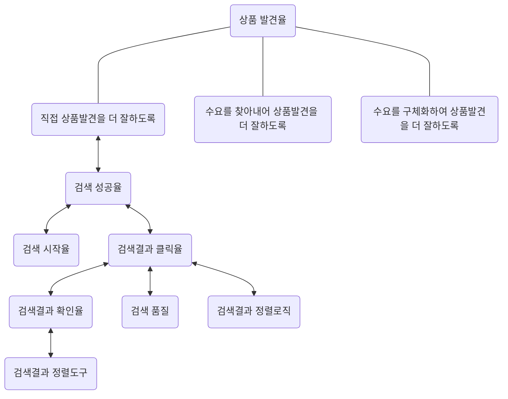
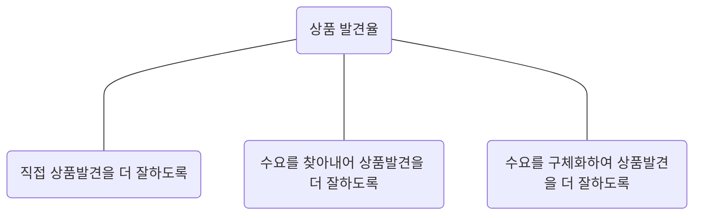
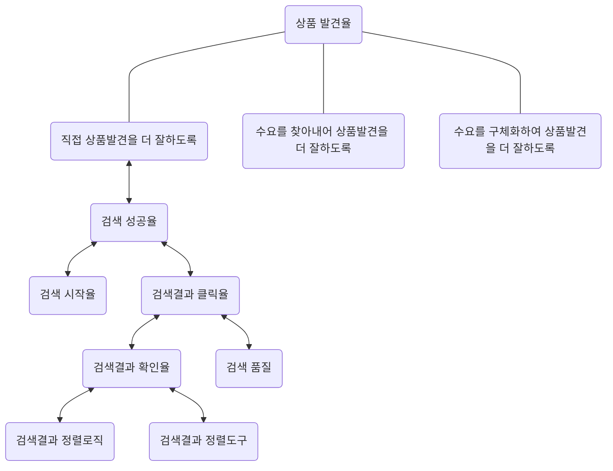

# 기회-인과 그래프

# 예시

## 기회-인과 그래프

## 노드 타입

| 타입 | 설명 | 구성 |
| --- | --- | --- |
| 기회  | 세부문제를 풀어내고 지표를 성장시키기 위해 팀이 가져갈 수 있는 기회를 담고 있습니다. | 팀이 가져갈 수 있는 기회에 대한 서술을 담고 있습니다. 각 가회의 아래에는 기회를 가져가기 위한 가설들이 연결됩니다 |
| 변수 | 기회를 잡아내기 위해 어떤 것을 사전적으로 건드려야 하는지, 그리고 이외에도 기회에 영향을 주는 변수들을 담고 있습니다. | 독립변수: 기회에 영향을 끼치는 변수들을 의미합니다. 일반적으로 이러한 변수들을 실행을 통해 조작하여 종속변수를 변화시키고 성장을 도모합니다. |
| - | - | 종속변수: 독립변수가 변화한 결과로 변화하게 되는 지표입니다. 이 경우에는 목표하는 세부목표의 지표가 종속변수가 됩니다. |
| - | - | 매개변수: 매개변수는 독립변수와 종속변수 사이에서 인과 효과를 전달하는 중간자 역할을 합니다. 독립변수가 매개변수를 거쳐 종속변수에 영향을 끼치는 형태를 가집니다. |
| - | - | 혼란변수: 혼란변수는 독립변수와 종속변수 모두에게 영향을 끼치는 변수를 의미합니다. |
| 오차항 | 인과에서 미처 고려하지 못한 사항들을 담고 있습니다. 그래프의 설명력을 높여줍니다. | 모델에 포함되어 있지는 않지만 각 변수들에 간섭하여 결과에 영향을 주는 항목들을 담고 있습니다. |

# 가이드

# 기회-인과 그래프 가이드

기회-인과 그래프는 고객의 문제를 해결하고 제품을 개선하기 위해 개선해야 하는 지표인 세부문제 지표를 성장시키기 위한 일련의 기회와 기회를 잡아내기 위한 변수들을 담고 있습니다. 이는 기회를 잡기 위한 빠른 실행을 가능케 함과 동시에, 구조적 접근을 통해 Iteration이 진행됨에 따라 팀이 문제해결과 기회에 대한 이해를 지속적으로 높일 수 있는 기반을 제공합니다. 이러한 기회-인과 그래프는 기본적으로 멘탈 모델을 통해 가정한 고객의 맥락을 기초로 하며 가정한 고객의 상에 따라 가져갈 수 있는 기회와 기회를 잡아내기 위한 변수들을 구조적으로 표현하는 방식입니다. 이 가이드에서는 우선 기회-인과 그래프의 기초가 되는 기회 솔루션 트리, 그리고 인과 그래프에 대해 설명하고 이를 토대로 기회-인과 그래프에 대해 자세히 기술합니다.

# 기회 솔루션 트리

Opportunity Solution Tree. Continuous Discovery Habits

Continuous Discovery Habits에서 소개된 기회 솔루션 트리는 문제를 풀어내기 위한 구조적인 접근 방식입니다. 기회 솔루션 트리는 최상단에 고객의 문제를 해결한 결과로 나오는 Outcome과 이 Outcome을 움직이기 위한 일련의 Opportunity들, 그리고 이 Opportunity를 잡아내기 위한 Solution과 Solution을 검증하기 위한 Assumption Test으로 구성됩니다. Opportunity는 Outcome을 만들어내기 위해 팀이 가져갈 수 있는 기회를 의미합니다. 예를 들어, 팀이 풀고자 하는 세부문제가 커머스에서 고객이 서비스에 진입한 후 상품을 잘 발견할 수 있도록 하는 문제라고 할 때, 여기서 가져갈 수 있는 기회는 고객이 직접 상품발견을 더 잘 할 수 있도록 해주는 것, 고객이 가진 수요를 구체화하여 원하는 상품을 더 잘 발견할 수 있도록 해주는 것 등이 있습니다. 이 중 직접 상품발견이라는 기회를 잡기 위해 고객에게 검색 보조 도구를 제공해주는 것과 같은 Solution을 내어놓고, 이 Solution을 실행하기 위해 Assumption Test를 진행할 수 있습니다.

이러한 구조적 접근의 장점은 전체적인 기회와 가능한 실행 옵션들에 대한 파악을 통해 생각치 못했거나 놓친 기회를 잡아낼 수 있다는 점, 그리고 실행을 통해 좋지 않은 기회를 소거할 수 있다는 점이 있습니다. 기회를 분류에 따라 구조적으로 나열하며 어떤 기회를 잡아낼 수 있는지, 미처 생각치 못한 기회가 있는지를 쉽게 파악할 수 있습니다. 만약, 나열한 기회들이 충분히 팀이 가져갈 수 있는 기회들을 모두 포괄하고 있지 못할 경우 추가적으로 기회들을 생각해보고 추가하여 세부문제를 풀어내는 데 보다 효과적인 Solution들을 생각해낼 수 있습니다. 또한, 이미 나열한 기회들 중 세부문제를 풀어내고 원하는 Outcome을 만들어내는 데 효과적이지 못한 것들을 실행을 거쳐 판단해낼 수 있습니다. 이들을 기회 솔루션 트리에서 소거하여 팀이 중요하지 않은 기회를 잡아내는 데에 불필요하게 시간을 소모하지 않을 수 있게할 수 있습니다.

하지만, 기회 솔루션 트리의 한계로는 기회와 솔루션들을 구조적으로 정리해줄 뿐, 제품을 성장시키고 개선하는 데 결정적인 도움이 될 주요 변수들을 표시하고 그 변수들의 관계를 표현하지는 못한다는 점이 있습니다. 이에 따라 저는 인과추론에서 변수간의 관계를 서술할 때 쓰이는 인과 그래프를 추가하여 기회 솔루션 트리를 기회-인과 그래프로 발전시키고자 합니다.

# 인과 그래프와 기회-인과 그래프

인과 그래프는 변수간의 관계를 표현한 그래프로 주로 방향성 비순환 그래프(Directed Acyclic Graph, DAG)를 통해 표현됩니다. 노드라고도 표현되는 이 변수는 종속변수, 독립변수, 매개변수, 혼란변수로 나뉩니다. 종속변수는 독립변수의 변화로 인해 변하는 변수를 의미하며 독립변수는 앞서 변화하며 결과적으로 종속변수를 변화시키는 변수를 의미합니다. 예를 들어, 검색 시작율이라는 독립변수가 변화하면 상품 발견율이라는 종속변수가 변화하는 형태입니다. 매개변수는 독립변수와 종속변수 사이에 위치하며 독립변수의 변화를 매개하여 종속변수에 전달합니다. 검색 시작율이 높아지면 검색결과페이지 방문율에 영향을 주며 검색결과에 잘 도달하게 되면 종속변수인 상품 발견율이 변화하는 것을 예로 들 수 있습니다. 마지막으로 혼란변수는 독립변수와 종속변수 모두에게 영향을 주는 것으로 특정 브랜드를 대상으로 한 프로모션이 진행되며 검색 시작율과 상품 발견율 모두에 영향을 주는 케이스가 있을 수 있습니다. 이러한 혼란변수는 처치 이전에 발생하기에 Pre-Treatment Variable이라고도 불립니다.

이러한 인과 그래프를 기회 솔루션 트리와 함께 사용할 수 있다면 보다 정밀한 가설과 실행한이 나올 수 있는 기반이 가능해집니다. 이 결합은 기회-솔루션 트리를 기초로 트리 하부의 Solution과 Assumption Test 부분을 인과 그래프로 대체하는 방식으로 진행되며 이를 기회-인과 그래프라고 합니다. 커머스 서비스에서 제품에 진입한 고객이 원하는 상품을 더 잘 찾도록 한다라는 세부문제를 풀어내고 그 결과로 이의 대표적 지표인 상품 발견율을 높이기 위한 과정에 기회-인과 그래프를 활용하며 예시를 보여보도록 하겠습니다.

### 기회 나열

기회-인과 그래프를 만들기 위해 가장 먼저 진행해야하는 것은 세부문제의 지표를 올리기 위한 기회들을 나열해보는 것입니다. 고객이 상품을 더 잘 발견하도록 한다는 문제를 풀어내기 위해서는 여러가지 기회가 있을 수 있습니다. 이 기회를 가장 잘 나열할 수 있는 방법은 멘탈모델을 참고하는 것입니다. 예를 들어, 멘탈모델에서 커머스에 진입하는 고객은 1) 구매할 상품이 명확한 고객 2) 명확하지는 않지만 살 상품 카테고리가 있는 고객 3) 그냥 구경하러 들어온 고객이라는 세 가지 맥락으로 나뉜다고 했을 때, 각각의 고객 분류에 따라 기회를 나열해볼 수 있습니다. 구매할 상품이 명확한 고객을 타겟하여 직접 상품발견을 더 잘하도록 하는 기회를, 수요가 분명하지는 않지만 살 상품 카테고리가 있는 고객에게는 수요를 구체화하여 상품발견을 더 잘 할 수 있도록 하는 기회를, 구경하러 온 고객에게는 이들의 숨겨진 수요를 찾아내어 상품발견을 더 잘 할 수 있도록 하는 기회를 잡아볼 수 있습니다.

### 인과 그래프 작성

기회가 잘 나열되었다면 다음으로 할 것은 기회에 대한 인과 그래프를 작성하는 것입니다. 위의 예시로 돌아가서 직접 상품발견을 더 잘하도록 하는 기회를 잡아내기 위해서는 이 기회에 대한 인과 그래프를 작성해볼 필요가 있습니다. 커머스 서비스에서 직접 상품발견을 하도록 할 수 있는 방법 중 가장 대표적인 것은 검색을 이용하는 것입니다. 이러한 검색이 잘 진행된 결과로 영향을 받는 종속변수는 검색 성공율입니다. 검색 성공율은 검색을 시작한 고객이 고객이 검색을 통해 상품을 발견하는지를 의미합니다. 이러한 검색 성공율에 영향을 주는 독립변수는 검색 시작율과 검색결과 페이지에서의 검색결과 클릭율이 될 수 있습니다. 이 중에서도 검색결과 클릭율에 영향을 주는 다른 변수들이 있을 수 있습니다. 하나는 검색결과를 일정수준 이상 확인하는 비율입니다. 이는 검색결과를 잘 볼수록 클릭도 많이 할 것이라는 가정 하에서 설정되었습니다. 나머지 하나는 검색 품질로 검색어를 잘 해석하여 검색결과를 잘 가져와야 클릭율이 올라갈 것이라는 가정 하에서 나온 변수입니다. 검색결과 확인율에도 두 가지 변수가 연결되는데 첫 번째는 좋은 결과를 상단에 보여주는 정렬로직과 고객이 원하는 것을 더 잘 찾을 수 있게 해주는 정렬도구입니다.

이러한 기회-인과 그래프의 장점은 인과를 토대로 좋은 가설과 실행이 나올 수 있는 기반이 되며 동시에 Iteration을 거치며 실행안의 결과와 이를 토대로 한 피드백 내용을 받아들이며 잘 발전할 수 있는 구조를 가지고 있다는 점입니다. 예를 들어, 검색결과 페이지에서의 정렬로직이 변화하면 검색결과 확인율이 변화한다는 것을 표현하였습니다. 이 관계를 토대로 “인기 있는 브랜드를 상단에 노출해준다면 검색결과 확인율이 높아질 것이다”, 혹은 “리뷰 점수가 높은 상품을 우선적으로 노출해준다면 검색결과 확인율이 높아질 것이다”와 같은 가정을 생각해내고 실행안을 구상할 수 있습니다. 이러한 가정을 토대로 수차례 실험을 진행해 본 결과 검색결과 확인율은 증가하지 않았지만 오히려 검색결과 클릭율은 증가하는 결과가 나올 수도 있습니다. 이러한 경우 정렬이 잘 될 경우 고객이 스크롤을 내리며 검색결과를 확인하기 보다는 상단에서 바로 검색결과를 클릭하게 된다고 보고 기회-인과 트리를 아래와 같이 수정할 수 있습니다.

TDCC에서의 모든 실행안은 위의 기회-인과 그래프를 토대로 만들어진 가정을 기반으로 하며 이 실행안들이 실행되고 평가된 결과를 토대로 문제가 충분히 잘 정의된 것이 맞는지, 멘탈모델이 적절히 작성되었는지, 기회-인과 그래프에서 수정될 것은 없는지를 판단하게 됩니다. 이러한 판단에 기초하여 각 부분이 지속적으로 수정, 개선되는 과정을 거치며 동적으로 발전하게 됩니다. 이러한 의미에서 실행안이 나오는 기초가 되는 기회-인과 그래프는 매우 중추적인 역할을 하게 됩니다.

# Reference

Continuous Discovery Habits: Discover Products that Create Customer Value and Business Value(2021). Teresa Torres.

실무로 통하는 인과추론 with 파이썬(2024). 마테우스 파쿠레.