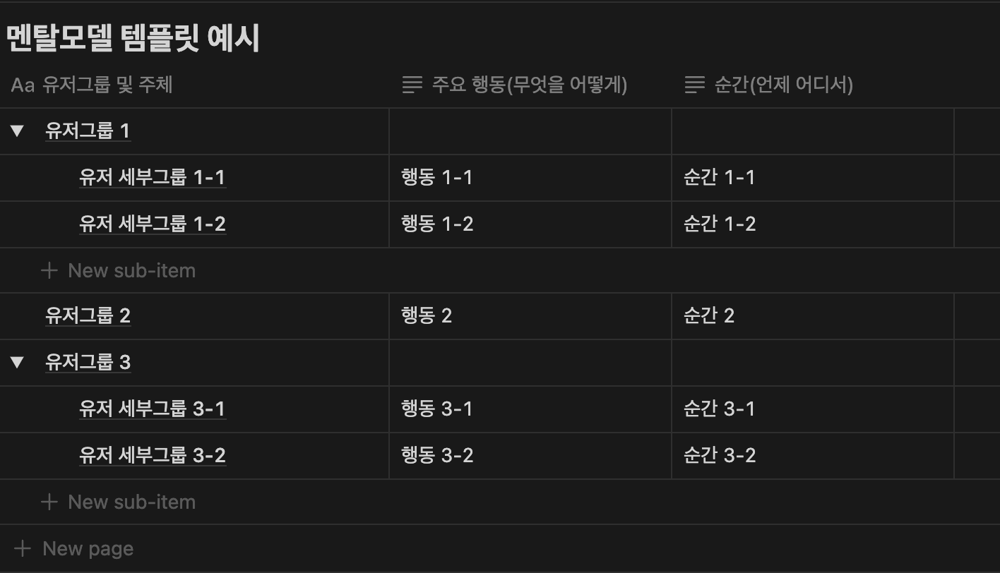
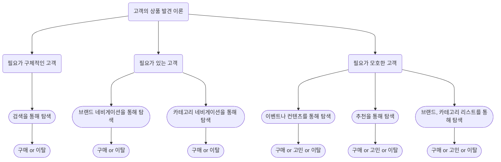
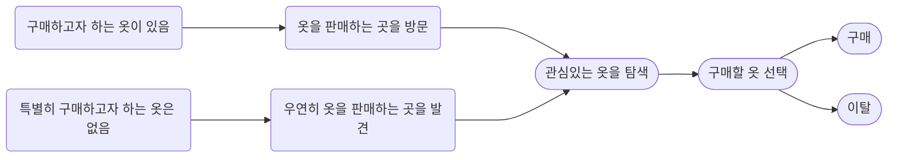

# 멘탈모델

# 예시

# 가이드

## 왜 멘탈모델이 필요한가?

올바른 프로세스에 기반한 반복만이 고객이 만족할 수 있는 제품을 내놓을 수 있다는 TDCC의 철학은 멘탈모델 없이는 성립되지 않습니다. 올바른 프로세스가 반복되며 고객 만족에 다가가기 위해서는 고객이 왜, 어떻게, 언제 이 제품을 사용하는지에 대한 이해가 필수적이기 때문입니다. 이러한 멘탈모델은 서비스와 기능을 설계하는 지침(Confidence)이자, 사용자와 사업 측면의 명확성을 담보하는 것이며(Clarity), 비전과 기회가 지속되도록(Continuity)하는 기반입니다(Indi Young, Mental Models: Aligning Design Strategy with Human Behavior, 2008).

멘탈모델을 세우고 멘탈모델에 기반한 가설과 실행을 통해 멘탈모델을 검증하고, 틀린 부분이 있다면 수정하고 개선하는 과정을 통해 마치 어두운 방의 윤곽을 파악하는 것과 같이 고객에 대한 이해도를 지속적으로 높여나가야만 우리는 고객을 파악할 수 있습니다. 멘탈모델이 없이 좋은 가설이 연속되기 어려운 이유는 여기에 있습니다. 어두운 방의 구조를 파악할 때, 미리 방의 구조를 머릿속에 그려보고 그에 따라 손으로 짚어보며 그려본 것이 맞았는지 틀렸는지를 확인하고, 틀린 것들을 소거해 나가는 동시에 맞은 것들을 토대로 그림을 발전시키며 방의 구조를 빠르게 파악할 수 있습니다. 하지만, 그러한 생각 없이 주변을 무작정 더듬는 방식을 취한다면 방의 구조를 파악하는 데 더 많은 시간이 소요될 수 있으며 운이 좋지 않다면 온전히 구조를 파악하는 데 실패할 수도 있습니다. 무작위한 실행의 결과에 따른 파편화된 정보는 고객에 대한 총체적 이해에 큰 도움이 되지 않거나, 좋지 않은 경우 오히려 방해가 될 수 있기 때문입니다.

예를 들어, 커머스를 방문한 고객들이 상품을 더 잘 발견할 수 있도록 하는 문제가 주어졌을 때, 커머스를 방문하는 고객이 구매할 것을 확고하게 정한 목적형 고객, 어떤 종류의 물건을 살지는 결정했으나 무엇을 살지는 결정하지 못한 탐색형 고객, 사고싶은 것은 특별히 없으나 구경하러 들어온 추상형 고객으로 나뉠 수 있다는 멘탈모델을 생각해볼 수 있습니다. 이 멘탈모델을 기반으로 한다면 “목적형 고객은 바로 검색이나 해당 브랜드를 찾을 가능성이 높기에 이런 유형의 고객이 많은 곳에서 검색을 강조한다면 상품 발견율이 증가할 것이다”라는 가설을 세워보고 해결안을 실험해볼 수 있습니다. 만약 가설이 검증된다면 멘탈모델은 한층 단단해질 것이며 고객에 대한 이해는 더 고도화될 것입니다. 검증되지 않는다고 하더라도 소거할 가정과 멘탈모델을 더 개선해볼 단서를 얻을 수 있습니다. 하지만, 만약 이와 같은 멘탈모델 없이 “검색을 강조하면 검색을 이용하는 유저들이 더 많이 사용하면서 발견이 증가할 것이다”와 같은 가설을 내어놓게 된다면 설사 실험이 성공한다고 하더라도 고객에 대해서 굉장히 단편적인 부분만을 배울 수 있습니다. 예컨데 ‘유저들은 검색을 선호하기에 이를 강조하는 것이 좋다’와 같은 배움입니다. 이는 제품에 진입하는 유저들의 발견행위를 구조적으로 이해하기에는 너무 파편적인 정보이며 오히려 유저를 이해하는 과정에 장기적으로 장애물이 될 가능성이 높습니다.

## 멘탈모델의 수립

멘탈모델을 수립하기 위해서는 우선 유저의 행동이 언제, 어떻게, 왜 발생하는지를 묘사해볼 필요가 있습니다. 이러한 묘사를 통해 유저가 행동하는 맥락과 양식을 총체적으로 이해해봅니다. 이러한 묘사를 토대로 다음 할 작업은 컨셉화입니다. 우리가 이해하고자 하는 행동을 유저들이 왜 하는지에 대한 컨셉을 기술합니다. 마지막으로, 이 컨셉을 토대로 멘탈모델을 작성합니다.

### 묘사

유저의 행동에 대한 묘사를 통해 멘탈모델의 수립을 위한 기반을 마련합니다. 묘사는 궁금증에서 시작하여 육하원칙을 토대로 진행해볼 수 있습니다. 예를 들어 커머스에서 상품을 구매하는 유저들이 어떻게 하면 더 성공적으로 상품을 구매할 수 있을까라는 궁금증을 토대로 아래와 같이 묘사해볼 수 있습니다.

- 누가: 상품을 구매하려는 사람이
- 무엇을: 상품을 구매하는 행위를
- 언제: 구매할 필요가 있을 때
- 어디서: 커머스 플랫폼에서
- 어떻게: 검색, 추천, 카테고리 등의 경로를 통해
- 왜: 내가 원하는 것을 얻거나 필요에 따라 사용하기 위해

이와 같이 유저 행동을 묘사해보며 유저가 제품을 왜, 어떻게 이용하는지를 이해합니다.

### 나열

위에서 진행한 묘사를 토대로 각 묘사 부분에서 추가적으로 나올 수 있는 유저의 행동을 자세히 나열해봅니다. 우선 한계 없이 가능한 행동들을 모두 나열하고 이후 지나치게 특수하거나 일반적이지 않다고 여겨지는 행동을 소거합니다. 이러한 나열을 쉽게 할 수 있는 방법 중 하나는 제품에서 유저가 하는 행동을 현실의 유사한 행동과 비교하여 치환해보는 것입니다. 예를 들어, 이커머스서 발견한 상품을 장바구니에 담고자 하는 고객이 있을 때, 이 고객이 기대하는 것은 본인이 마음에 드는 상품을 장바구니에 넣어놓고 한번에 결제하는 것입니다. 이는 할인마트에서의 상품 구매와 유사합니다. 할인마트에서 고객들은 구매하고자 하는 상품, 혹은 도중에 발견한 상품을 장바구니에 넣어놓고 한번에 계산합니다. 만약 이커머스에서 장바구니에 원하는 것을 담았는데 그것이 담기지 않거나 다른 것이 담긴다면, 이는 고객에게 혼란을 가져다 줄 것입니다. 고객들은 현실세계의 익숙한 경험과 맥락을 모바일에서도 기대하며 그에 벗어나는 것은 고객의 경험을 악화시킬 수 있습니다(Megan Chan, Jakob Nielsen, 2024). 그렇기에 유사한 맥락이나 논리를 가진 현실의 인간 행동과 우리가 보고자 하는 모바일에서의 행동을 치환해본다면 우리는 제품 발전을 위해 중요한 단서를 얻을 수 있습니다. 위에서 묘사한 내용을 치환해보자면 우선 패션 커머스와 옷가게에 진입한 고객을 생각해볼 수 있습니다.

누가

- 살 옷이 분명한 사람이
- 살 카테고리 정도는 정한 사람이
- 살게 분명치 않은 사람이

- 살 옷이 분명한 사람이
- 살 카테고리 정도는 정한 사람이
- 살게 분명치 않은 사람이

어디서

- 커머스에서
- 포털의 광고를 통해
- 영상의 추천을 통해

- 옷가게에서
- 길거리에서 광고나 호객행위를 통해

언제

- 당장 내일 입을 옷이 필요할 때
- 다음 계절을 준비할 때
- 가격이 저렴한 때
- 마음에 드는 제품이 있을 때

- 당장 내일 입을 옷이 필요할 때
- 다음 계절을 준비할 때
- 가격이 저렴한 때
- 마음에 드는 제품이 있을 때

왜

- 살만한 것이 있나 둘러보려
- 살 것이 명확하게 있어서
- 살 카테고리 정도는 정해서

- 흥미가 생겨 둘러보려
- 살 것이 명확하게 있어서
- 살 카테고리 정도는 정해서

어떻게

- 홈의 컨텐츠, 프로모션 영역에서
- 검색 영역에서
- 브랜드 홈, 카테고리 영역에서

- 전면의 가판대에서
- 점원에게서
- 각 카테고리, 브랜드별 섹션에서

무엇을

- 생각하던 상품을
- 생각은 했으나 명확하지 않던 상품을
- 살 생각이 없었던 상품을

- 생각하던 상품을
- 생각은 했으나 명확하지 않던 상품을
- 살 생각이 없었던 상품을

옷가게에 진입한 고객은 기본적으로 상품을 구매하려는 의지를 가지고 진입하였을 것입니다. 다만, 이 의지는 사람에 따라 다를 수 있습니다. 어떤 고객은 전면의 가판대에 이끌려 진입했을 수도 있고, 어떤 고객은 명확하게 구매할 것이 있을 수도 있으며, 어떤 고객은 카테고리나 브랜드 정도만을 정하고 들어왔을 수 있습니다. 이러한 고객의 맥락에 따라 각 고객은 가판대만 둘러보다가 나갈 수도, 점원에게 바로 접근하여 원하는 상품의 위치를 물어볼 수도, 각각의 카테고리가 있는 영역을 구경할 수도 있습니다. 이러한 치환을 통해 제품을 이용하는 고객에 대한 묘사를 보다 현실적인 형태로 작성해볼 수 있습니다.

### 분류

마지막으로 위에서 진행한 묘사와 나열 내용을 토대로 고객을 분류합니다. 분류가 필요한 이유는 고객의 수많은 정보를 맥락에 맞게, 의미있는 방식으로 정리하고 구조화해야만 그 구조를 토대로 Actionable한 인사이트나 아이디어가 나올 수 있기 때문입니다. 묘사와 나열 과정에서 만든 컨셉은 분류 없이는 무의미한 경우가 많습니다.(Joanne RodriGues, 2020) 예를 들어, 묘사와 나열에 의하면 커머스에서 상품을 구매하려는 고객은 1) 물건을 구매할 구체적인, 혹은 구체적이지 않지만 분명 존재하는 필요가 있을 때 2) 필요의 맥락에 따라 적합한 경로에서 3) 상품을 구매하거나 찾거나 이탈하는 최종 행동을 진행한다고 컨셉을 잡아볼 수 있습니다. 이는 아래와 같이 분류하여 시각화해볼 수 있습니다. 

만약 우리가 분류과정을 진행하지 않았다면 컨셉에서 Actionable한 인사이트나 계획을 만들어내는 것은 어려울 수 있습니다. 하지만, 이러한 분류과정을 거쳐왔다면 각 고객의 특성과 맥락에 맞춰 보다 Actionable한 가설을 수립할 수 있습니다. 예를 들어, 필요가 모호한 고객은 개입을 통해 필요를 구체화하거나 좋은 제안을 해줄 경우 더 잘 상품을 발견할 수 있을 것이라는 가정을 토대로 이벤트나 컨텐츠를 보다가 이탈하려고 하는 시점에 한 번 상품이나 다른 컨텐츠를 추천해보는 작업을 진행해볼 수 있을 것입니다. 이러한 작업이 잘 소구되는지에 따라 멘탈모델의 유용함이 검증되거나 멘탈모델이 개선되어야 하는지 여부를 확인할 수 있습니다. 이와 같은 구체적인 가정이나 계획은 분류과정이 진행되지 않았다면 분명 나오기 어려운 것들입니다.

### 멘탈모델의 수립

위 과정들을 모두 거쳐 예시로 “고객은 필요라는 맥락에 따라 자신에게 적합한 경로를 통해 상품 구매 관련 행동을 한다”라는 고객의 상품 발견문제를 풀기 위한 멘탈모델을 간단히 수립해볼 수 있습니다. 그리고, 이 진술과 위 과정에서 최종적으로 나온 고객분류 및 하위 행동들을 Template에 채워넣으며 멘탈모델 Object를 만들어냅니다. 예시로 언급한 멘탈모델은 고객이 가진 필요라는 맥락, 그리고 이용하는 경로, 최종 행동에 따라 세부적인 사항들을 가지고 있습니다. 각각의 세부적인 사항들과 컨셉들은 실제 가설과 실행안을 통해 이 멘탈모델이 맞는지를 검증하는 데 중요한 근거가 됩니다. 이러한 멘탈모델이 준비된다면 가설을 설정하고 실행안을 통해 이 가설과 멘탈모델에 대해 검증하는 다음 단계로 나아갈 수 있습니다.

## 부록: 경험지도

경험지도는 TDCC의 소개 부분에서 언급한 Teresa Torres의 ‘Continuous Discovery Habits’에서 제안된 개념입니다. 경험지도는 Product Analytics에서 흔히 이야기하는 User Path나 User Journey처럼 제품 내에서의 고객의 여정을 의미하는 것이 아니라, 실제 고객이 현실에서 직접 겪고 있는 동일한 경험, 혹은 유사한 형태의 현실 경험이 어떠한 맥락으로 진행되는지를 표현한 결과입니다. 예를 들어 현실에서 옷을 구매하려는 고객은 아래와 같은 경험지도를 갖게됩니다.

이러한 경험지도를 통해 멘탈 모델에서 고객이 어떻게 구성, 분류되고 각기 어떤 특성을 가지고 있을 지 확인한 것에 더해, 고객이 우리가 제공하려는 가치를 현실에서 어떻게, 어떤 맥락을 거쳐 획득하고 있는지를 유추해볼 수 있습니다. 이러한 경험 지도가 멘탈모델과 더불어 사용되거나 멘탈모델을 구축하는 과정에서 함께 사용된다면 문제-세부문제를 풀어나가는 과정에 보다 고객 관점으로 접근하기 수월해지고 이는 결국 더 좋은 가설과 인과, 해결안으로 귀결될 것입니다. 멘탈모델 만으로는 고객의 맥락을 파악하고 좋은 가설, 인과, 해결안을 구상하는 데 어려움이 있을 경우, 경험지도 작성을 추가로 진행하며 더 좋은 가설과 실행안이 나올 수 있는 기반을 더 탄탄하게 만들 수 있습니다.

## Reference

Product Analytics: Applied Data Science Techniques for Actionable Consumer Insights(2020). Rodrigues, Joanne. 

[Mental Models](https://www.nngroup.com/articles/mental-models/). Nielsen Norman Group.

Mental Models: Aligning Design Strategy with Human Behavior(2008). Indi Young.