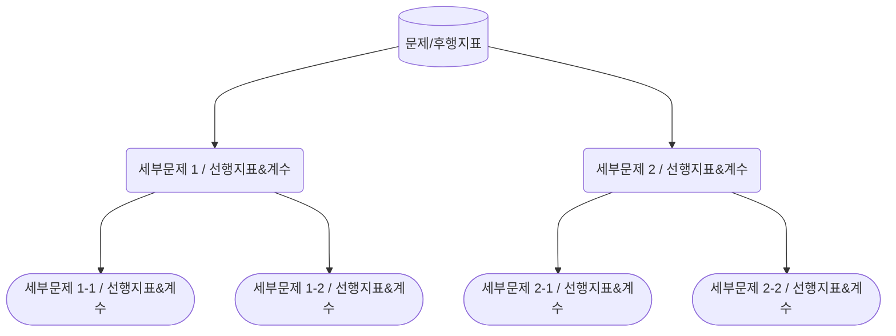
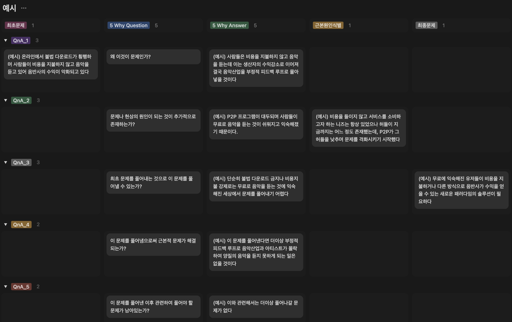
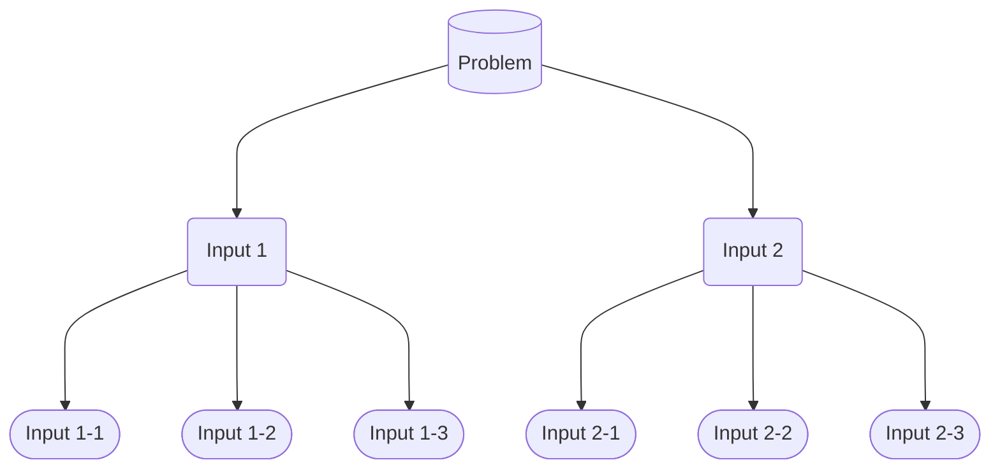
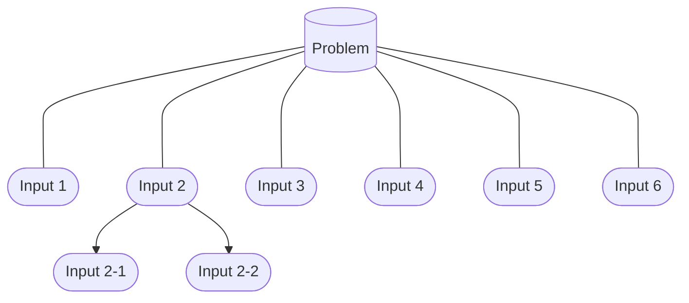
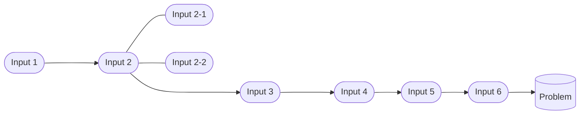
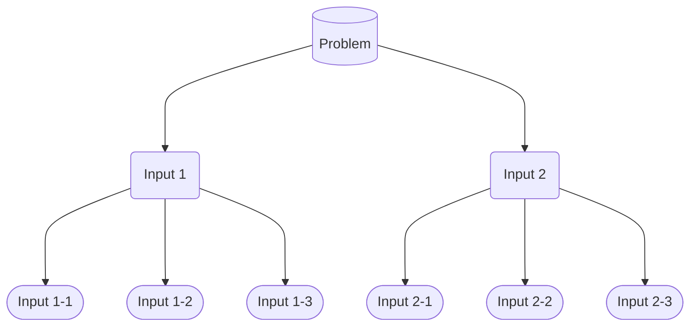

# 문제트리

# 예시

# 가이드

# 문제트리 가이드

문제트리는 팀이 풀어야 할 근원적인 고객의 문제와 문제를 풀어내기 위해 선행적으로 풀어내야 하는 세부문제들을 구조적으로 도식화한 결과입니다. 이 가이드에서는 문제트리를 만들기 위해 먼저 고객의 근원적문제를 정의하기 위한 문제분석 과정과 문제를 작성하는 과정을 다룹니다. 이후 이 문제를 토대로 어떻게 세부적인 문제로 나눌 것인지, 각 세부문제를 표현할 수 있는 지표를 어떻게 잡을 것인지, 그리고 그 세부문제들 중 어떤 것이 더 문제와 더 강한 관계를 가지고 있는지 찾아내는 방법을 설명합니다. 이 과정을 거쳐 정의한 문제와 세부문제, 그리고 각각을 나타내는 지표들과 우선순위를 담아 최종적으로 문제트리를 만듭니다.

### 기존의 프로젝트에 TDCC가 적용되는 경우

기존의 프로젝트가 있는 경우 문제분석의 단계를 처음부터 필수적으로 진행할 필요는 없습니다. 만약 팀이 다루고 있는 제품과 문제에 대한 이해가 성숙한 수준이고, 이미 정의되어 있으며 중요하다고 합의된 문제가 있다면 이것을 바로 문제로 기술할 수 있습니다. 기술한 문제를 빠르게 세분화하고, 이를 토대로 해결안을 빠르게 실행하고 피드백을 진행하며 정의했던 문제의 유효함을 검증한 후 부족한 부분이 있다면 개선하는 것이 이 경우에는 보다 효과적입니다.

### 신규 프로젝트에 TDCC가 적용되는 경우

반면에, 기존에 팀이 정의한 문제를 해결하려 했으나 문제정의가 잘못되어 문제를 잘 풀어내지 못한 경우, 혹은 신규 프로젝트여서 아직 팀이 제품에서(혹은 제품을 통해) 풀어내야 하는 문제를 정의하지 못한 경우 문제분석과 작성 과정을 진행할 수 있습니다. 이 경우에도 문제분석과 작성에 지나치게 많은 시간을 쏟는 것은 권하지 않습니다. 빠르게 분석과 작성의 과정을 마친 후 실행과 피드백을 통해 정의한 문제가 맞았는지를 검증하는 것이 TDCC에서는 보다 권장하는 방식입니다.

# 문제분석

문제 기술의 시작점은 우선 문제에 대해 분석하며 문제의 근원적인 원인에 대해 탐구해보는 것입니다. 여기서는 문제의 종류를 먼저 구체화하고 Root Cause Analysis 방식을 통해 문제의 근본적인 원인을 찾아나가는 과정을 다룹니다.

## 문제의 종류

문제에는 종류가 있습니다. 여기에는 우리가 제품과 서비스로 풀고자 하는 고객의 문제가 있고, 그 제품과 서비스의 존속을 위해 풀어야 하는 비즈니스 문제가 있습니다. 어떤 상황에는 고객의 문제를 풀며 비즈니스 문제를 같이 풀 수 있을 경우도 있고, 어떤 상황에는 고객의 문제를 풀더라도 비즈니스 문제가 풀리지 않아 두 문제를 따로 풀어야 하는 경우도 있을 수 있습니다. 전자의 경우 대표적으로 Chat API를 고객에게 제공하고 이용료를 받는 센드버드나 배달을 중개해주고 수수료를 수취하는 배달의 민족, 쿠팡과 같은 커머스 서비스들이 있을 수 있습니다. 후자의 경우는 지역기반 중고거래 서비스를 제공해주었으나 그것만으로는 수익이 발생하지 않아 광고 시스템을 추가적으로 도입하여 수익을 창출하는 당근이 흔히 알려져 있습니다. 우리가 풀고자 하는 문제는 무엇이며, 이 문제를 풀었을 때 서비스의 영속성을 담보할 비즈니스 문제도 같이 풀 수 있는가, 아니라면 더 풀어내야 할 비즈니스의 문제가 있는가를 명확히 인지하는 것은 문제를 분석하는 첫 걸음입니다. 고객의 문제와 비즈니스의 문제를 간단히 정리해보면 아래와 같습니다.

- 고객의 문제 - 제품과 서비스를 이용할 고객이 가진 문제를 의미합니다. 이 문제를 풀었을 때 비즈니스의 문제가 함께 풀릴 수도, 비즈니스 문제는 따로 풀어내야할 수도 있습니다.
    - 일반 고객의 문제 (B2C)
    - 기업 고객의 문제 (B2B)
- 비즈니스의 문제 - 제품, 서비스를 토대로 어떻게 수익을 창출할 것인가라는 문제입니다. 고객에게 어떤 비용을 지불하게 할 것인지에 따라 방향이 달라질 수 있습니다.
    - 금전 비용
        - 요금을 부과할 것인가?
            - 정기 요금인가?
            - 비정기 요금인가?
        - 수수료를 수취할 것인가?
    - 시간 비용
        - 광고비를 책정할 것인가?

고객의 문제를 풀어내며 비즈니스 문제가 같이 풀릴 경우 문제의 분석과 기술 과정을 통해 문제를 보다 자세하게 탐구하고 정의합니다. 고객의 문제를 풀어내는 것이 비즈니스 문제의 해결로 귀결되지 않을 경우 고객의 문제와 비즈니스 문제 각각에 문제 분석과 기술을 통해 접근합니다. 결과적으로 이와 같은 경우에는 고객의 문제가 정의되어 있고 이러한 문제를 해결하기 위한 Layer가 하나, 비즈니스의 문제를 해결하기 위한 Layer가 하나 나오게 됩니다.

### 분석 방법

이미 정의된 문제가 없는 경우 가장 중요한 것은 핵심적, 근본적 문제를 모두 파악하여 후속 문제를 남기지 않는 것입니다. 후속 문제를 남기지 않는다는 것은 정의된 문제에서 파생되는 또다른 문제가 없다는 것을 의미합니다. 문제를 피상적으로 파악하고만 있다면 좋은 문제정의가 이루어지기 어려우며 이에 파생되는 또다른 문제들이 좋은 해결안이 나오는 것을 가로막습니다. 그렇기에 정의된 문제가 있더라도 그것이 충분히 핵심적, 근본적이어서 후속 문제를 남기지 않을 정도로 잘 정의된 것이 아니라면 문제 분석을 통해 문제를 다시 정의하고 시작할 필요가 있습니다.

문제를 피상적으로 파악하는 것을 넘어 효과적으로 파악하기 위해 이미 널리 알려진 5 Whys, Fishbone Diagram, Pareto Analysis, Root Cause Analysis와 같은 다양한 기법들이 존재합니다. 본 문제 분석 부분에서는 이들 중 Root Cause Analysis를 기반으로 문제를 분석해나가는 방식을 다루고자 합니다.

### RCA(Root Cause Analysis)

Root Cause Analysis는 아래와 같이 여섯 단계로 구성됩니다. 문제 분석에서는 2, 5, 6단계를 생략하고 1,3,4단계만 진행합니다. 또한, 3단계는 5 Whys 기법을 통해 진행합니다.

1. **문제 정의**: 문제를 명확하게 정의하고, 언제, 어디에서, 어떻게 발생하는지를 구체적으로 기술합니다.
2. **데이터 수집**: 문제와 관련된 모든 데이터를 수집하며, 이는 문제의 원인을 분석하는 데 필요한 정보를 제공합니다.
3. **원인 분석**: 다양한 분석 도구를 사용해 문제의 원인을 파악합니다. 일반적으로 사용되는 도구에는 Ishikawa Diagram (또는 Fishbone Diagram), The 5 Whys, Fault Tree Analysis 등이 있습니다.
4. **근본 원인 식별**: 분석을 통해 하나 또는 여러 근본 원인을 식별합니다.
5. **해결책 개발**: 식별된 근본 원인을 해결할 수 있는 조치를 개발합니다. 이 단계에서는 근본 원인을 제거하거나 영향을 최소화할 수 있는 방안을 마련합니다.
6. **실행 및 모니터링**: 해결책을 실제로 실행하고 그 효과를 모니터링하여, 문제가 해결되었는지와 유사한 문제가 다시 발생하지 않도록 합니다.

아래는 RCA 과정의 예시와 각 과정에 대한 자세한 설명들입니다.

### 최초 문제정의

문제를 최초로 정의합니다. 어떤 문제가 발생했는지, 그 문제가 발생한 시점, 위치, 환경 등을 기술하며 문제를 정의하게 됩니다. 예를 들어 아래와 같은 항목들을 채워나가며 문제를 최초로 정의합니다.

- 문제: 처음 커머스 제품에 진입한 유저들이 원하는 상품을 잘 찾고 있지 못하고 있다.
- 시점: 처음 제품을 다운로드받고 제품에 진입한 시점
- 위치: 제품의 홈 영역과 카테고리 영역에서 특히 문제가 심하게 발생하고 있다.

### 원인분석

이 문제가 왜 발생했는지 그 근본 원인을 찾아나가기 위한 과정을 진행합니다. 여기서는 특히 5 Whys 방식을 통해 원인 분석을 진행하게 됩니다. 위의 커머스 제품을 예시로 5 Whys에 기반해 원인분석을 진행해보자면 아래와 같습니다.

1. 커머스 제품에 처음 진입한 유저들은 왜 상품을 잘 찾고 있지 못하고 있는가?: 제품의 홈 영역이 복잡하기 때문이다.
2. 왜 제품의 홈 영역이 복잡한가?: 프로모션과 네비게이션 메뉴, 추천 상품과 같은 여러 맥락이 혼재되어 있기 때문이다.
3. 왜 여러 맥락이 혼재되어 있는가?: 여러 상품과 카테고리, 프로모션들을 한번에 보여주고 소개하려다 보니 여러 맥락이 혼재되었다.
4. 여러 맥락을 보여주는 것이 효과적인 것인가?: 이미 제품을 잘 학습하고 이용하고 있는 유저들은 이를 잘 이용하고 있다.

### 근본원인식별

원인분석에서 5 Whys에 기반해 질문해 본 것들을 토대로 문제를 유발하게 된 근본적인 원인을 식별해냅니다. 위의 예시에서 4번의 질문을 해보며 파악한 바로는 “제품 자체가 우리 제품에 익숙한 유저를 주요 대상으로 하여 만들어져 있기에 이들에게는 이미 익숙한 맥락을 많이 담고 있으며 이러한 많은 맥락이 신규 유저에게는 장애물로 작용하고 있다”가 문제라는 것을 알 수 있게됩니다.

# 문제작성

문제분석 부분에서 분석한 것에 맞춰 세부문제의 근원적인 문제이자 세부문제를 풀어낼 경우 최종적으로 해결되는 문제가 될 주요 문제를 작성합니다. 문제를 작성할 때에는 최초로 생각했던 문제와 후속 문제를 남기지 않는 근본문제, 이렇게 문제를 정의하게 된 배경과 문제를 대변하는 지표를 함께 적시합니다.

<aside>
💡 `최초 정의한 문제는 이것`이었으나 우리가 진정으로 풀어야 할 `고객(비즈니스)의 문제는 이것`이며. 이는 `이러한 근본 원인`에서 비롯된 것이다. 이는 `이러한 지표`로 표현된다

</aside>

### 부록: 문제의 실천적 정의

또한, 문제를 정의할 때 해결할 수 있는 형태로 문제를 세부적으로 잘 정의하기 위해 SMART 프레임워크를 추가적으로 이용하여 문제 Object에 대한 보다 자세한 설명을 더할 수 있습니다. SMART는 구체적인(Specific), 측정 가능한(Measurable), 실현 가능한(Action-oriented), 관련이 있는(Relevant), 기한이 있는(Time-bound)을 의미합니다. 각각은 세부적으로 아래와 같습니다

- 배경 - 구체적인 배경 정보 수집하기
- 성공기준 - 프로젝트의 성공 KPI(혹은 지표)를 명확히 하기
- 경계 - 프로젝트에 어떤 것을 포함할지, 혹은 어떤 것을 포함하지 않을지 그 경게계 명확히 하기
- 제약조건 - 솔루션의 제약 조건을 명확히 하기
- 책임자/관련자 - RACI와 같은 도구를 활용하여 책임자 역할 명확히 하기
- 자원 - 전문가 DB등 동원 가능한 주요 자원 파악하기

이 SMART 프레임워크를 이용하여 작성한 문제를 실제 이 문제를 풀어나가기 위한 직접적인 과정에 맞춰 좀 더 실천적으로 기술할 수 있게됩니다. 이 부분은 이미 위에서 기술한 문제가 충분히 실행에 가까우며 팀이 해결가능한 범위에 있다면 생략해도 무방합니다.

# 세부문제 구조화

위의 단계에서 정의한 핵심적이고 근원적인 문제(`이하 핵심 문제`)를 토대로 문제를 해결해나가기 위한 세부문제를 구체화해나가는 부분입니다. 여기서는 문제를 세부적인 단위로 쪼개는 구조화방법을 통해 세부문제를 정의합니다. 문제 구조화에는 크게 하위 구조 나열법과 프로세스법이 존재합니다.

### 하위 구조 나열법

핵심 문제를 토대로 핵심 문제를 해결하기 위한 하위 항목들을 가장 가까운 Input들 부터 가장 먼 Input들 까지 구조적으로 나열합니다.

예를 들어, 아래와 같이 하위 구조를 나열해볼 수 있습니다.

- 핵심 문제: 고객들이 상품을 더 쉽게 찾도록 한다
    - 상품 발견을 더 쉽게 한다
        - 원하는 상품을 더 쉽게 찾을 수 있도록 한다
        - 고객에게 개인화된 상품을 추천한다
        - 고객과 유사한 사람들이 좋아하는 상품을 제안한다
    - 원할 만한 상품을 더 가져온다
        - 선호되는 품목을 더 다양하게 온보딩시킨다
        - 선호될 것으로 보이는 품목을 찾아 온보딩시킨다

### 프로세스법

핵심 문제를 토대로 핵심 문제의 해결안이 되는 항목들을 절차적 순서에 따라 나열합니다. 절차적 순서는 고객이 서비스를 이용하며 맞닥뜨리는 순간들을 절차적 기준에 따라 나누며 문제를 구조화합니다. 예를 들어 고객이 상품을 더 쉽게 찾도록 하는 문제에서는

- 핵심 문제: 고객들이 상품을 더 쉽게 찾도록 한다
    - 고객이 상품을 더 잘 탐색할 수 있도록 한다
        - 상품수요가 확실한 고객이 쉽게 경로를 찾도록 한다
        - 상품수요가 어느 정도 있는 고객이 쉽게 경로를 찾도록 한다
        - 상품수요가 모호한 고객이 쉽게 경로를 찾도록 한다
    - 탐색한 상품 정보를 더 쉽게 확인하도록 한다
        - 상세 이전의 정보전달을 더 잘 해준다
        - 상품 상세 안에서의 정보전달을 더 잘 해준다
    - 정보를 토대로 상품과 나의 Fit을 더 쉽게 확인하도록 한다
        - 스타일 측면에서 Fit을 더 쉽게 확인하도록 한다
        - 사이즈나 재질 측면에서 Fit을 더 쉽게 확인하도록 한다

### 방법의 선택

하위 구조 나열법과 프로세스법을 동시에 펼쳐놓고 모두 참고하는 방법을 권장하나, 상황에 따라 아래와 같이 하나의 옵션을 주로 참고하는 케이스를 정의해볼 수 있습니다.

- 하위 구조 나열법을 주로 참고하는 경우
    - 각 세부문제들이 순서로 연결되어 있기 보다는 상이한 맥락의 집합일 때 하위 구조 나열법이 보다 효과적일 수 있습니다.
    - 예를 들어, 토스와 같은 금융 플랫폼은 본인의 자산/소비내역 확인, 송금, 결제, 중개, 커머스 등 고객들이 여러 가지 맥락으로 방문하는 플랫폼 서비스이기에 하위 구조 나열을 통해 각각 맥락에 해당하는 고객들의 문제를 보다 잘 정의하고 풀어나갈 수 있습니다.
- 프로세스법을 주로 참고하는 경우
    - 고객 여정이나 비즈니스의 과정이 어느 정도 정해져 있는 경우 프로세스법을 주로 참고할 수 있습니다.
    - 예를 들어, 커머스와 같이 방문-발견-구매-배송으로 고객 여정이 보다 분명히 정의되어 있는 경우 프로세스법이 문제를 세분화하는 과정에 더 효과적일 수 있습니다.

### 구조화 원칙

MECE(Mutually Exclusive, Collectively Exhaustive) 의 원칙을 따릅니다. Mutually Exclusive란 상호간에 겹치는 부분이나 중복되는 영역이 없어야 한다는 것을 의미하며 Collectively Exhaustive는 각 부분을 모두 합쳤을 때 전체를 커버해야한다는 의미를 담고 있습니다. 이는 분석이나 솔루션이 포괄적이며 관심사항의 모든 잠재적 분야를 담고 있다는 것입니다.

# 문제 지표화

문제 지표화 단계에서는 문제 구조화 과정에서 정의한 세부 문제들에 대해 각각 지표를 할당합니다. 문제 Object에 기술된 지표는 후행지표, 혹은 Output Metric이라 불리며 세부문제를 해결한 결과 최종적으로 움직이는 지표입니다. 세부문제 Object에 기술된 지표는 선행지표, 또는 Input Metric이라 불리며 팀이 실행과 개선을 통해 변화시키기 용이하며, 후행지표에 영향을 줄 수 있는 지표를 의미합니다. 문제 지표화 과정에서는 이러한 선행지표를 어떻게 설정할 수 있을지, 어떤 지표를 설정하면 좋을지에 대해 안내합니다.

### 지표의 종류

먼저 지표의 종류에 대해 한 번 짚고 넘어갈 필요가 있습니다. 지표는 역할이나 특성에 따라 아래와 같이 나뉠 수 있습니다. 지표의 종류를 미리 짚고 넘어가는 것이 중요한 이유는 팀이 풀어야 하는 세부 문제의 현황을 표현하는 데에 어떤 지표가 보다 효과적인지를 미리 가늠해볼 수 있다는 점입니다. 아래와 같은 종류의 지표들 중 필요한 것들을 선택하여 세부 문제를 잘 표현할 수 있는 지표의 종류를 결정합니다. 아래에서 설명하는 지표의 종류는 Lean Analytics를 기준으로 합니다.

- Input / Output
    - Input: 위에서 설명한 바와 같이 선행지표로도 불립니다. 행동을 통해 변화시키기 용이한 지표이며 이 지표의 변화가 Output 지표의 변화로 귀결됩니다.
    - Output: 동일하게 위에서 설명한 것처럼 후행지표라고도 불립니다. 일반적으로 Output지표는 실행을 통해 변화시키기는 어려우며 증가할 경우 근원적 문제의 해결을 의미하는 것으로 이해 가능합니다.
- Active / Passive
    - Active : 유저가 직접 한 행동을 통해 표현되는 지표입니다. 예를 들어 버튼 클릭율, 페이지 이동율, 탭 클릭 수, 필터 사용 수, 검색율 등이 있습니다.
    - Passive : 유저가 직접 어떤 행동을 하지는 않았지만 관찰될 수 있는 지표입니다. 예를 들어 어떤 페이지에서의 평균 체류시간, 특정 컨텐츠 3초 이상 노출율 등이 있습니다.
- Volume / Ratio
    - Volume: DAU, 클릭수 등과 같이 절대량으로 측정되는 지표를 의미합니다.
    - Ratio: Retention Rate, CTR등과 같이 절대량이 아닌, 비율로 측정되는 지표를 의미합니다.

### 주요 제품 지표

주요 제품 지표에서는 세부문제를 설명하기 위한 지표들의 예시를 항목별로 소개합니다. 지표의 종류를 확인하며 어떤 종류의 지표를 설정하는 것이 세부문제를 해결하는데 좋을지 생각해보았다면 여기서는 항목의 여러 지표들을 살펴보며 최종적으로 어떤 지표를 세부문제의 지표로 삼을지 결정합니다. 이 항목들에는 Market, Growth, Retention, Stickness, Engagement Metric들이 있으며 이 항목과 지표들은 Sequia Capital Data Science Blog의 포스팅 “Measuring Product Health”를 참고했습니다.

| 분류 | 지표 | 설명 |
| --- | --- | --- |
| Market Metrics | MAU/installs | Install수 대비 MAU가 얼마나 되는지를 측정. Market에서 얼마나 많은 유저가 제품을 찾고 관심을 보이는 지를 확인 |
| Growth Metrics | MAU, WAU, DAU | 일간, 주간, 월간 유저 규모 |
| - | D/D, W/W, M/M, Y/Y Changes | 제품의 주요 기간 기준에 따라 성장이나 변화를 측정 |
| - | Quick Ratio | New User와 Resurrected User를 Churn User로 나눠준 값을 측정 |
| - | New users/MAU | MAU 중 신규유저의 비중을 확인 |
| - | sign-ups/installs | 설치 대비 가입유저의 비중을 의미 |
| Retention Metrics | Dn/Wn/Mn Metrics | D1잔존율*D1대비 D7잔존율*D7대비 D30잔존율로 D30 잔존율을 측정 |
| - | Cohort Curves | 언제부터 Retention이 Flattening하는지를 확인 |
| Stickness Metrics | DAU/MAU | 유저가 한 달 내에 더 자주 들어오는지를 측정 |
| - | Open Rate | 설치 후 제품 실행율을 의미 |
| - | Lness | 주어진 기간 동안 N일 이상 들어온 유저의 수 (e.g. 지난 일주일 동안 3일 이상 접속한 유저의 수) |
| - | Sticky or DoD, WoW, MoM retention | 어제 들어온 유저 중 오늘 잔존한 유저, 지난 주에 들어온 유저 중 이번 주 잔존한 유저를 측정 |
| Engagement Metrics | Time spent/DAU | DAU 한 명당 얼마나 제품에서 시간을 사용했는지 확인 |
| - | Number of sessions | 제품에서 몇 세션을 체류했는지 확인 |
| - | Time spent/session | 세션당 평균적으로 얼마나 체류했는지 측정 |
| - | Inventory available | 소셜 미디어를 예시로 유저가 얼마나 많은 컨텐츠를 확인할 수 있는지(인벤토리에 있는지)를 확인 |
| - | Content consumption (number of views) | 인벤토리에 있는 컨텐츠 중 얼마나 소비하는지 확인 |
| - | Production of content | 컨텐츠의 생산 정도를 확인 |
| - | Feedback on content | 컨텐츠에 대한 피드백을 확인 |

혹은 흔히 해적 지표로 일컬어지는 AARRR에 따라 아래와 같은 형식으로 지표들을 나누고 참고해볼 수도 있습니다

| 분류 | 지표 |
| --- | --- |
| Acquisition (고객 획득) | NAU (New Active User), DAU, MAU |
| Activaion (고객 활성화) | 핵심 활동 성공율, 체류 시간 |
| Retention (고객 유지) | 재방문율 |
| Referral (추천) | Viral K, 추천 비율, 공유 비율 |
| Revenue (수익) | LTV, 월 매출, ARPU, ARPPU, 주문 유저 비율 |

이러한 지표들의 예시들을 참고하여 각 세부문제를 가장 잘 표현할 수 있는 지표를 설정, 세부문제의 해결 성과를 모니터링할 수 있도록 문제 지표화를 진행합니다.

# 문제 우선순위

구조화를 통해 세부문제를 정의하고 지표화를 통해 세부문제를 지표로 표현하는 과정 까지 거쳐왔다면 문제의 우선순위와 영향도를 파악하는 우선순위 설정의 과정을 진행할 수 있습니다. 문제의 우선순위는 세부문제 Object의 지표가 문제 Object의 지표와 얼마나 강한 관계를 가지고 있는지에 따라 결정될 수 있습니다. 여기에는 데이터가 충분히 있는 경우와 그렇지 않은 경우가 있을 수 있는데, 각각의 경우에 따라 문제의 우선순위를 잡아보는 방법을 알아봅니다.

### 데이터가 존재하지 않는 경우

신규 프로젝트에 TDCC가 도입되는 경우, 즉, 아직 제품이 나오지 않았거나 제품이 나왔더라도 유저가 너무 적거나 다른 이유로 데이터가 수집되지 않은 경우 데이터가 존재하지 않을 수 있습니다. 이 경우 데이터를 기반으로 우선순위를 설정하는 것은 어렵습니다. 그렇기에 이 지점에서는 팀의 Product Manager, UX Designer등과 함께 논의하며 직관에 기반해 우선순위를 설정하고 빠른 Iteration을 통해 검증하는 것을 권장합니다.

### 데이터가 충분한 경우

데이터가 충분한 경우 아래와 같은 방법들을 통해 우선순위를 추정해볼 수 있습니다. 기본적으로 값이 높으면 세부문제가 핵심문제와 밀접한 관련을 가지고 있으며 우선순위가 높다고 가정합니다.

| 방법 | **설명** | **방법** |
| --- | --- | --- |
| **상관분석** | 핵심문제와 세부문제간의 상관관계를 측정합니다. 일반적으로 상관관계와 인과관계는 같지 않으나, 상관관계가 높다면 인과를 가정하고 빠른 행동을 통해 이를 증명해 볼 가치가 있습니다. | 시계열 데이터: • Pearson Correlation Coefficient / Cross Correlation (교차상관) / Time Lagged Cross Correlation / Dynamic Time Wrapping |
| - | - | 비시계열 데이터: Pearson / Kendall Tau / Spearman / Phi / Cramer V |
| **회귀분석** | 회귀분석을 통해 세부문제(독립변수)와 핵심문제(종속변수)간의 관계를 측정합니다. 이 또한 특정 조건이 충족된 상황을 제외하고는 인과를 의미하지는 않으나, 일반적으로 높은 계수를 가지고 있는 Feature가 높은 우선순위를 가지고 있다고 가정해볼 수 있습니다. | Linear Regression / Multivariate Linear Regression |
| **XAI** | XAI 기법을 통해 핵심문제에 각 세부문제들의 얼마만큼의 영향도를 가지고 있는지 판단합니다. 알고리즘과 방식의 선택은 환경과 조건에 따라 자유롭게 진행됩니다 | Local Interpretability: LIME / SHAP |
| - | - | Global Interpretability: Random Forest |

위의 방법을 통해 측정한 우선순위에 따라 세부문제 Object 템플릿의 우선순위 항목을 채워줄 수 있습니다. 각 우선순위는 어떤 문제를 먼저 풀어야 제품 성장과 고객 만족에 임팩트가 더 클지에 대한 척도가 됩니다.

# 세부문제의 구조

세부문제는 문제 아래에만 연결될 수도 있지만, 세부문제에 선행하는 또다른 세부문제가 있을 경우 세부문제 아래에 또 다른 세부문제들이 연결될 수도 있습니다. 세부문제가 하단에 또다른 세부문제를 두는 이유는 세부문제마저도 너무 큰 문제여서 실제 실행으로 문제를 풀어내기에는 어려운 때가 있기 때문입니다. 문제 구조화 단계의 프로세스법에서 예시로 든 것을 다시 가져와보도록 하겠습니다.

- 핵심 문제: 고객들이 상품을 더 쉽게 찾도록 한다
    - 상품 발견을 더 쉽게 한다
        - 원하는 상품을 더 쉽게 찾을 수 있도록 한다
        - 고객에게 개인화된 상품을 추천한다
        - 고객과 유사한 사람들이 좋아하는 상품을 제안한다
    - 원할 만한 상품을 더 가져온다
        - 선호되는 품목을 더 다양하게 온보딩시킨다
        - 선호될 것으로 보이는 품목을 찾아 온보딩시킨다

여기서의 핵심문제는 “고객들이 상품을 더 쉽게 찾도록 한다”입니다. 이러한 핵심문제를 풀어내기 위해서는 세부문제인 “상품 발견을 더 쉽게 한다”, “원할 만한 상품을 더 가져온다”를 풀어내야 합니다. 하지만 규모가 있는 커머스 제품에서는 이러한 세부문제도 아직 너무 큰 문제이고 실제 제품팀의 행동이 변화시키기에는 먼, Input이라기 보다는 Output에 가까운 문제입니다. 그렇기에 이러한 세부문제를 다시 한 번 구조화하여 추가적인 세부문제를 정의하고 연결시킬 수 있습니다. 이를 통해 Actionable한 형태의 세부문제를 토대로 이후의 과정을 진행할 수 있으며 더 의미있는 실행이 진행될 수 있습니다.

# Reference

맥킨지 논리력 수업(2021). 저우궈위안.

[Measuring Product Health](https://medium.com/sequoia-capital/measuring-product-health-626b2186cece). Sequia Capital Publication

해석 가능한 AI(2024).  아제이 탐피.