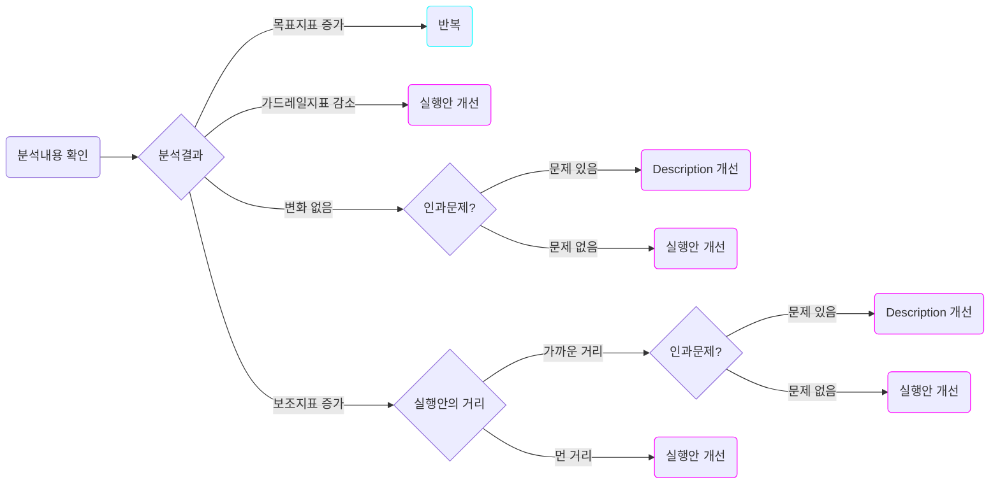
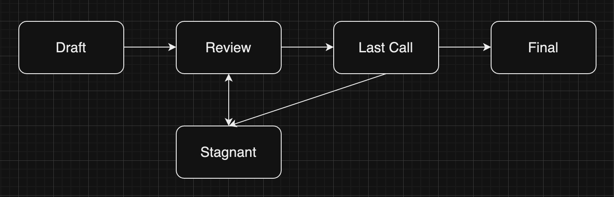

# 제안로그

# 예시

아래는 예시를 토대로 템플릿을 작성해 본 내용입니다.

| **컨텐츠** | **설명** |
| --- | --- |
| **종류** | Conception Level Proposal |
| **대상** | **세부문제 Object**  - 검색을 통해 상품을 잘 발견하도록 한다   **멘탈모델 Object** - 고객의 상품발견 모델  **가설 Object** - 검색 페이지를 방문하는 고객들의 검색결과에서의 필터 사용율을 높여줄 경우 검색을 통한 상품 발견율이 증가할 것이다.  **실행안 Object** - 필터를 쉽게 사용할 수 있는 버튼 형태로 제공 - 필터의 디폴트 값을 검색자 성별에 맞춰 제공 |
| **조치** | **세부문제 Object** - 개선  **멘탈모델 Object** - 존치  **가설 Object** - 삭제 & 생성  **실행안 Object** - 삭제 & 생성 |
| **동기 및 근거** | **세부문제 Object** - 세부문제를 해결하기 위한 가설, 실행안 Object의 잇다른 실패와 지표를 변화시키지 못하는 것으로 보았을 때 기존의 세부문제 Object로는 세부문제가 충분히 고객의 문제를 대변하지 못하고 있다고 판단. 이에 대한 개선을 진행  **멘탈모델 Object** - 멘탈모델 자체에는 크게 문제가 없는 것으로 생각되기에 우선은 존치 판단  **가설 Object** - ‘필터를 쉽게 사용할 수 있는 버튼 형태로 제공’과 ‘필터의 디폴트 값을 검색자 성별에 맞춰 제공’ 실행안들을 분석해 본 결과 둘 다 모든 지표에서 변화가 없던 상황. 결국 필터 사용율과 검색을 통한 상품 발견율은 인과가 없는 것으로 확인. 삭제를 진행하고 새롭게 개선된 세부문제에 맞는 가설 Object를 새로 생성  **실행안 Object** - 세부문제 개선과 가설의 삭제, 생성으로 인한 교체로 인해 새로운 가설에 맞는 실행안으로 교체 필요. 기존의 실행안 Object들을 삭제하고 새로운 실행안 Object들을 생성 |
| **사양** | **세부문제 Object** - ‘검색을 통해 상품을 잘 발견하도록 한다’ → ‘직접탐색을 통해 상품을 잘 발견하도록 한다’ 로 `개선`  **가설 Object** - 검색 페이지를 방문하는 고객들의 검색결과에서의 필터 사용율을 높여줄 경우 검색을 통한 상품 발견율이 증가할 것이다. → `삭제` - 직접 탐색을 진행하는 고객들에게 탐색 보조기능을 제공해줄 경우 직접 탐색을 통한 상품 발견율이 증가할 것이다 → `생성`  **실행안 Object** - 필터를 쉽게 사용할 수 있는 버튼 형태로 제공 → `삭제` - 필터의 디폴트 값을 검색자 성별에 맞춰 제공 → `삭제` - 검색결과페이지에 도달한 고객에게 가이드 UI를 제공 → `생성` - 검색결과페이지에 도달한 고객에게 검색결과별 섹션에 도달할 수 있는 숏컷 제공 → `생성` |

# 가이드

# 제안로그 가이드

제안로그는 Description에 대한 피드백을 담고 있는 제안들로 구성되어 있습니다. 이 문서에서는 Execution의 결과 Description에 대한 개선을 진행할 필요가 있다고 판단될 경우 분석결과를 토대로 Description을 어떻게 개선할지에 대한 제안을 작성하는 방법을 기술합니다. 제안은 분석결과를 토대로 Description 특정 문제, 세부문제, 기회, 변수가 1)개선이 필요하다고 생각되어 개선되거나 2)무효한 것으로 판명되어 삭제되거나 3)새로운 것이 필요하다고 판단되어 생성되는 경우들에 대한 내용을 담고 있습니다. 이 문서에서는 우선 피드백 알고리즘을 통해 Description의 개선 필요 여부를 판단하고, 개선이 필요하다고 판단될 경우 제안을 작성하는 방법을 다룹니다.

# 피드백 알고리즘

피드백 알고리즘에서 가장 먼저 진행되어야 할 것은 우선 분석내용과 결과를 확인하는 작업입니다. 우선 분석 내용을 확인하면 우선 다음과 같은 것들을 알 수 있습니다

- 목표지표는 어떻게 변화했는가?
- 보조지표는 어떻게 변화했는가?
- 가드레일 지표는 어떻게 변화했는가?

위의 내용에 따라 다음과 같이 피드백 내용을 작성할 수 있습니다.

| **분석내용** | **상황** | **대응** |
| --- | --- | --- |
| 목표지표 증가 | 가드레일지표가 부정적으로 변화하지는 않은 경우 | 동일한 Description과 가정을 토대로 실행안을 내놓으며 개선을 반복합니다. |
| 보조지표 증가 | 실행안의 거리가 목표지표에 영향을 직접적으로 끼치기에는 너무 먼 거리였을 경우 | 다음 실행안은 목표지표와 좀 더 가까운 거리에서 실행을 진행하거나, 보조지표를 타겟하는 것이 맞다고 판단된다면 이를 타겟하는 실행안으로 개선합니다 |
| - | 실행안의 거리가 충분히 가까웠는데 목표지표와 세부문제의 지표간의 인과가 문제있어보이는 경우 | 가정의 기반이 되는 멘탈모델이나 기회, 변수, 가정의 문제일 수도, 혹은 이들 모두 위에 있는 세부문제의 문제일 수 있습니다. 이들 중에 문제가 있는 것을 찾고 개선합니다 |
| - | 실행안의 거리가 충분히 가까웠는데 목표지표와 세부문제의 지표간의 인과문제가 없어보이는 경우 | Description의 문제가 아니라 실행안이 충분히 인과를 반영하지 못하게 설계되었을 수 있습니다. 실행안을 개선합니다 |
| 가드레일지표 감소 | 목표지표는 증가헀는데 가드레일지표가 감소한 경우, 혹은 목표지표가 증가하지 못했고 가드레일지표가 감소한 경우 | 실행안이 충분히 가드레일 지표를 고려하여 설계되지 못했을 수 있습니다. 실행안을 개선합니다 |
| 변화없음 | 목표지표와 세부문제의 지표간의 인과가 문제있어보이는 경우 | 가정의 기반이 되는 Description의 문제일 수 있습니다. 이들 중에 문제가 있는 것을 찾고 개선합니다. 혹은, 상위에 있는 세부문제의 정의가 잘못된 것은 아닌지 확인합니다 |
| - | 목표지표와 세부문제의 지표간의 인과문제가 없어보이는 경우 | Description의 문제가 아니라 실행안이 충분히 인과를 반영하지 못하게 설계되었을 수 있습니다. 실행안을 개선합니다 |

각각 상황과 대응에 따라 피드백 내용을 최종적으로 작성한 이후에 이 피드백 내용을 토대로 제안을 작성하도록 합니다. 이에 따라 개선되고 발전하는 Description의 문제, 세부문제, 멘탈모델, 기회, 변수, 인과는 Dynamic이라는 프레임워크의 핵심가치를 반영하는 요소입니다.

# 제안의 작성

기본적으로 제안은 Description의 개선을 위한 요소입니다. 그렇기에 피드백 알고리즘을 통해 해석한 결과가 실행안의 개선이 필요하다는 내용일 경우 Improvement과정을 진행하는 대신 다시 Execution단계로 돌아가 실행안의 개선 및 반복을 진행합니다. 만약 Description의 개선이 필요하다는 내용이 피드백 알고리즘을 통해 파악될 경우에는 Improvement과정을 진행하여 제안을 작성합니다. 제안은 제안의 ‘대상’이 되는 Description의 요소를 작성한 내용과 어떻게 개선이 되어야 하는지에 대한 방향을 담고 있는 ‘조치’, 그리고 이러한 제안이 나오게 된 ‘동기 및 근거’와 조치에 대한 세부내용을 담고 있는 ‘사양’으로 구성되어 있습니다.

## 대상

Description을 구성하는 요소인 문제, 세부문제, 멘탈모델, 기회-인과 그래프 내 기회, 변수, 혹은 인과관계 중 제안의 대상이 될 요소를 선택합니다. 여러개의 요소가 대상이 될 수도, 한 개의 요소가 그 대상이 될 수도 있습니다.

## 조치

대상에 어떤 작업을 할지를 결정합니다. 개선/삭제/생성중 하나가 기술될 수 있으며 각 내용에 따라 아래와 같이 대상에 대한 개선 및 피드백을 진행합니다.

- 개선: 대상에 일부 문제가 있는 것으로 보고 이를 개선하는 결정입니다.
- 삭제: 대상에 큰 문제가 있어 개선보다는 제거하는 것이 더 합리적인 것으로 판단될 경우의 조치입니다.
- 생성: 고객의 문제를 풀기 위해 새로운 내용을 담은 새로운 요소가 필요하다고 판단될 경우의 조치입니다.

## 동기 및 근거

해당 제안을 진행하게 된 배경과 그 이유를 간략히 서술합니다. 이는 분석결과를 기준으로 합니다. 분석 내용을 토대로 목표지표나 보조지표가 움직였는지, 그에 따라 가드레일 지표가 훼손되지는 않았는지를 확인합니다. 이를 통해 최종적으로 가설의 잘못인지, 세부 문제에 문제가 있는 것인지, 아니면 실행안이 충분치 않았는지를 알아봅니다. 동기 및 근거란에는 이러한 분석결과와 판단에 근거해서 왜 대상, 혹은 복수의 대상들이 개선/삭제/생성되어야 하는지를 서술합니다.

## 사양

마지막으로 사양에는 조치에 대한 세부 내용과 계획을 담습니다. 다만, 삭제의 경우는 따로 사양을 적을 필요는 없습니다. 예를 들어, 특정한 요소가 삭제되는 경우에는 삭제되는 대상에 대한 동기와 근거만 있으면 됩니다. 반면에, 새로운 요소가 생성되는 경우나 기존의 요소가 개선되는 경우 생성되는 요소는 문제, 세부문제, 멘탈모델, 기회-인과 그래프 내 기회나 변수 중 어디에 생성되거나 어디에 있던 것이 개선되는지, 그리고 어떤 자세한 내용을 가지고 있는지 서술해줄 필요가 있습니다.

# 제안의 진행

제안은 아래와 같은 단계로 진행됩니다. 

1. Draft: 실행안의 분석결과를 토대로 작성된 제안의 초안입니다. 아직은 Draft 단계로 적용되려면 이후 단계를 거쳐야 합니다.
2. Review: Draft에 대한 리뷰를 진행합니다. 대상과 조치 등에 대해 모두가 동의하는지, 동기 및 근거나 사양에 대해 팀원이 공감하는지를 확인합니다. 일반적으로 회고 시점에 진행됩니다.
    1. Stagnant: Draft가 작성되었으나 Review나 Last Call에서 Consensus에 이르지 못한 제안들이 가게 되는 단계입니다. 이후 논의를 거쳐 다시 Draft단계로 돌아가 리뷰를 받아 다음 과정으로 나아가거나 영구히 삭제될 수 있습니다.
3. Last Call: 최종적으로 해당 제안을 수용하여 Description에 새로운 요소를 생성하거나 어떤 요소를 삭제, 개선할지를 결정하는 과정입니다. 회고 시점, 혹은 회고 이후에 진행될 수 있습니다. 
4. Final: Last Call에서 적용으로 결론이 난 제안 내용에 따라 Description을 업데이트하는 단계입니다. 

이렇게 팀원들의 합의하여 Final 단계까지 도달한 제안은 Description으로 전달되어 Description의 내용들을 발전시키는 근거로 사용됩니다.

Description 중 제품 개선 과정의 근간을 이루는 문제와 세부문제 제안은 팀의 방향성과 제품 개선의 미래 향방에 큰 영향을 끼칠 수 있습니다. 그렇기에 이는 다소 신중할 필요가 있으며 이에 따라 위 제안 진행의 전 과정을 거치는 것을 추천합니다. 반면에, 멘탈모델이나 기회-인과 그래프는 신중함 보다는 빠른 Iteration과 이를 통해 신속한 개선이 이루어질 때 보다 큰 효과를 발휘할 수 있는 성질의 요소들입니다. 그렇기에 이 경우에는 Review 단계를 생략하고 바로 Last Call을 거쳐 Final 단계로 진입하고 다음 Iteration을 진행하는 것도 가능합니다.

# Reference

https://ansubin.com/ethereum-improvement-proposals/