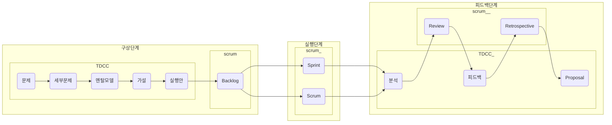

# TDCC 가이드

# 시작하기

TDCC는 애자일 팀이 기존에 사용하는 애자일 프레임워크와 함께 사용되어 데이터 기반으로 제품 및 비즈니스의 그로스를 가속화하기 위한 프레임워크입니다. 그렇기에 이 문서에서는 팀이 하나의 애자일 프레임워크를 선택한 상황을 전제하고 TDCC를 적용하기 위한 과정을 기술합니다.

# Agile Framework 선택

### 새로운 프로젝트에 TDCC를 연동하는 경우

애자일 프레임워크는 웹/앱 서비스를 만들기 위한 현대 제품 개발 방식의 표준입니다. 아래의 애자일 프레임워크들 중 팀이 적용하고자 하는 애자일 프레임워크를 선택합니다.

- [Scrum](https://scrumguides.org/)
- Kanban
- [Scaled Agile Framework (SAFe)](https://scaledagileframework.com/)
- [Crystal](https://monday.com/blog/rnd/agile-crystal/)
- [Extreme Programing (XP)](http://www.extremeprogramming.org/)

### 기존 프로젝트에 TDCC를 연동하는 경우

기존에 선택한 Agile Framework가 있는 경우 따로 이 단계를 거칠 필요 없이 다음 단계를 진행합니다.

# TDCC Init

- TDCC 템플릿을 프로젝트 노션 페이지로 복사합니다.

# 최초의 Active Layer(= Genesis Layer) 만들기

- 템플릿이 복사되었다면 Active Layer 테이블에서 Object를 순서에 따라 만들어줍니다. 이 때 아직 실행안 Object를 토대로 제품 개발이 진행된 상태가 아니므로 Object는 실행안 Object까지만 만듭니다.
    - 각각의 Object를 만드는 과정은 Object Guide를 참고합니다
- 이후 과정들은 Genesis Layer가 만들어진 후에 진행합니다. Genesis Layer가 없는 상태에서는 TDCC가 온전히 Agile Framework와 연동되어 활용되기 어렵습니다.

### 초기 단계 제품의 경우

초기 단계의 제품일 경우 풀어내려 하는 문제와 그에 선행되는 세부문제가 복잡하지 않을 수도 있습니다. 그럴 경우 유연하게 세부문제 Object를 생략할 수도 있습니다.

### 성장/성숙 단계 제품의 경우

성장/성숙 단계의 제품일 경우 근원적인 문제를 직접적으로 해결하기는 어려울 수 있습니다. 이에 따라 선행되는 세부문제를 두어 문제를 풀어낼 수 있는 수준으로 나누고 세부문제를 풀어내기 위한 멘탈모델, 가설, 실행안을 준비합니다.

# Agile Framework와 TDCC의 활용

Agile Framework는 일반적으로 구상-실행-피드백 세 단계로 나뉘어 진행됩니다. Scrum의 경우 가장 먼저 하는 작업은 개발이 필요한 Product의 Backlog를 생각해내고 우선순위에 따라 리스트업하는 것입니다. 이후 실제 제품 개발과 배포를 실행하기 위한 Sprint를 만들고 이러한 Backlog들 중 우선순위가 높은 것을 우선적으로 Sprint에 할당, 제품 개발을 진행합니다. 이후 Sprint Review와 Retrospective과정을 거치며 개발 과정과 제품에 대한 평가와 회고를 진행합니다. 이러한 구성은 다른 Agile Framework도 유사하며 이러한 Agile Framework의 각 단계에 맞춰 TDCC가 함께 사용될 수 있습니다. 각각의 단계별 Agile Framework와 TDCC의 사용법은 아래와 같습니다.

### 구상단계

구상단계는 고객의 문제를 해결하기 위해 어떤 제품, 기능을 출시할지를 구상하는 단계를 의미합니다. TDCC는 구상단계에서 기존의 애자일 프레임워크가 설명해주지 않던 문제, 세부문제, 멘탈모델과 가설을 설명합니다. 이러한 TDCC의 Object와 Agile Framework는 종류에 따라 아래와 같이 연결될 수 있습니다. 

- Scrum의 Product Backlog 생성단계: Genesis Layer에서 정의한 Object들 중에서 우선순위에 따라 먼저 실행해야 할 세부문제 Object를 정하고 그 안의 실행안 Object들을 Product Backlog에 넣습니다.
- Kanban의 Backlog 생성단계: Genesis Layer에서 정의한 Object들 중에서 우선순위에 따라 먼저 실행해야 할 세부문제 Object를 정하고 그 안의 실행안 Object들을 Product Backlog에 넣습니다.
- XP의 User Stories, Release Planning 단계: XP의 User Stories는 TDCC의 문제, 세부문제, 멘탈모델, 가설, 실행안 Object로 대치될 수 있습니다. 여기서 우선순위에 따라 해결해야할 세부문제 Object와 그 아래 연결된 실행안 Object를 Release Planning 단계로 가져와 제품 개발 및 Iteration계획을 수립합니다

### 실행단계

실행단계는 TDCC보다는 Agile Framework의 영역입니다. Scrum의 Sprint와 Daily/Weekly Scrum, XP의 Iteration과 Small Release, SAFe의 Develop on Cadence와 같이 각각의 Agile Framework는 실행을 위한 체계적이고 명확한 방법론을 가지고 있습니다. 이 방법을 따라 제품 개발을 진행합니다.

### 피드백단계

마지막으로 실행단계에서 고객에게 제공한 제품과 기능의 효과를 확인하고 이를 토대로 고객과 제품에 대한 팀의 이해를 발전시키며 다음 배포를 준비하는 피드백 단계가 진행됩니다. TDCC는 이러한 피드백 단계가 어떤 내용으로, 어떻게 이루어지며, 이 결과가 어떻게 고객과 제품에 대한 이해도를 지속적으로 높일 수 있을지에 대한 방안을 제시합니다. 아래처럼 TDCC와 각 Agile Framework는 연결될 수 있습니다

- Scrum의 Sprint Review와 Retrospective단계: 스크럼의 리뷰와 회고 단계에서 분석 Object를 확인하고, 피드백 Object를 내어놓으며 Conception Level, Execution Level에 있는 Object들에 대한 개선/삭제/존치의견을 담고 있는 Proposal이 나오게 됩니다.
- SAFe의 Release on Demand의 Measure-Learn단계: Release on Demand의 Measure와 Learn 단계에서 분석 Object를 확인하고, 피드백 Object를 내어놓으며 Conception Level, Execution Level에 있는 Object들에 대한 개선/삭제/존치의견을 담고 있는 Proposal이 나오게 됩니다.
- XP의 Iteration-Development의 Learn and Communicate단계: 제품을 개발하며 나오는 Learn and Communicate 단계에서 분석 Object를 확인하고, 피드백 Object를 내어놓으며 Conception Level, Execution Level에 있는 Object들에 대한 개선/삭제/존치의견을 담고 있는 Proposal이 나오게 됩니다.

# 활용 예시 - Scrum과 TDCC를 조합한 Workflow

가장 널리 쓰이는 Agile Framework인 Scrum을 기준으로, 어떻게 Scrum과 TDCC를 조합하는지 알아보도록 하겠습니다. 

1. 먼저 구상단계에서는 Scrum의 Product Backlog를 만들기 위해서는 고객의 문제를 정의하고 이를 세분화한 후에, 이를 해결하기 위한 멘탈모델과 가설, 그리고 가설 위해서 탄생한 실행안들이 필요합니다. 이 실행안들은 Scrum을 시작하기 위한 Backlog가 됩니다.
2. 실행 단계에서는 Scrum의 Sprint와 Scrum을 이용해 실행안이자 Backlog에 해당하는 제품과 기능을 빠르게 개발하고 고객에게 전달합니다.
3. 마지막으로 피드백 단계에서는 분석 내용을 토대로 Review를 진행하고 이후 피드백 내용에 기초하여 회고를 진행합니다. 회고 이후에는 Conception과 Execution Level의 Object에 대한 의견을 담고 있는 Proposal이 나오고 이 Proposal이 변화시킨 Object들을 토대로 다음 Backlog가 나오고 Iteration이 진행됩니다.