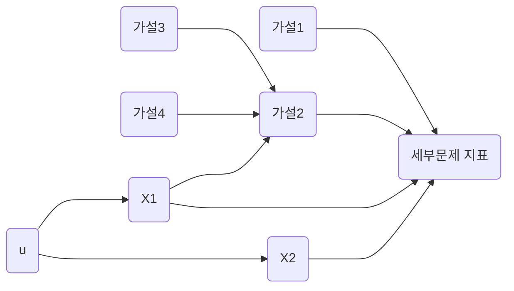
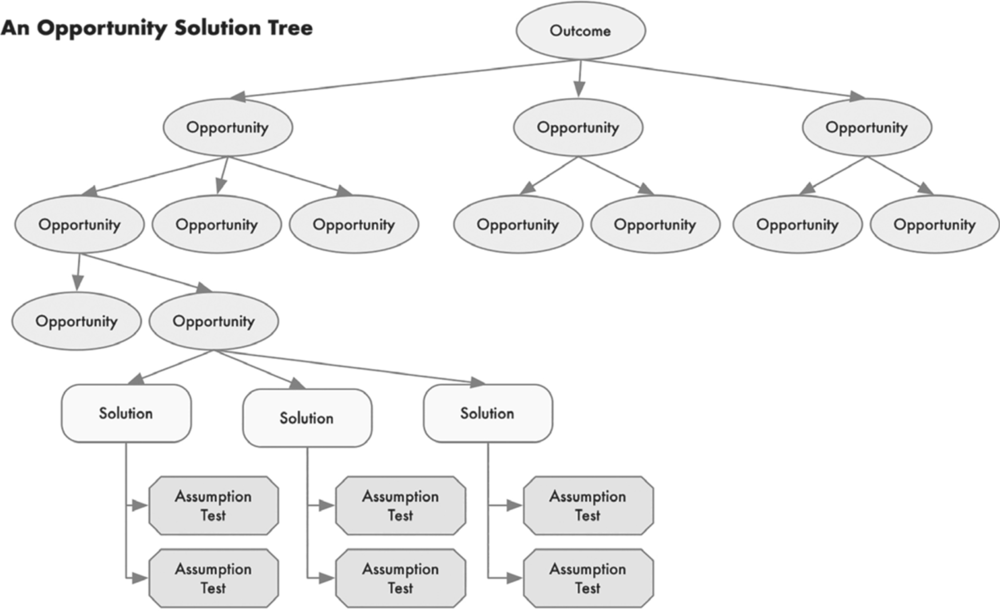
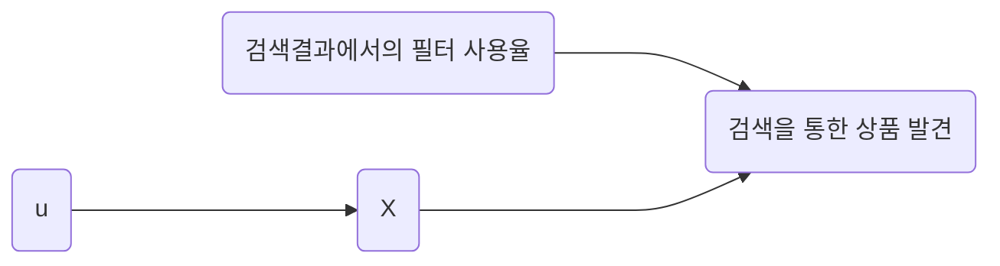
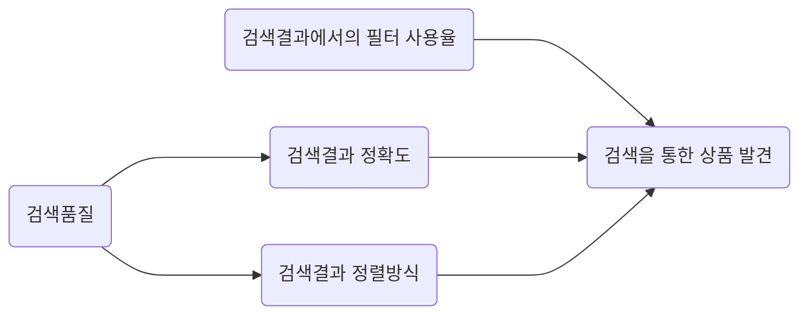
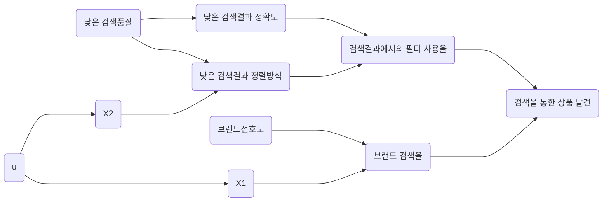

# 가설

# 템플릿

## 기회 솔루션 트리 & 인과 그래프

`기회 솔루션 드리와 인과그래프는 같은 세부문제를 Parent로 가지는 다른 가설 Object와 공통으로 사용될 수 있습니다.`

## 가설

| 가설 | 대상 | 처치(선행지표) | 목표지표(세부문제 지표) |
| --- | --- | --- | --- |
| 가설 1 | 대상이 되는 유저 | 처치를 통해 변화시키고자 하는 목표지표의 선행지표 | 최종적으로 증가시키고자 하는 지표 |
| 변수 1 |  | 처치 외 목표지표에 영향을 주는 지표. X1로 표시되며 u로부터 영향받음 |  |
| 변수 2 |  | 처치 외 목표지표에 영향을 주는 지표. X2로 표시되며 u로부터 영향받음 |  |

# 가이드

# 가설 가이드

가설 Object는 Parent로 연결된 세부문제 Object의 선행지표를 개선하기 위한 논리적 기술을 담고 있습니다. 이는 빠른 실행을 가능케 함과 동시에, Iteration이 진행됨에 따라 팀이 문제 해결에 지속적으로 다가갈 수 있게 해주는 기반을 제공합니다. 가설은 1)기회 솔루션 트리&인과 그래프와 2)가설작성 두 부분으로 나뉘어져 있습니다. 기회 솔루션 트리와 인과 그래프는 세부문제 해결에 영향을 주는 여러 가설(기회 솔루션 트리의 용어로는 Opportunity. 이하 가설로 통합하여 표현.)들을 구조적으로 표현하여 세부문제 해결을 위한 전반적 이해와 가설의 실패, 성공에 따라 방향성을 가늠할 수 있도록 해주어 다음 Iteration에 대한 단서를 제공합니다. 가설은 이러한 기회 솔루션 트리와 인과 그래프를 어떻게 구상할지, 그리고 이들의 주요 요소인 가설을 어떻게 작성할지를 담고 있습니다. 가이드에서는 우선 기회 솔루션 트리와 인과그래프에 대해 설명하고 가설에 대한 설명과 작성방법에 대해 다룹니다.

# 기회 솔루션 트리와 가설

Opportunity Solution Tree. Continuous Discovery Habits

Continuous Discovery Habits에서 소개된 기회 솔루션 트리는 가설과 함께 사용될 때 매우 효과적입니다. 기회 솔루션 트리는 최상단에 고객의 문제를 해결한 결과로 나오는 Outcome과 이 Outcome을 움직이기 위한 일련의 Opportunity들, 그리고 이 Opportunity를 잡아내기 위한 Solution과 Solution을 검증하기 위한 Assumption으로 구성됩니다. 완벽히 대치되지는 않지만 기회 솔루션 트리의 요소들을 TDCC의 각 Object와 치환해본다면 Outcome은 세부문제의 지표가 될 것입니다. 그리고, Opportunity는 어떤 것을 실행한다면 이 Outcome을 어떻게 변화시킬 수 있을 것이다라는 가설이 됩니다. 그리고 이에 대한 Solution과 Assumption은 이후에 다룰 실행안과 유사하다고 볼 수 있습니다.

예를 들어 설명해본다면 아래와 같습니다. 풀고자 하는 세부문제의 지표가 검색을 통한 상품 발견(=Outcome)이라면 이러한 상품 발견을 올리기 위한 방법은 여러 가지가 있을 수 있습니다. 검색 결과에서 유저가 검색결과를 원하는 대로 좁히고 조절할 수 있게 해주는 것일 수도 있고, 그런 것을 할 필요 없이 유저의 특성에 가장 맞는 상품을 먼저 보여주는 것(=Opportunity)이 될 수 있습니다. 이들을 가설로 표현하면 검색결과에서의 필터 사용율이나 검색결과에서의 추천을 통한 상품 발견율이라는 지표들이 증가하면 검색을 통한 상품 발견이 증가할 것이다가 됩니다. 그리고, 이러한 가설을 실현하기 위해 구체적으로 실행안(=Solution, Assumption)이 만들어지게 됩니다.

TDCC에서는 멘탈모델을 토대로 하여 기회 솔루션 트리를 작성할 수 있습니다. 하지만, TDCC에서는 단순히 위처럼 기회 솔루션 트리에 맞춰 여러 가설을 나열하는 것으로 끝나지 않습니다. TDCC에서는 나열된 가설들과 세부문제가 인과적으로 어떤 관계를 맺고 있는지, 그리고 예상치 못한 변수들이 있는지도 함께 표현합니다. 가설은 기본적으로 인과를 가정하는 것이라 볼 수 있습니다. 어떤 대상에게 처치를 가하면 행동이 변화해 목표지표가 변화할 것이라는 구조로 이루어져 있기 때문입니다. 하지만 이러한 가설에서 예상하지 못한, 결과에 영향을 주는 다른 변수들이 있을 수 있습니다. 그렇기에 TDCC에서는 결과에 영향을 줄 수 있는 잠재적인 변수들까지 포함하여 인과 그래프를 그려보며 기회 솔루션 트리를 더욱 상세하고 정밀하게 작성합니다. 이를 통해 최종적으로 검증하려는 가설 뿐만 아니라 그에 영향을 줄 수 있는 잠재적 변수를 일목요연하게 파악될 수 있으며 기회 솔루션 트리가 보다 정교하게 문제 해결과 제품 개선을 위한 청사진을 보여줄 수 있게 됩니다.

예를 들어 위 가설에서 목표하고 있는 상품 발견율은 검색어 관련 상품 노출이라는 처치안의 결과로 변화할 수도 있지만, 그것에 영향을 끼치는 많은 변수들이 존재합니다. 현실적으로 그것을 모두 파악하고 그래프에 표현하는 것은 어렵습니다. 그래서 우선은 다른 여러 변수들을 우선 X로 묶어 표현한 다음 해당 변수에 영향을 끼치는 원인을 u로 표현합니다. 만약 몇 가지 변수들에 영향을 주는 원인이 동일하다 해당 변수들은 하나의 X로 표현될 수 있습니다.

이러한 인과그래프를 가정하며 실험하려는 가설과 관련하여 얽힌 인과구조를 미리 생각하고 그려본다면 배포된 기능의 결과를 분석하고 이를 통해 가설을 검증할 때 다음 단계를 더 잘 밟아나갈 수 있습니다. 결과가 좋았다면 검증된 가설과 인과를 토대로 실행안을 지속적으로 발전시켜나가는 방식으로, 결과가 썩 좋지 않았다면 다른 변수의 영향력을 확인하기 위해 다른 가설을 추가하고 이에 맞춰 처치안 및 실행안으로 실험을 해보는 작업으로 다음 단계를 밟아나갑니다. 이후 지속적인 Iteration에 따라 위의 인과그래프는 아래와 같이 발전하고 변화한다는 것을 밝혀낼 수 있습니다. 이 인과그래프 또한 아직 완성은 아니며, 계속되는 Iteration에 따라 더 개선될 여지가 있습니다.

TDCC에서 결과적으로 기회 솔루션 트리는 나열한 여러 가설(=Opportunity)들과 그 가설들 간의 인과관계에 더해, 고려하지 못했던 외생변수들이 추가되며 결과적으로 위와 같이 표현되게 됩니다. 기회 솔루션 트리를 이용하여 나열한 최초의 가설들이 인과를 확인하는 과정을 통해 지속적으로 발전하고 개선되며 가설과 변수들의 구조가 보다 명확하게 표현됩니다. 발전의 결과인 기회 솔루션 트리&인과 그래프는 세부목표(Outcome)을 변화시키는 데 효과적인 가설(Opportunity)와 그렇지 못한 가설을 구분하고 어떤 가설들을 실제로 테스트해보며 고객의 문제를 해결할 수 있는지를 가늠할 수 있는 척도가 됩니다. 그리고, 이를 토대로 어떤 Opportunity를 잡아낼 지, 그리고 어떤 Opportunity는 이미 충분한 실행으로 더 얻어낼 것이 없다고 판단해 나중에 이에 대한 실행안을 내놓을지를 판단하여 팀이 고객의 문제를 해결하고 제품을 개선하는 데 핵심적인 결정을 내릴 수 있습니다.

# 가설이란 무엇인가?

다음으로는 이러한 기회 솔루션 트리&인과 그래프에서 사용되는 가설에 대해 좀 더 자세히 알아보고 어떻게 작성하는 것이 좋을지 알아봅니다. 가설은 TDCC에서 기회 솔루션 트리&인과 그래프를 이루는 주요 요소이자 Object의 이름 그 자체이기도 합니다. 가설은 결과의 탐구를 위한 시작점으로, 제한된 근거 위에서 제안된 가정이나 추정을 의미합니다. 이러한 가설은 단일 변수에 대한 주장일 수도 있고, 두 변수이상의 변수의 관계에 대한 가정일 수도 있습니다. 여기서 다루고자 하는 가설은 단일 변수에 대한 주장이 아닌 하나의 종속변수와 한 개 이상의 독립변수간의 관계로 한정합니다. 예를 들어 위에서 언급했던 “검색결과에서의 추천을 통한 상품 발견율이라는 지표들이 증가하면 검색을 통한 상품 발견이 증가할 것이다”가 있습니다. 특히, 가설은 상관관계를 가진 두 변수간의 인과를 측정하는 기반이 되기도 합니다. 이 부분에서는 가설이 어떻게 구성되고 실질적으로 가설을 어떻게 작성할지를 다룹니다.

# 가설의 구성

### 가설의 구성요소

- 대상 (생략 가능)
    - 가설의 대상이 되는 것을 기술합니다. 일반적으로는 가설의 결과에 따라 영향을 받을 제품의 유저, 혹은 고객을 의미합니다. 생략 가능합니다.
- 처치
    - 목표하는 지표를 변화시키기는 데에 어떤 처치가 영향을 끼칠 수 있을지를 의미하며 목표지표에 영향을 끼칠 선행지표로 기술됩니다. 구체적으로 어떤 실행안을 만들고 제품 개발, 실험을 진행할지는 실행안에서 구체화할 예정이므로 여기서는 “어떤 처치를 하면 목표지표가 증가할 것이다”라는 처치를 통해 변화시킬 지표와 목표지표간의 관계로 기술합니다.
- 목표지표
    - 처치의 결과로 변화하기를 기대하는 지표입니다. 일반적으로 특정 세부문제 Object의 선행지표(Input Metrics)가 여기서는 목표지표로 표현됩니다.

# 가설의 작성

### 작성

커머스에서 거래액을 증가시킨다라는 후행적인 문제(거래액이 후행지표)를 풀기 위해 상품 발견율이라는 선행적인 문제(상품 발견율이 선행지표)를 풀려고 하는 상황을 가정합니다. 가설의 작성은 멘탈모델에 기반할수록 강력해집니다. 예를 들어 이전에 작성한 멘탈모델을 토대로 보았을 때, 필요가 구체적인 고객은 검색을 통해 탐색하는 경우가 많을 것으로 여겨질 수 있습니다. 이에 따라 검색을 통한 상품 발견율을 높여주는 처치를 한다면 상품 발견율이 올라갈 것이다라는 가설을 생각해볼 수 있습니다. 혹은, 한 단계 더 내려가 목표지표가 검색을 통한 상품 발견율이라면, 검색결과에서의 필터 사용율을 높여주면 검색을 통한 상품 발견율이 올라갈 것이다라는 가설을 생각해볼 수 있습니다.

<aside>
💡 예시) 검색 페이지를 방문하는 고객들(`대상`)의 검색결과에서의 필터 사용율을 높여줄 경우(`처치`) 검색을 통한 상품 발견율(`목표지표`)가 증가할 것이다.

</aside>

# Reference

Continuous Discovery Habits: Discover Products that Create Customer Value and Business Value(2021). Teresa Torres.

실무로 통하는 인과추론 with 파이썬(2024). 마테우스 파쿠레.