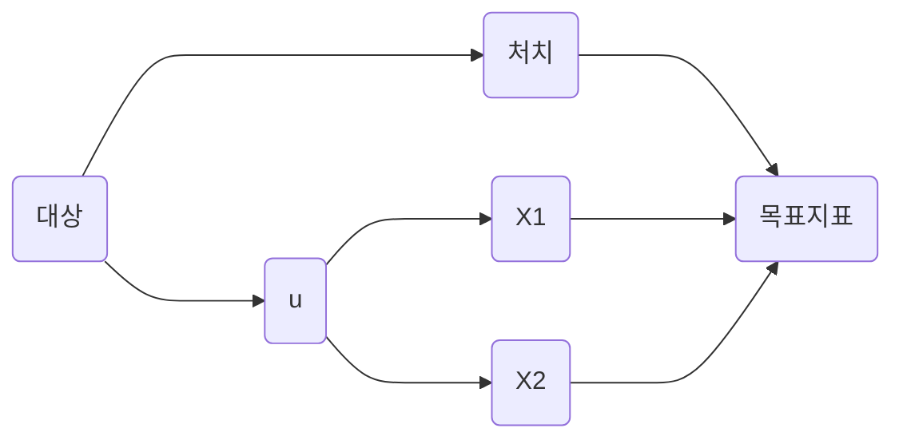

# 분석

# 템플릿

대상 / 처치 / 목표지표

[평가 DB](%E1%84%87%E1%85%AE%E1%86%AB%E1%84%89%E1%85%A5%E1%86%A8%2071f1d9bcf43a4236bd1ff84c1cba4b50/%E1%84%91%E1%85%A7%E1%86%BC%E1%84%80%E1%85%A1%20DB%200f406f9a711b40fab9131ab45b0f06f9.csv)

# 가이드

# 분석 가이드

분석은 실행안 Object의 내용을 토대로 제품 및 기능을 개발, 배포한 후 그 효과를 확인하는 과정을 의미합니다. 분석의 경우 실행안의 형태와 관련하여 실험인 경우에 실행안을 분석하는 방법과, 실험이 아닌 경우 실행안을 분석하는 방법으로 나뉘게 됩니다. 실행안 모두 설정한 지표가 어떻게 변화했는지를 확인하고 배포계획을 수립하는 것은 같으나 그 이전 과정에 다소 차이가 있는데 이는 아래와 같습니다. 

실험이 아닌 실행안의 분석 과정

- 분석방식 확인
- 지표확인
- 배포계획

실험 형태의 실행안의 분석 과정

- 실험확인
- 지표확인
- 배포계획

# 실험이 아닌 실행안 분석

가설 검증을 위해 실험을 설계하고 수행하는 것이 가장 이상적이지만, 현실적으로 모든 상황에서 실험을 수행하는 것은 어렵거나 불가능할 수 있습니다. 예법적 문제, 비용, 시간 등의 제약으로 인해 실험이 불가능할 때도 있기 때문입니다. 이러한 경우에는 **관찰 데이터(Observational Data)**를 활용하여 실행안을 분석하고 가설을 검증하는 방법을 사용할 수 있습니다. 실험을 하지 않는 상황에서는 실행안은 결과를 확인하기 위해 더 정교한 분석이 요구되기 때문에, 관찰 데이터를 통한 분석 방식을 상세히 서술합니다. 

## 관찰 데이터란?

관찰 데이터는 연구자가 무작위 배정 등의 방법을 통해 직접 개입하지 않고, 배포에 따라 자연적으로 발생한 데이터입니다. 예를 들어, 사용자가 앱을 어떻게 사용하는지에 대한 로그 데이터나, 과거의 마케팅 캠페인 이후의 매출 데이터 등이 관찰 데이터에 해당합니다. 이 데이터는 개선을 통해 이미 발생한 사건이나 행동을 기록한 것이므로, 이를 바탕으로 가설을 검증하려면 신중한 접근이 필요합니다.

## 분석방식 확인

핵심은 실행안을 통해 변화시키고자 하는 지표의 변화에 개입하는 의도치 않은 변수를 어떻게 통제할 것인가입니다. 이를 어떻게 통제할 것인지에 따라 아래와 같이 분석 방법이 나뉠 수 있습니다.

| **분석방법** | **내용** | 사용하는 경우 |
| --- | --- | --- |
| 성향 점수 매칭 (PSM; Propensity Score Matching) | 대표적인 매칭 방법은 실행안의 대상이 되는 실험군의 처치 전 변수, 특성과 같은 값을 가진 대조군을 매칭하는 것입니다. 이를 통해 실험군과 대조군이 유사한 분포를 가지도록 조정합니다. | 대상과 비대상 중 같은 특성을 가진 유저들을 매칭할 수 있어 집단간 밸런스를 맞출 수 있을 때 사용합니다. |
| 도구 변수 (Instrumental Variables) | 독립변수와는 상관성을 지니고 있으면서 오차항과는 상관성을 지니고 있지 않은 도구 변수를 통해 실행안 외 실행에 영향을 줄 수 있는 변수들의 영향도를 최소화합니다. | 오차항과 상관성을 지니지 않으면서 독립변수와는 상관성을 가진 변수가 있을 때 사용합니다. |
| 회귀불연속설계 (RDD; Regression Discontinuity Design) | 실행안(=처치)에 따라 실행안 대상의 종속변수가 비대상에 비해 실행에 따라 극적으로 변화하며 단절되는 양상이 생기는지를 확인하는 방법입니다. | 대상과 비대상이 특정 경계선(Cutoff)에서 나눠지는 경우 효과적으로 사용될 수 있습니다. |
| 이중 차분법 (DID; Difference In Difference) | 준실험 분석방법의 하나로 실험안으로 여겨지는 처치를 받은 그룹과 최대한 유사한, 대조군으로 여겨지는 그룹을 찾아낸 후, 두 그룹의 평행추세가정 속에서 시간에 따른 두 그룹 간의 차이를 함께 비교하는 방식입니다. 성향 점수 매칭과 함께 사용될 수 있습니다. | 서로 다른 특성을 가진 모집단들에 처리가 배정(Assign)될 경우 사용합니다. |

각각의 분석방식에 대해 보다 자세히 설명하자면 아래와 같습니다.

### 성향 점수 매칭

성향 점수 매칭(Propensity Score Matching)은 관찰 연구에서 실험군과 대조군 간의 비교를 할 때 발생할 수 있는 혼란 변수(confounding variables)를 통제하기 위한 통계적 기법입니다. 이 방법은 공변량을 토대로 각 유저의 성향 점수를 계산하고, 이 점수를 기반으로 실험군과 대조군에서 유사한 유저들을 매칭합니다. 성향 점수 매칭은 아래와 같은 단계로 진행됩니다. 

1. 성향 점수 추정
    - **공변량 선택**: 성향 점수를 추정하기 위해서는 처리 여부와 결과에 모두 영향을 미칠 수 있는 공변량을 선택해야 합니다. 즉, 처치된 변수 이외에 결과에 영향을 줄 수 있는 변수들을 선택합니다.
    - **모델링**: 로지스틱 회귀(Logistic Regression)나 프로빗 회귀(Probit Regression) 등의 이진 분류 모델을 사용하여 성향 점수를 추정합니다.
    - **성향 점수 계산**: 선택된 모델을 사용하여 각 개체의 성향 점수를 계산합니다.
2. 매칭 수행
    - 성향 점수가 추정되면, 처리군과 대조군에서 유사한 성향 점수를 가진 개체들을 매칭합니다. 매칭 방법에는 여러 가지가 있습니다:
        - **최근접 이웃 매칭 (Nearest Neighbor Matching)**: 각 처리군 개체에 대해 성향 점수가 가장 가까운 대조군 개체를 선택합니다.
        - **칼리퍼 매칭 (Caliper Matching)**: 성향 점수의 차이가 미리 정한 임계값(칼리퍼) 이하인 개체들만 매칭합니다.
        - **복수 매칭 (Radius Matching)**: 하나의 처리군 개체에 여러 대조군 개체를 매칭하거나 그 반대로 진행합니다.
        - **성향 점수 구간화 (Stratification or Subclassification)**: 성향 점수 범위를 여러 구간으로 나누고, 각 구간 내에서 처리 효과를 추정합니다.
3. 매칭 결과 평가
    - **균형성 검증 (Balance Checking)**: 매칭 후 처리군과 대조군의 공변량 분포가 유사한지 확인합니다. 표준화된 평균 차이(Standardized Mean Difference)나 히스토그램 등을 활용합니다.
    - **매칭 효율성 평가**: 매칭된 샘플의 크기와 대표성을 평가합니다.
4. 처리 효과 추정
    - 매칭된 데이터셋에서 처리 효과를 추정합니다. 일반적으로 평균 처리 효과(ATE, Average Treatment Effect)나 처리된 집단에 대한 평균 처리 효과(ATT, Average Treatment Effect on the Treated)를 계산합니다.

성향 점수 매칭을 예시를 통해 설명하자면 실행안 Object의 가이드에서 예시로 설정한 “검색페이지 신규방문고객 중 검색 경험이 없는 고객에게 검색결과페이지에서 쉽게 사용할 수 있는 버튼 형태로 필터를 제공”하는 실행안을 예시로 성향 점수 매칭을 설명해볼 수 있습니다. 이 실행안이 A/B 테스트로 진행될 수 없어 특정 시점 이후 전체 유저에게 배포된 경우, 배포 시점 전후로 목표지표가 변화했는지를 확인하여 실제 실행안이 효과가 있었는지를 확인해야 합니다. 그러나, 여기에는 또다른 변수들이 영향을 끼쳤을 수 있습니다. 예를 들어, 해당 플랫폼에서의 구매 경험, 프로모션 대상 여부와 같은 것들이 처치와 상관 없이 유저의 행동에 영향을 끼칠 수 있습니다. 이들을 공변량이라 부릅니다. 이를 인과 그래프로 표현하면 아래와 같습니다.

성향 점수 매칭에서는 이러한 공변량을 고려하여 유사한 성향을 가진 유저들을 매칭하여 실행안 전후의 목표지표 변화를 관찰하는 방식을 통해 변인을 통제하고 실행안의 결과를 최대한 유의미하게 확인할 수 있습니다. 위에서 이야기한 공변량들을 선정한 후 이를 토대로 로직스틱 회귀와 같은 모델링을 통해 성향 점수를 계산합니다. 이후 처치를 받은 유저(=실험군. 배포된 기능을 이용한 유저)와 처치를 받지 않은 유저(=대조군. 배포된 기능을 이용하지 않은 유저) 중 선정한 매칭 수행 기준에 따라 매칭된 유저(=유사한 공변량 수준을 가진 유저)들 간의 목표지표 변화를 비교합니다. 이러한 방식을 통해 다른 변수의 영향력을 최소화하며 실행안의 효과를 알아볼 수 있습니다.

실무에서는 이러한 성향 점수 매칭의 논리에서 착안하여 좀 더 간소화한 방법을 사용해볼 수 있습니다. 위에서 정의한 공변량을 토대로 유저를 빠르게 몇 가지 세그먼트로 나누거나, 유사한 지표를 보이는 유저들을 묶어서 비교하는 방식으로 약식의 매칭을 진행할 수 있습니다. 이러한 방식을 통해 성향점수 매칭이 가지는 이점을 활용함과 동시에 좀 더 빠르게 분석과 피드백, 다음 실행을 위한 데이터를 수집할 수 있습니다.

이러한 성향 점수 매칭에는 다음과 같은 한계가 존재하는데 이러한 한계를 고려하여 성향 점수 매칭을 사용할 필요가 있습니다.

- **비관측된 변수에 대한 한계**: 관찰되지 않은 혼란 변수(Unobserved Confounders)는 통제할 수 없어 인과 추론에 여전히 영향을 줄 수 있습니다.
- **매칭의 완벽성 부재**: 성향 점수가 동일한 개체를 완벽히 매칭하기 어렵고, 매칭 기준에 따라 결과가 달라질 수 있습니다.
- **표본 크기 감소**: 엄격한 매칭 기준을 적용하면 많은 데이터가 제외되어 통계적 검정력이 감소할 수 있습니다.

### 도구 변수

도구 변수는 내생성을 제거하여 인과 관계를 정확히 추정하기 위해 사용되는 외생 변수입니다. 실행안을 통해 인과 관계를 추정할 때, **내생성(Endogeneity)** 문제로 인해 설정한 목표지표에 편향이 발생할 수 있으며 이는 정확한 분석을 어렵게 합니다. 이러한 내생성은 주로 다음 세 가지 원인으로 발생합니다.

- **누락 변수 편향(Omitted Variable Bias)**: 중요한 설명 변수를 모델에서 제외한 경우.
- **측정 오류(Measurement Error)**: 독립 변수 또는 종속 변수에 대한 측정이 정확하지 않은 경우.
- **역인과성(Reverse Causality)**: 종속 변수가 독립 변수에 영향을 미치는 경우.

위의 내생성 문제를 제어하기 위해 임의로 설정한 도구 변수를 통해 내생적인 설명 변수 X를 외생적인 도구 변수 Z로 대체하여 종속 변수를 추정해볼 수 있습니다. 일반적으로 2단계 최소자승법(2SLS, Two-Stage Least Squares)을 사용하며 이를 통해 인과에 대한 추정치를 얻을 수 있습니다. 이 추정치를 통해 실행안이 실제로 목표한 지표를 증가시키는 데에 기여했는지 여부를 확인할 수 있습니다.

- **1단계 회귀 (Reduced Form Equation)**
    - 내생적 변수 X를 도구 변수 Z에 회귀시켜 예측값 X Hat를 얻습니다
- **2단계 회귀 (Structural Equation)**
    - 종속 변수 Y를 예측된 X Hat에 회귀시켜 최종 추정치를 얻습니다

도구 변수는 세 가지 가정을 충족해야 합니다. 우선 도구 변수는 영향을 파악하고자 하는 변수에 인과적 영향을 끼칩니다. 이를 1단계 효과라고 부릅니다. 다음으로, 도구변수는 무작위 배정과 거의 마찬가지로 배정되어야 합니다. 즉, 통제하고자 하는 누락변수들과 상관관계를 가지고 있지 않아야 하며 이는 독립성 가정이라 불립니다. 마지막으로, 도구변수는 도구변수가 최종적으로 변화시키고자 하는 성과지표를 직접적으로 변화시키는 것이 아니라 선행지표(여기서는 목표지표)를 변화시키고 이 변화가 성과지표를 변화시키도록 설정되어야 합니다. 이를 배제 제약이라 부릅니다. 이러한 가정을 충족해야 도구변수가 내생성을 잘 제어하고 인과를 밝히는 핵심이 될 수 있습니다.

도구변수 활용의 예시로 미국의 KIPP를 들 수 있습니다. KIPP는 공립학교보다 높은 수준의 교육을 제공하는 학교입니다. 이러한 KIPP로의 진학이 학업성취도에 끼치는 영향을 알아보는데에는 도구변수의 도움이 필요합니다. 이는 애초에 공부에 더 열성적이거나 관심이 많은 학생이 좋은 학교에 진학하게 된다면 내생성의 문제(이 경우 누락 변수 편향)으로 인해 KIPP 진학이 성적에 주는 긍정적인 인과를 확인하기 어려워지기 떄문입니다. 도구변수는 이러한 내생성의 문제를 제거하여 KIPP가 좋은 성적에 주는 인과적 영향을 확인할 수 있게 해줍니다.

KIPP의 입학생을 선정하는 방식은 무작위 추첨입니다. 그렇기에 추첨에 당첨됨으로써 발생하는 유일한 차이가 KIPP 입학 가능성이라 가정하면 이는 배제 제약이 될 수 있습니다. 이러한 가정을 토대로 KIPP 입학을 위해 응모를 진행한 학생들 중 추첨되어 KIPP에 진학한 학생과 추첨되지 못해 KIPP에 진학하지 못한 학생간의 이후 시험 점수나 성적을 비교할 수 있습니다. KIPP 추첨 당첨 여부를 도구 변수 Z로 두고 KIPP 진학 여부를 내생적 변수 X로 두어 1단계 회귀를 진행합니다. 이후 종속변수 Y인 학생의 성적을 X Hat에 회귀시켜 최종적으로 KIPP 진학이 성적에 주는 영향도를 확인할 수 있습니다.

### 회귀불연속설계

회귀불연속설계(RDD)는 준실험적 연구 디자인 중 하나로, 임의의 처치(assignments)가 불가능한 관찰 연구에서 인과 관계를 추정하기 위한 강력한 도구입니다. 특정한 **컷오프(cutoff)** 또는 임계값을 기준으로 처치 여부가 결정되는 상황에서, 컷오프 근처의 관측치들을 비교하여 처치 효과를 추정합니다. 컷오프(Cutoff), 또는 임계값은 할당 변수의 특정 값으로, 이 값을 기준으로 처치군과 대조군이 구분됩니다. 여기서 할당 변수(Assignment Variable)는 개인이나 관측치가 처치를 받는지 여부를 결정하는 변수입니다. 컷오프 근처의 관측치들은 할당 변수의 값이 유사하지만 처치 여부는 다르기 때문에, 이들을 비교하여 처치의 인과 효과를 추정할 수 있습니다. 회귀불연속설계가 유효하기 위해서는 아래 두 가지 가정이 필요합니다.

1. **연속성 가정(Continuity Assumption)**
    - 할당 변수와 결과 변수 사이의 관계가 컷오프를 기준으로 연속적이어야 합니다.
    - 처치 이외의 다른 요인이 컷오프에서 불연속적으로 변화하지 않아야 합니다.
2. **무작위성 가정(Local Randomization)**
    - 컷오프 근처의 관측치들은 무작위로 처치군과 대조군에 배정된 것과 유사하다고 가정합니다.

회귀불연속설계를 통해 실행안의 결과를 추정하는 방법은 아래와 같은 방법들이 있을 수 있습니다.

1. **그래픽 분석**
    - 할당 변수와 결과 변수의 산점도(scatter plot)를 그려 컷오프에서의 불연속성을 시각적으로 확인합니다.
2. **회귀 분석**
    - 컷오프를 기준으로 양측에서의 회귀선을 추정하고, 컷오프에서의 함수값의 차이를 처치 효과로 간주합니다.
    - 로컬 선형 회귀(Local Linear Regression)를 주로 사용하며, 고차 다항식 회귀를 사용할 수도 있습니다.
3. **이중차분법(Difference-in-Differences)**
    - 컷오프 근처의 작은 구간을 선택하여, 처치군과 대조군의 평균 차이를 계산하는 방식으로, 회귀불연속설계와 함께 사용될 수 있습니다.

회귀불연속셜계는 특정 컷오프나 임계값을 기준으로 처치가 이루어지는 경우 인과를 파악하는 데 효과적입니다. 이러한 회귀불연속설계의 예시를 들어보자면 다음과 같습니다. 예를 들어 커머스에서 새로운 유저 등급 제도를 추가하는 경우를 생각해볼 수 있습니다. 유저의 높은 등급이 상품구매지표에 영향을 줄 것이다라는 가설 하에 기존에 가장 낮은 등급인 그린, 중간 등급인 오렌지, 높은 등급인 레드에 더해 VIP등급을 새로 추가하는 실행안을 진행해 유저들의 상품 구매를 높이고자 하는 경우, 이 실행안의 유효성을 평가하는 데에 회귀불연속 설계가 효과적일 수 있습니다.

](%E1%84%87%E1%85%AE%E1%86%AB%E1%84%89%E1%85%A5%E1%86%A8%2071f1d9bcf43a4236bd1ff84c1cba4b50/image.png)

RDD의 예시 - 출처 [Andrew Wheeler](https://andrewpwheeler.com/2021/11/24/regression-discontinuity-designs/)

당연하게도 VIP 등급에 올라선 유저는 상품을 더 많이 구매하는 유저일 것이기 때문에 단순히 이 등급에 올라간 유저의 상품구매 지표를 보는 것 만으로는 인과를 파악하기 어렵습니다. VIP에 등극해서 구매가 많아진 것일 수도, 애초에 구매성향이 높은 유저가 VIP에 등극한 것일 수도 있기 때문입니다.  대신, VIP 승급선(전월기준 100만원 구매)의 근처에 있던 유저들 중에 승급선을 넘겨 VIP 등급에 승급한 유저와 간발의 차이로 승급선에 승급하지 못한 유저를 비교해볼 수 있습니다. 승급선 근처에 있었기에 승급한 유저와 승급하지 못한 유저의 구매 성향은 크게 차이나지는 않을 것입니다. 이후에 이 중 승급한 유저들이 실제 VIP의 혜택으로 인해 승급하지 못한 유저들에 비해 더 좋은 상품구매지표를 보이는 경우 VIP 등급이 상품구매에 긍정적인 영향을 끼친다고 볼 수 있습니다.

### 이중차분법

이중차분법(Difference-in-Differences, DD)은 준실험적 연구 디자인 중 하나로, 정책 변화나 프로그램 도입 등의 효과를 평가하기 위해 널리 사용됩니다. DD는 시간에 따른 처리군과 대조군의 결과 변화를 비교하여 처치(treatment)의 인과 효과를 추정합니다. DD에서 실험군은 처치나 정책 개입의 영향을 받는 집단, 대조군은 처치의 영향을 받지 않는 비교 대상 집단을 의미하며, 사전 시점은 처치가 시행되기 이전의 기간을, 사후 시점은 처치가 시행된 이후의 기간을 의미합니다. 이러한 DD의 주요 가정을 정리하자면 아래와 같습니다.

- **공통 추세 가정**: 처치가 없었더라면 실험군과 대조군은 시간에 따라 유사한 방식으로 변화했을 것이다.
- **처치 효과 추정**: 실험군과 대조군의 시간에 따른 결과 변화의 차이를 통해 처치의 효과를 추정한다.

DD 추정량은 위와 같이 계산될 수 있으며, 이 추정량을 통해 단순 DD 추정을 통해 결과를 분석할 수도, 추가적으로 회귀분석을 통해 결과를 분석할 수도 있습니다.

DD를 통해 공통 추세 가정이 성립하고 시간에 따라 처치가 변하지 않는 실행안의 효과를 확인해볼 수 있습니다. 이전 실행안 Object의 예시로 돌아가보겠습니다. 실험을 하지 못하고 모든 신규검색유저에게 버튼 형태의 검색필터기능을 제공해 준 경우를 예시로 들어 DD를 설명해보면 다음과 같습니다. 검색필터를 사용한 유저들은 물론 원래 제품을 더 활발하게 이용하고 그에 따라 더 높은 상품발견율을 가지고 있을 수 있습니다. 반대로, 검색필터를 사용하지 않은 유저들은 제품을 활발하게 이용하지 않을 수 있고 이에 따라 상대적으로 낮은 상품발견율을 가지고 있을 수 있습니다. 두 집단의 상품발견율이 각 집단의 성향에 따라 다르나 이들이 공통 추세 가정을 따른다고 가정하면 두 그룹의 상품발견율은 동일한 트렌드로 변화할 것입니다. 이를 이미지로 표현하면 아래 사진의 Pre Intervention 구간과 같습니다.

](%E1%84%87%E1%85%AE%E1%86%AB%E1%84%89%E1%85%A5%E1%86%A8%2071f1d9bcf43a4236bd1ff84c1cba4b50/image%201.png)

DID의 예시 - [Figarri Keisha](https://medium.com/bukalapak-data/difference-in-differences-8c925e691fff)

만약 처치가 잘 작동해서 검색필터를 사용한 유저들의 상품 발견율이 증가했다면 이후 두 그룹의 상품발견 트렌드는 위 사진의 Post Intervention처럼 차이가 커지는 트렌드로 변화하게 됩니다. 이중차분법은 처치가 없었을 경우 예상되는 트렌드와 실제 처치를 통해서 변화한 트렌드간의 차이를 계산하여 처치의 효과를 계산합니다. 수식으로 표현하자면 검색필터기능을 이용하지 않은 유저의 이전 상품발견율은 Ycb, 이후 상품발견율은 Yca로 표현됩니다. 마찬가지로, 검색필터기능을 이용한 유저의 이전 상품발견율은 Ytb, 이후 상품발견율은 Yta로 표현됩니다. 공통 추세를 가정한 상태에서 처치가 없었다면 원래 Yta는 Yta1으로 가야 합니다. 하지만, 검색필터라는 처치로 인해 Yta2로 가게 되었다고 가정합니다. 이에 따른 처치의 효과는 (Yta - Ytb) - (Yca - Ycb)로 계산할 수 있습니다. 

## 지표확인

선택한 분석 방식에 따라 각 지표가 실제로 어떻게 변화했는지 확인합니다. 이렇게 확인한 지표는 최종적으로 배포계획을 확정하는 근거가 됩니다.

| **지표** | 확인 방식 |
| --- | --- |
| 목표지표 | 목표지표가 목표했던 바대로 유의하게 증가하거나 감소했을 경우 실행이 성공적으로 진행되었다고 판단할 수 있습니다. 다만, 배포계획은 가드레일지표와 함께 고려되어야 합니다. |
| 보조지표 | 목표지표가 유의하게 변화하지 않은 상황에서 보조지표는 실행의 결과가 유효했는지에 대한 판단을 도와줄 수 있습니다.  |
| 가드레일지표 | 가드레일 지표가 유의하게 감소할 경우 목표한 지표가 성공적으로 증가했다고 하더라도 실행이 성공적으로 진행되었다고 보기는 어려울 수 있습니다.  |

## 배포계획

목표지표-가드레일지표-보조지표가 어떻게 움직였는지에 따라 실행안이 성공적이었는지 여부를 판단하고 배포된 실행안을 적용할 지 여부를 판단합니다. 케이스에 따라 아래와 같이 진행할 수 있습니다.

- 목표지표 증가 - 가드레일지표 변화없음: 일반적으로 실행안이 성공적이었다고 판단되어 배포가 유지되고 평가에 긍정적으로 반영될 여지가 큽니다.
- 목표지표 증가 - 가드레일지표 감소: 가드레일지표가 비즈니스, 제품 측면에서 가지는 중요도에 따라 달라집니다. 가드레일 지표의 감소로 인한 비용이 목표지표 증가로 인한 효용보다 크다면, 이후 피드백을 거쳐 다음 실행안을 내거나 비용문제가 심각할 경우 롤백을 진행할 수도 있습니다.
- 목표지표 변화없음 - 보조지표 증가 - 가드레일지표 변화없음: 보조지표가 비즈니스, 제품 측면에서 가지는 중요도에 따라 달라집니다. 보조지표의 증가가 충분한 임팩트를 가져올 여지가 높지 않다고 판단된다면 실행안이 효과적이지는 않다고 판단되어 이후 평가에 반영될 가능성이 있습니다. 가드레일 지표가 감소하지는 않았으므로 롤백을 진행하는 경우는 상대적으로 많지 않습니다.
- 목표지표 변화없음 - 보조지표 증가 - 가드레일지표 감소: 마찬가지로 보조지표와 가드레일지표가 비즈니스, 제품 측면에서 가지는 중요도에 따라 달라집니다. 각 지표의 임팩트를 Projection을 통해 추정해본 후 결론내릴 수 있습니다.

# 실험 형태의 실행안 분석

온라인 A/B Test 형태의 실행안을 실행한 경우 실험의 설계에 따라 실험에 대한 분석을 진행할 수 있습니다. 이 과정은 1)실험확인 2)지표확인 3)배포계획(Rollout Plan)으로 진행됩니다.

## 실험확인

실험 확인은 실험을 분석하기 이전에 실험이 잘 진행되었는지, 실험을 분석할 수 있는지 여부를 확인하는 과정입니다. 이는 실험의 무작위성을 검증하는 작업과 실험의 결과를 내릴 수 있는 표본 크기가 충분히 확보되었는지, 계절성이나 다른 요인을 고려하여 실험 기간이 더 필요한 지 여부를 확인합니다.

### 무작위성 검증

실험의 각 그룹, 대조군과 실험군에 할당된 유저들이 무작위로 잘 할당되었는지를 확인합니다. 이를 확인하기 위한 방법으로는 아래와 같은 것들이 있습니다. 실험 플렛폼에 대해 충분히 신뢰도가 쌓여 있고, 실험의 무작위성을 저해할 특별한 요소가 있지 않다면 이 과정은 생략해도 무방합니다.

- A/A Test: 만약 실험 설계 및 시작시에 A/A Test를 함께 설정했다면, 대조군간의 실험 지표 비교를 통해 무작위성이 위배되지는 않았는지 확인 가능합니다.
- 카이제곱 적합도 검정: Demographic(연령, 성별 등) 요소, 혹은 실험의 독립변수와 상관성을 가지고 있지 않으며 모든 유저가 가질 수 있는 변수를 통해 각 실험 그룹에 유저가 무작위로 적절히 할당되었는지를 확인할 수 있습니다.

### 표본 크기 검증 및 실험기간 확인

| **실험 방식** | 표본크기검증  및 실험기간 확인방법 |
| --- | --- |
| **전통적인 A/B 테스트** | 실험설계 단계에서 책정한 실험의 크기 및 시간에 따라 필요한 정도의 시간이 지나고 생각한 정도의 크기의 데이터가 모였는지 확인합니다. |
| **연속적인 A/B 테스트
(Sequential A/B Testing)** | 실시간으로 실험의 성과를 모니터링하며 실험을 안정적으로 결론내릴 수 있는 시점을 결정합니다. 보다 자유롭게 실험을 종료할 시점을 결정합니다. |

계획한 실험 기간이 지남에 따라 표본의 크기가 충분한 지, 이에 따라 실험의 결론을 내릴 수 있을지를 판단하는 과정입니다. 실행안 Object에서 설명한 실험방식들 중 ‘전통적인 A/B Test’인지, ‘연속적인 A/B Test’인지에 따라 달라질 수 있습니다.

## 지표확인

각 지표가 선택한 검정 방식에 따라 유의한 차이를 나타내는지 확인한 후 지표가 실제로 어떻게 변화했는지 확인합니다. 이렇게 확인한 지표는 최종적으로 배포계획을 확정하는 근거가 됩니다.

| **지표** | 확인 방식 |
| --- | --- |
| 목표지표 | 목표지표가 목표했던 바대로 유의하게 증가하거나 감소했을 경우 실험이 성공적으로 진행되었다고 판단할 수 있습니다. 다만, 배포계획은 가드레일지표와 함께 고려되어야 합니다. |
| 보조지표 | 목표지표가 유의하게 변화하지 않은 상황에서 보조지표는 실험의 승리군을 어떻게 지정할 것인지에 대한 판단을 도와줄 수 있습니다.  |
| 가드레일지표 | 가드레일 지표가 유의하게 감소할 경우 목표한 지표가 성공적으로 증가했다고 하더라도 실험이 성공적으로 진행되었다고 보기는 어려울 수 있습니다.  |

## 배포계획

목표지표-가드레일지표-보조지표가 어떻게 움직였는지에 따라 실험의 승리군을 어떤 그룹으로 지정하고 제품을 최종적으로 전체 유저에게 배포할지에 대한 계획을 확정합니다. 케이스에 따라 아래와 같이 진행할 수 있습니다.

- 목표지표 증가 - 가드레일지표 변화없음: 일반적으로 실험군의 승리군 지정 후 배포로 진행될 여지가 큽니다.
- 목표지표 증가 - 가드레일지표 감소: 가드레일지표가 비즈니스, 제품 측면에서 가지는 중요도에 따라 달라집니다. 변화한 가드레일지표를 토대로 Projection을 진행하여 손실이 더 큰지 여부를 계산해볼 수도 있습니다. 손실이 크다면 대조군을, 손실이 감당할 만큼 작다면 실험군을 승리군으로 지정합니다.
- 목표지표 변화없음 - 보조지표 증가 - 가드레일지표 변화없음: 보조지표가 비즈니스, 제품 측면에서 가지는 중요도에 따라 달라집니다. 보조지표의 증가가 충분한 임팩트를 가져올 여지가 높지 않다고 판단된다면 대조군이 승리군으로 지정될 수 있고, 반대라면 실험군을 승리군으로 지정할 수 있습니다.
- 목표지표 변화없음 - 보조지표 증가 - 가드레일지표 감소: 마찬가지로 보조지표와 가드레일지표가 비즈니스, 제품 측면에서 가지는 중요도에 따라 달라집니다. 각 지표의 임팩트를 Projection을 통해 추정해본 후 결론내릴 수 있습니다.

# Reference

고수들의 계량경제학(2017). Joshua D. Angrist , Jorn-Steffen Pischke.

[인과관계를 찾아서 시리즈](https://danbi-ncsoft.github.io/study/2019/08/07/IV.html). NCSOFT DANBI