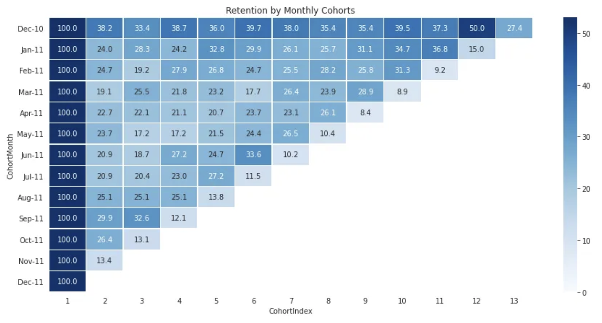
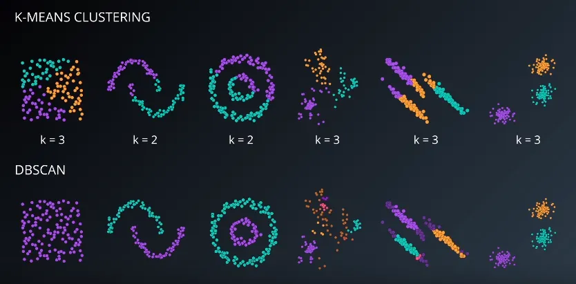
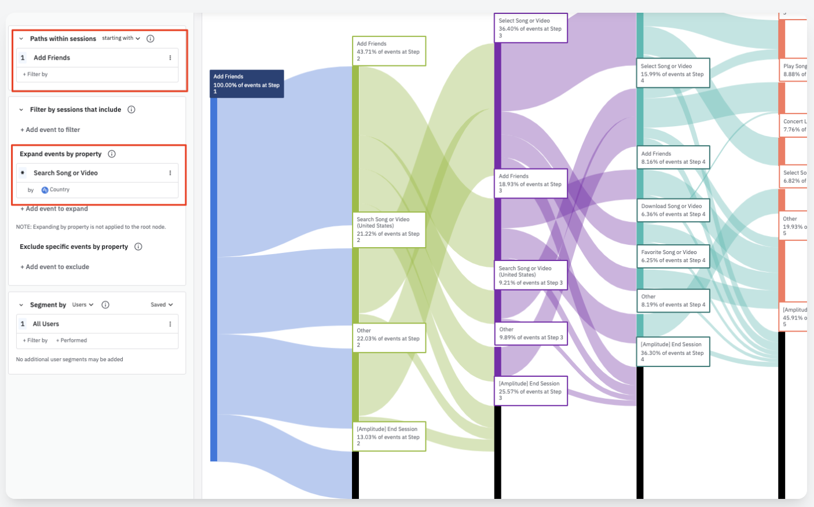
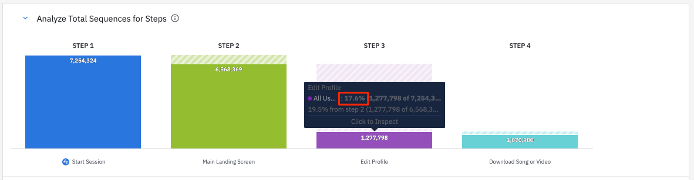
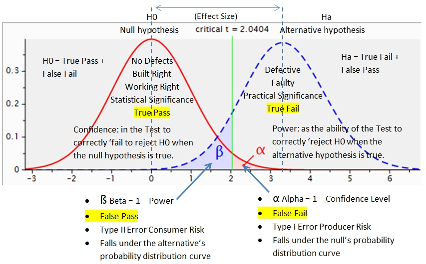

# 실행안

# 템플릿

기본 템플릿

|  | **내용** |
| --- | --- |
| **가설** | 검색 페이지를 방문하는 고객들의 검색결과에서의 필터 사용율을 높여줄 경우 검색을 통한 상품 발견율이 증가할 것이다. |
| **대상** | 검색페이지 방문고객 중 검색 경험이 없는 고객 |
| **위치** | 검색결과페이지 |
| **실행안** | 필터를 쉽게 사용할 수 있는 버튼 형태로 제공 |
| **목표지표** | 검색경험 없는 고객의 검색을 통한 상품 발견율 |
| **보조지표** | 필터 사용율 |ß
|  | 인당 검색결과 페이지에서의 상품 노출수 |
| **가드레일지표** | 모든 고객의 검색을 통한 상품 발견율 |

실험일 경우 추가 템플릿

|  | **내용** |
| --- | --- |
| 실험지표 | 실험지표인 목표지표와 보조지표, 가드레일 지표를 작성합니다. 이미 기본 템플릿에서 작성했다면 그것으로 갈음합니다. |
| 실험대상 | 이미 기본 템플릿에서 작성했다면 기 작성한 내용으로 갈음할 수 있습니다. 
| 실험크기 및 기간 | 유의수준 5% / 검정력 80% / 대조군에 비해 실험군의 목표지표가 30%증가할 경우 모수 10,000명 필요. 실험위치 트래픽 기준 7일 소요 예정 |
| 실험방식 | 다변량 테스트 |

# 가이드

# 실행안 가이드

실행안에서는 세부문제를 풀어내기 위해 기술한 가설이 실질적으로 기능과 제품으로 구현되도록 하기 위한 방안을 다룹니다. 실행안에서 가장 중요하게 다룰 부분은 사전분석입니다. 실행안을 구상하기에 앞서 실행안의 대상이 될 유저들의 특성은 어떠한지, 이 유저들은 제품의 어느 부분에서 활동하고 있는지, 그리고 어떻게 행동하고 있는지에 대한 사전분석을 통해 가설을 실행안으로 녹여낼 단서를 획득합니다. 이후 실행안이 실험(A/B테스트)로 진행되는지 여부에 따라 실험 진행을 위해 참고할 실험설계: 실험의 방법, 기간, 지표 설정까지 실행안에서 다룹니다.

물론 사전분석 없이도 제품 및 기능 배포와 실험을 진행할 수 있습니다. 만약 보다 빠른 실행과 실패, 반복을 위한 기반(충분한 엔지니어링 리소스, 실험 및 개발 플랫폼 등)이 잘 갖추어져 있다면 사전분석을 통해 실행안을 구상하는 대신 Product Manager나 UX Designer의 직관에 따라 사전분석 없이 실행안을 구상할 수도 있습니다. 하지만 대부분의 경우 사전분석을 통해 실행안을 구상하는 것이 장기적으로는 더 빠르게 고객을 위한 제품에 이르는 길이라 이 TDCC에서는 보고 있습니다. 그렇기에 간단하게라도 사전분석을 통해 실행안을 구상하는 것을 권장합니다.

# 사전분석이란?

사전분석은 가설과 실행안을 이어주는 작업입니다. 사전분석의 목표는 제품과 서비스의 데이터를 살펴본 결과를 토대로 가설의 선행지표를 변화시켜 목표지표를 움직일 수 있는 효과적인 실행안을 도출해내는 데 있습니다. 물론 이 과정을 거치지 않고도 가설과 실행안을 내놓을 수 있습니다. 하지만 보다 효과적인 반복과 실행을 위해서는 사전분석 결과를 토대로 한 가설과 실행안이 필요합니다.

# 사전분석의 단계

사전분석은 실행안의 대상이 될 유저를 알아보는 단계, 해당 유저가 제품의 어느 위치에서 활동하는 지를 알아보는 단계, 그리고 그 위치에서 어떤 행동을 하는지를 확인하는 단계로 구성됩니다. 이 세 단계에 대한 분석을 통해 어떤 가설로 제품을 개선시킬 수 있을지를 알아보고 보다 효과적인 실행안을 구상할 수 있습니다. 각 과정을 밟아나가는 것을 보다 자세히 설명하기 위해 이전 멘탈모델에서의 예시에서 수립한 멘탈모델과 이에 맞는 가설을 토대로 사전분석을 진행하는 과정을 설명해보도록 하겠습니다. 

세부문제는 “검색을 통한 상품발견율을 높이고자 하는 경우”입니다. 수립한 멘탈모델을 다시 돌아보자면 커머스 플랫폼에 진입하는 고객은 각기 다른 필요의 정도를 가지고 있을 것이며 그에 따라 다른 행동을 할 것이다라는 것이었습니다. 이 고객은 세 가지 부류로 나뉠 수 있으며 세 가지 고객 유형을 다시 보자면 아래와 같습니다.

- 필요가 구체적인 고객 - 구매 전환율 높음 / 구매 리드타임 짧음
- 필요가 있는 고객 - 구매 전환율 중간 / 구매 리드타임 중간
- 필요가 모호한 고객 - 구매 전환율 낮음 / 구매 리드타임 김

이에 따라 설정한 예시 가설은 “검색을 하는 고객(`대상`)의 검색페이지에서의 필터 사용율(`처치`)을 올린다면 발견 전환율(`목표지표`)가 증가할 것이다”입니다. 이를 토대로 사전분석의 단계에 대한 예시와 방법들을 살펴보도록 하겠습니다.

## 대상: 실행안의 대상이 되는 유저들은 어떤 사람들인가?

좋은 실행안이 만들어지기 위해서는 우선 실행안의 대상이 될 유저에 대한 이해가 필요합니다. 여기서는 멘탈모델과 가설을 이용합니다. 멘탈모델에서의 분류에 맞춰 가설의 대상을 정하고 가설의 대상이 가지는 특징적인 부분을 먼저 알아봅니다. 예를 들어, 가설에서 설정한 대상은 검색을 하는 고객이며 이 고객들은 멘탈모델 상 필요가 구체적인 고객일 가능성이 높습니다. 사전분석을 통해 고객들이 어떤 주기로 제품을 방문하는지, 어떤 특징을 가지고 있는지, 그리고 이러한 특징이 다른 고객이 가진 것과 어떻게 다른지를 확인할 수 있습니다. 이렇게 확인한 내용을 가설, 멘탈모델과 함께 생각하며 실행안의 대상을 정해볼 수 있습니다. 아래에서 설명한 분석방법들 중에 Segmentation을 통해 검색유저 중 특히 신규검색유저의 상품 발견율이 현저히 낮다는 사실을 발견했다고 가정해보겠습니다.

### 분석 방법

**1. Cohort**

Cohort는 특정 기간동안 공통된 특징을 공유하는 그룹의 사람들을 의미합니다. 흔히 우리가 Cohort를 아래와 같은 차트 형태로 그리는 것은 ‘특정 월에 제품을 방문한 고객’이나 ‘특정 주에 상품을 구매한 고객’과 같이 공통된 특성을 가진 유저들의 이후 기간 동안의 행동을 보기 위함입니다. 이처럼 Cohort 분석은 공통된 특징을 가진 그룹의 사람들을 상정한 기간 동안 관찰하며 특징을 알아보는 데에 강점이 있습니다.

코호트 차트. [Toward Data Science](https://towardsdatascience.com/strategy-analytics-in-python-1-churn-analysis-82cb0247fe6f)

**2. Segmentation**

몇 가지 지표를 통해 유저의 세그먼트를 나눠 분석해보는 방법도 있습니다. 여기에는 크게 1) Demographic을 이용한 방법, 2) Psychographic을 이용한 방법이 있습니다. Demographic은 성별, 연령, 지역등을 이용해 유저들의 세그먼트를 나눠보는 방식입니다. Psychographic은 유저의 행동 데이터를 토대로 유저의 세그먼트를 나눠보는 것을 의미합니다. 이 행동 데이터에 따라 세그먼트는 Affinity Audiences와 In-Market Audiences로 추가 분류될 수 있습니다([Google Ads Audience Segments](https://support.google.com/google-ads/answer/2497941?hl=en#zippy=%2Cdetailed-demographics)).

- **Affinity Audiences**: 관심사와 취미, 선호 라이프스타일 등에 따라 만들어진 유저 세그먼트입니다. 열정적인 스포츠인, 테크 관심가, 요리를 취미로 가진 사람 등이 예시가 될 수 있습니다.
- **In-Market Audiences**: 제품 안에서의 활동을 기준으로 나뉘어진 유저 세그먼트입니다. 구매, 장바구니, 상품탐색, 방문 등의 여러 활동을 토대로 VIP, 주요고객, 일반고객, 신규고객 등을 세그먼트로 나누어 보는 것이 하나의 예시입니다.

이 중에 가장 빈번하게 사용되는 것은 Psychographic의 In-Market Audiences입니다. 예를 들어 필요가 구체적인 고객은 방문 후 구매를 했을 것이라 가정하고 방문 후 구매까지 간 유저를 해당 세그먼트로, 필요가 모호한 고객은 방문 후 장바구니 상품 추가나 상품 좋아요와 같은 행동 없이 나갔을 것이라 가정하고 방문만 한 고객을 해당 세그먼트로 넣을 수 있습니다.

**3. Clustering | Classification**

중요하게 정의한 지표나 피쳐를 토대로 비지도 학습 방법을 이용하여 Clustering Analysis를 진행할 수도 있습니다. Clustering은 일반적으로 아래와 같은 종류가 있습니다.

K-Means Clustering과 DBSCAN의 비교. [Toward Data Science](https://towardsdatascience.com/unsupervised-machine-learning-clustering-analysis-d40f2b34ae7e)

- K-Means Clustering
- Hierarchichal Clustering
- Density Based Scan Clustering (DBSCAN)
- Gaussian Clustering Model

혹은 지표나 피쳐에 따라 유저 분류에 대한 답이 이미 있는 경우라면 지도 학습 방법을 이용하여 Classification을 진행할 수 있습니다. 여기에는 대표적으로 아래와 같은 종류가 있습니다

- K-NN

## 위치: 실행안은 어디서 실행되어야 하는가?

가설이 온전히 검증되기 위해서는 실행안이 진행될 제품의 위치도 잘 선정되어야 할 필요가 있습니다. 이를 위해서는 가설과 실행안의 대상이 되는 유저가 제품의 어떤 곳에서 어떻게 활동하고 있는지를 알아야 하고 그 활동의 맥락이 어떠한지를 알아내야 합니다. 예를 들어 위에서 설정한 대상인 처음으로 검색을 하는 신규검색유저들은 어떻게 검색 페이지를 찾아오는지, 검색 페이지에 진입한 후 어떤 경로로 나아가는지를 확인할 수 있습니다. 아래의 Funnel Analysis를 통해 검색 페이지에 진입하는 신규 검색 유저는 대부분 제품에 진입하자마자 검색을 찾고 바로 검색을 진행하지만 검색결과 페이지에서 결과를 많이 클릭하지 않고 이탈한다는 사실과 같은 것을 알아냈다고 가정해보겠습니다.

### 분석 방법

**1. Path Analysis**

첫 번째 방법은 Path Analysis를 통해 실제 제품에서 고객들이 어떤 여정을 거치며 제품을 이용하고 있는지를 파악하는 것입니다. Path Analysis는 관찰하고자 하는 첫 영역 부터 유저가 어떤 Flow를 거쳐 제품의 다음 영역으로 이동하는지를 보여줍니다. 이러한 Path Analysis는 유저가 제품을 이용하는 맥락을 쉽게 볼 수 있게 해준다는 것에 강점이 있습니다. 이를 통해 대상이 되는 고객이 어떤 여정을 거쳐 제품을 이용하고 있으며 이 중 어떤 부분에서 실행안을 기획할지에 대한 단서를 확보할 수 있습니다.

Path  Finder. [Amplitude](https://amplitude.com/docs/analytics/charts/legacy-charts/legacy-charts-pathfinder)

일반적으로 Path Analysis는 기준 이벤트나 영역을 중심으로 Previous Step들을 보는 방식, 그리고 Next Step들을 보는 방식으로 나뉘어집니다. Previous Step은 특정 영역에 진입하기까지 유저가 어떤 경로를 통해 접근해왔는지를 보는 데 유리하고 Next Steps는 특정 영역에 진입하고 나서 유저가 어느 영역으로 나아가는지를 보는 데 그 장점이 있습니다. 이러한 Path Analysis를 통해 유저의 흐름을 살펴보며 실행안을 진행해 볼 위치를 가늠해볼 수 있습니다.

**2. Funnel Analysis**

두 번째 방식은 Funnel Analysis를 통해 제품의 각 단계에서 고객들이 어떤 행동을 하고 있는지를 알아내는 것입니다. Funnel Analysis는 고객 행동의 단계를 규정하고 고객이 얼마나 다음 단계로 넘어가는지, 그 중에 얼마나 많은 유저가 이탈하는지를 살펴 보는 방식입니다. 이 방식은 Path Analysis처럼 유저의 모든 여정을 살피기 보다는 주목하고자하는 한 여정에 집중하여 유저가 단계별로 어떤 양상을 보이는 지를 보다 자세히 살펴볼 수 있다는 점에서 강점을 가지고 있습니다.

Funnel Diagram. [Amplitude](https://amplitude.com/docs/analytics/charts/legacy-charts/legacy-charts-pathfinder)

이러한 Funnel Analysis는 특정 제품의 물리적인 단계를 의미할 수도(e.g. 홈화면→검색화면→검색결과→상품상세), 논리적으로 규정된 고객의 행동을 단계에 따라 나눈 것일 수도 있습니다(e.g. 진입→발견→장바구니→구매). 이 중 하나의 방식을 선택하여 고객에게 접근해볼 수 있을 만한 단계, 혹은 위치를 사전적으로 확인하여 실행안을 진행할 곳을 정할 수 있습니다.

## 행동: 실행안의 대상이 되는 유저들은 어떤 행동을 하는가?

마지막으로, 좋은 실행을 위해서는 가설의 대상이 되는 유저들이 어떤 행동을 하고 있는지, 그 현황을 파악하고 그것을 토대로 처치를 하기 위한 구체적 방안이 나올 수 있어야 합니다. 유저들이 하는 행동을 분석하며 어떤 실행안을 기획하고 실행해야 원하는 결과를 만들어낼 수 있는지를 미리 확인하기 위해 유저들의 행동 현황을 사전적으로 분석합니다. 예를 들어, 신규검색유저가 가장 많이 이탈하는 검색결과 페이지에서 유저들이 어떤 행동을 하는지를 관찰할 수 있습니다. 아래의 분석방법 중 Active Engagement를 이용, 신규검색유저들이 스크롤을 일정수준 이상 내리면서 상품을 찾기는 하나 원하는 상품을 찾지 못하고 제품을 이탈한다는 사실을 알아냈다고 가정합니다.

### 분석 방법

**1. Active Engagement**

첫 번째 방식은 대상 유저들이 해당 위치에서 보여주는 Active Engagement를 관찰하는 것입니다. Active Engagement는 실제 유저가 직접 행동을 한 결과로 집계되는 지표들을 이용해 행동을 분석하는 것입니다. 예를 들어 버튼 클릭, 스와이프, 스크롤 다운 등 유저가 직접 행동을 한 결과로 발생하는 데이터를 토대로 유저를 분석해볼 수 있습니다. 팀이 속한 게임이 Attention Game이라면 컨텐츠 소비나 댓글, 좋아요와 같은 반응 행동을, Transaction Game이라면 상품상세 방문, 장바구니 담기와 같은 행동을, Productivity Game이라면 글 작성이나 그림 그리기 행동 등을 확인할 수 있습니다(Lean Analytics).

**2. Passive Engagement**

다음으로는 대상 유저들이 보고자 하는 제품의 위치에서 보여주는 Passive Engagement를 확인하는 것입니다. Passive Engagement는 유저가 직접 행동을 하지는 않았지만 관찰될 수 있는 지표들을 이용해 유저의 행동을 분석하는 방식입니다. 예를 들어, 유저가 특정 버튼을 클릭하지는 않았지만 해당 버튼을 3초 이상 보고 있었다면 적어도 해당 버튼을 클릭할지 말지 고민했다고 가정해볼 수 있습니다. 이렇듯 직접 행동을 하지는 않았지만 관찰될 수 있는 데이터를 통해 Passive Engagement을 확인할 수 있습니다. 팀이 속한 게임이 Attention Game이라면 컨텐츠를 오랜기간 보고 있는 행동을, Transaction Game이라면 스크롤을 하다 특정 상품에 오래 멈춰있는 행동을, Productivity Game이라면 도구창을 오래동안 보고 있는 행동 등을 확인할 수 있습니다.

**3. Time Spent**

대상 유저들이 해당 위치에서 얼마나 많은 시간을 쓰고 있는지를 보는 것 또한 유저의 행동을 관찰할 수 있는 좋은 방법 중 하나입니다. 유저가 시간을 많이, 혹은 적게 쓰고 있다는 것은 맥락에 따라 제품 이용 방식에 대한 중요한 단서를 주는 것이 될 수 있기 때문입니다. 보통 체류시간을 보는 방법은 1) 유저당 평균 체류시간을 보는 방법을 사용하거나 2) 유저당 평균 세션수를 활용하는 방법이 주로 사용됩니다. 팀이 속한 게임이 Attention Game이라면 체류시간과 세션 수가 길수록 좋을 것이며, Transaction Game이라면 맥락에 따라 짧은게 좋을 수도, 혹은 긴게 좋을 수도 있으며, Productivity Game이라면 체류시간과 세션 수가 짧을수록 좋을 수 있습니다.

**4. Retention**

마지막으로 대상 유저들이 해당 위치에 잔존하는지 여부를 확인하는 것 또한 행동 관찰에 있어 중요한 인사이트를 줄 수 있습니다. 유저가 잔존하고 있다는 것은 해당 제품이 유저에게 가치를 주고 있다는 것을 의미하기 때문입니다. 이러한 Retention은 여러 가지를 기준으로 집계될 수 있는데, 해당 위치의 방문을 기준으로 집계될 수 있으며, 혹은 해당 위치에서의 중요한 행동을 기준으로 잡고 Retention을 집계할 수도 있습니다. 팀이 속한 게임이 Attention Game이라면 방문 Retention으로도 많은 것을 볼 수 있으며, Transaction Game이라면 구매나 장바구니 Retention을 중요한 기준으로 잡게될 가능성이 크고, Productivity Game이라면 결과물 제작이나 의도한 활동을 중심으로 Retention을 확인하는 것이 좋을 수 있습니다.

# 사전분석 결과

사전분석의 결과는 실행안의 대상이 될 유저들에 대한 기술(세그먼트나 코호트, 클러스터)과 실행안이 진행될 정확한 위치에 대한 정보, 그리고 그 위치에서 유저들이 보여주는 특징적인 행동을 나타내는 지표들로 구성됩니다. 위에서 본 예시들을 정리해보자면 아래와 같습니다.

- 대상 - 신규검색유저의 상품 발견율은 기존유저에 비해 45% 낮다
- 위치 - 검색시작페이지에 진입한 신규검색유저 중 90%는 검색을 진행하고 검색결과페이지로 이동하나 이 중 70%가 검색결과페이지에서 상품을 클릭하지 않고 이탈한다
- 행동 - 70%에 달하는 검색결과페이지에서의 이탈유저들 중 80%의 유저들은 검색결과페이지에서 첫 번째 pagination이 끝나는 시점까지 스크롤하나 상품을 클릭하지 않고 이탈한다

이러한 사전분석 결과에 따라 아래와 같이 실행안을 내어놓을 수 있습니다. 이러한 사전분석 결과를 토대로 한 실행안을 템플릿에 작성합니다.

- 대상 - 신규 검색 유저
- 위치 - 검색결과페이지
- 실행안 - 필터를 쉽게 사용할 수 있는 버튼 형태로 제공하여 탐색방법을 추가한다

# 실험 설계

실행안이 만약 실험일 경우에는 실행안을 실행하기 이전에 실험을 기획하고 설계할 필요가 있습니다. 이 부분에서는 실험을 어떻게 설계할지를 다룹니다.

### 실험 지표 (Overall Evaluation Criterion)

실험 지표에는 크게 목표지표, 보조지표, 가드레일 지표가 있습니다. 각 지표에 대한 자세한 설명은 아래와 같습니다. 실험을 진행하고 그 결과를 잘 해석하기 위해서는 각 지표들이 필수적으로 잘 정의되어야 합니다.

| **지표** | **설명** | **예시** |
| --- | --- | --- |
| 목표지표 | 목표지표는 실험을 통해서 변화시키고자 하는 지표를 의미합니다. 이는 가설 Object에서 이미 주어지며 위의 예시와 연결해서 보면 검색을 통한 상품 발견율이 됩니다. | 필터 사용율 |
| 보조지표 | 보조지표는 목표지표보다 민감히, 빠르게 움직이며 목표지표와 인과적 관계를 가지고 있을 것으로 추정되는 지표입니다. 예를 들어 검색결과 페이지에서의 필터 사용율, 검색결과 페이지에서의 인당 필터 사용 횟수가 될 수 있습니다. | 필터 노출율 |
| 가드레일지표 | 가드레일지표는 가정을 위반하는 것을 방지하는 지표로 비즈니스 성과의 보호를 위한 성격의 지표와 실험 결과의 신뢰성, 내부 타당성을 평가하기 위한 지표가 있습니다. 대부분의 경우 전자의 성격을 띄며, 여기서는 검색을 통한 인당 거래액, 매출액이 될 수 있습니다. (필터를 통해 저렴한 제품을 많이 더 발견하게 되며 인당 거래액이 하락하는 경우) | 상품 발견율 |

이러한 실험 지표는 아래와 같은 특성을 가지고 있어야 합니다.

- 측정 가능: 실제로 측정 가능해야 합니다. 구매 후 만족도와 같이 측정하기 어렵거나 불가능한 것은 좋은 실험 지표가 될 수 없습니다.
- 귀속 가능: 실험 지표는 대조군 및 모든 변형군에 귀속 가능해야 합니다. 예를 들어, 어떤 지표를 대조군에서는 관찰할 수 없고 실험군에서만 관찰할 수 있다면 동일한 지표로 비교가 가능하지 않으므로 이는 귀속 가능하지 않다고 표현되며 이는 좋은 지표가 되기 어렵습니다.
- 민감하고 시기적절함: 지표는 충분히 민감하고 시기적절해야합니다. 극단적으로 예시를 들면 회사의 주가는 실제 제품과 기능의 배포와는 너무 멀리 떨어져 있기에 민감하고 좋은 지표라고 하기는 어렵습니다. 그 외에도 단순히 특정 페이지에서의 CTR이 증가했다고 하더라도 다른 유관 페이지에서의 Cannibalization을 고려하지 않으면 좋은 지표가 되기 어렵습니다.

### 실험 대상

실험의 대상은 실험의 대상이 되는 유저 그룹이나 세그먼트를 의미합니다. 실험의 대상은 사전분석에서 분석한 대상을 실험의 대상으로 설정할 수도, 대상에 대한 사전분석을 특별히 진행하지 않았다면 이 단계에서 실험 대상을 선택할 수 있습니다. 예를 들어 커머스의 검색결과 페이지에서 실험을 진행하는 경우 아래와 같이 실험 대상을 생각해볼 수 있습니다. 

- 서비스 이용 경험 - 서비스를 이전에 이용해 본 경험이 있는 기존 유저, 혹은 서비스를 이전에 이용해 본 경험이 없는 신규 유저를 대상으로 실험을 진행할 수 있습니다. 예를 들어 최초 로그인 유저의 쉬운 로그인을 돕기 위한 기능을 배포하는 경우, 커머스에서의 결제가 익숙치 않은 유저를 위한 안내 기능을 배포하는 경우, 신규 유저를 대상으로 하는 것이 기능의 효과를 보다 명확히 관찰하는 데 유리할 수 있습니다.
- 인구통계학(Demographic) - 연령대, 성별 등 인구통계학적인 기준들을 토대로 실험의 대상을 결정할 수 있습니다. 예를 들어, 시력이 좋지 못한 사람들을 위해 글씨 크기나 아이콘의 크기를 키울 수 있는 기능을 제공하는 배포의 경우 상대적으로 시력이 낮은 사람이 많을 확율이 높은 고연령대의 유저를 실험 대상으로 하는 것이 유리할 수 있습니다.
- 행동 특성
    - 특정 기능 경험 - 특정 기능을 경험해 보았는 지 여부를 기준으로 실험 대상을 설정할 수 있습니다. 예를 들어 커머스에서 장바구니 관련 기능을 출시할 때 장바구니를 사용해 본 경험이 있는 유저를 대상으로 한다면 보다 결과를 효과적으로 확인할 수 있습니다
    - 특정 행동 빈도 높음 - 어떠한 기능을 자주, 많이 이용하는지에 따라서도 실험 대상을 선정할 수 있습니다. 예시로 구매이력에 따라 상품을 추천해주는 기능을 배포하는 경우 대상을 N회 이상 구매를 해본 유저로 한다면 해당 기능의 효과를 보다 명확하게 알아낼 수 있습니다.
    - 여러 행동 기준 특성 - 특정 행동 빈도 이외에도 여러 가지 행동을 기준으로 실험 대상을 정하고 실험을 진행할 수 있습니다. 예를 들어 최근 7일 내 제품을 3일 이상 방문했으면서 1회 이상 상품 발견과 장바구니 기능을 이용한 유저를 대상으로 장바구니의 상품을 리마인드해주는 기능을 실험해볼 수 있습니다.

### 실험의 크기 및 기간

가설 검정. [TestView](https://testview.wordpress.com/tag/significance/)

실험의 크기는 실험에 참여하는 유저의 규모를 의미합니다. 일반적으로 실험의 크기는 결과의 정밀도에 직접적인 영향을 끼칩니다. 작은 변화를 감지하거나 결론에 좀 더 충실해지기 위해서는 실험의 크기를 충분히 크게 가져가야할 필요가 있습니다. 실험을 진행하고 그 결과를 온전히 측정하기 위한 실험의 최소 크기를 결정하기 위해서는 MDE(Minimum Detectable Effect)와 유의수준, 검정력을 결정해야 합니다. MDE를 쉽게 표현하자면 우리가 실험을 통해서 변화시키고자 하는 목표지표가 최소 이 정도는 증가해야 팀이 유의미한 결론을 내려볼 수 있다고 말하는, 그 정도를 의미합니다. 다음으로는 실험의 결과가 우연히 나올 확율을 어느 정도로 제한할 것인지를 결정하는 유의 수준과 실험의 결과가 실험군의 결과로 나왔을 때 그 결과를 참으로 확인하게 될 확율인 검정력을 결정하게 됩니다. 이는 아래와 같이 결정해볼 수 있습니다.

| **항목** | **일반적 기준** | **설정 방법** |
| --- | --- | --- |
| **MDE** | 특별한 일반적 기준이 있지는 않음 | 다양한 방법이 있으며 MDE를 설정하는 방법의 여러 가지 사례는 링크를 참조 |
| **유의 수준** | 10% / 5% / 1% 중 하나를 선택 | 실험의 결과에 대한 신뢰성을 상대적으로 너그롭게 보고자 한다면 10%, 엄격하게 보고자 한다면 1%를 선택합니다. 일반적으로 5%를 많이 선택합니다. |
| **검정력** | 75% / 80% / 90% / 95% 중 하나를 선택 | 실험의 결과에 대한 신뢰성을 상대적으로 너그롭게 보고자 한다면 75%, 엄격하게 보고자 한다면 95%를 선택합니다. 일반적으로 80%를 많이 선택합니다. |

실험 기간은 위에서 언급한 MDE, 유의 수준, 검정력을 기준으로 하여 결정됩니다. 이 세 항목을 기준으로 어느 정도 Effect Size에서 어느 정도의 샘플이 필요한 지를 확인한 후, 실험이 진행되는 제품의 영역에는 몇 명의 유저들이 들어오는지를 확인하며 실험의 기간을 정해볼 수 있습니다. 계산은 아래와 같은 계산 기능을 제공해주는 사이트를 통해 빠르게 계산해볼 수 있습니다.

- [AB Test Guide](https://abtestguide.com/abtestsize/)
- [Optimizely](https://www.optimizely.com/sample-size-calculator/#/?conversion=3&effect=20&significance=95)

### 실험 방식

실험의 크기 및 기간이 정해졌다면 마지막으로 실험 방식을 결정합니다. 실험 방식은 실험하고자 하는 지표와 상황, 가설과 맥락에 따라 여러 가지 케이스가 있을 수 있습니다. 크게 아래 세 가지 케이스를 토대로 각 케이스 안에서 상황에 맞는 실험 방식을 선택합니다. 이러한 실험 방식까지 선택이 완료되었다면 정한 내용들을 실험 템플릿에 채워넣습니다.

| **케이스** | **실험 방식** | **설명** | 유의사항 |
| --- | --- | --- | --- |
| 몇 개의 변수를 실험할 것인가? | A/B 테스트 | 대조군 1개와 실험군 1개가 경쟁하는 전통적인 A/B 테스트입니다 |  |
|  | 다변량 테스트 | 대조군 1개와 실험군 2개 이상이 경쟁하는 다변량 테스트입니다. 여러 가지의 안을 한꺼번에 실험하고 비교할 때 유리합니다. |  |
| 실험 중간에 기능에 따른 고객의 반응이 달라질 수 있는가? | 전통적인 A/B 테스트 | Sequential A/B Testing과 대비되는 일반적으로 주어진 기간 동안 진행되고, 실험이 종료되는 시점에 한 번 분석되는, 우리가 알고 있는 A/B 테스트입니다 | 실험군이 이긴 것으로 보이지만 아직 더 실험이 진행될 필요가 있는 시점에 실험 결과를 내고 승리군을 선정하는 P-Value Peeking 문제가 발생할 수 있습니다. |
|  | 연속적인 A/B 테스트
(Sequential A/B Testing) | 실시간으로 실험의 성과를 모니터링하며 실험을 안정적으로 결론내릴 수 있는 시점에 승리군을 지정합니다. P-Value Peeking 문제와 좋은 경험의 제품을 고객에게 더 빨리 배포할 수 있다는 장점이 있습니다 |  |
| 장기적으로 관찰이 필요한 기능과 배포는 어떻게 볼 것인가? | 장기실험 | 실험하고자 하는 기능, 제품의 장기적인 효과를 측정하기 위해 긴 기간 동안 실험을 진행합니다. |  |
|  | 시간차 변수 실험 | 실험기간 동안(T1 + T2) 동일한 변인을 가진 실험군을 두 개로 나눠 첫 번째 실험군은 T1과 T2 동안, 두 번째 실험군은 T2에 실험군에 편입되도록 하는 방식입니다. 첫 번째와 두 번째 실험군을 비교하여 장기적 효과를 유추해볼 수 있습니다. |  |
|  | 보류 및 역실험 | 우선 90% 유저를 대상으로 배포를 진행함과 동시에 10%의 유저를 실험군으로 남겨 실험을 진행하는 방식입니다. 부작용이 예상되나 사정으로 인해 빨리 배포를 진행해야 하는 기능의 장기적 효과를 탐색하고 개선필요여부를 판단하는 데 효과적입니다. |  |

# 추가 고려사항

위 내용들을 토대로 실험 템플릿을 충분히 다 채울 수 있으나, 종종 예외 상황이 생길 수 있습니다. 이에 따라 아래와 같은 추가사항들을 고려하며 실험의 무결성을 보다 높은 수준으로 가져갈 수 있습니다.

### A/A Test

Null 테스트라고도 불리는 A/A Test는 기본적으로 실험과 실험 플랫폼에 대한 신뢰를 확보하기 위한 방법입니다. 간혹 무작위 배정에 문제가 생기는 경우가 있는데 이는 실험 플랫폼이 실험의 대상이 되는 유저를 랜덤하게 배정하는 과정에서 문제가 생겨서 발생할 수도 있고, 유저가 사용하는 기기의 차이 등 예상치 못한 변수가 개입해 무작위성에 문제가 생기는 경우에도 발생할 수 있습니다. 이에 따라 아래와 같이 A/A Test를 진행하여 이러한 문제가 발생했는지 확인하고 문제가 생겼을 경우 조치를 취할 수 있습니다.

- 실험 진행중에 A/A Test를 진행하는 경우
    - 어떠한 가설을 확인하기 위해 실험을 진행하는 중 A/A Test를 함께 진행하는 경우에는 실험 대상의 일부를 할당해 A/A Test를 진행합니다
    - 대조군 4.5: 실험군 4.5: 대조군 1
- A/A Test를 위해 실험을 진행하는 경우
    - 실험 플랫폼의 무결성 테스트 등을 위해 A/A Test만을 위해 실험을 진행하는 경우 유저를 5:5로 나누어 진행할 수 있습니다.
    - 대조군 5: 대조군 5

### 실험 간의 누출 및 간섭

기본적으로 실험에서는 실험이 진행되는 동안 특정 실험 그룹의 행동이 다른 실험 그룹의 유저에게, 혹은 다른 실험이 다른 실험에 영향을 끼치지 않는 것을 기본으로 가정하고 있습니다. 만약 가정을 깨고 이러한 일이 발생할 경우, 실험 간의 누출 및 간섭이 발생했다고 합니다.

- 직접 연결된 경우
    - 실험군의 변인이 직접적으로 대조군의 행동에 영향을 끼치는 경우를 의미합니다.
    - 예를 들어 소셜 네트워크 서비스에서 개선된 친구 추천 로직을 변인으로 실험을 진행하는 경우, 대조군에 해당하는 유저가 실험군에 해당하는 유저의 개선된 추천 로직으로 친구 요청을 많이 받게 되고 이에 따라 신청을 받기 위해 소셜 네트워크 서비스에 방문하여 더 많은 사람과 연결되며 간섭이 발생할 수 있습니다.
- 간접 연결된 경우
    - 잠재 변인이나 공유 리소스로 인해 대조군이 영향을 받는 경우를 말합니다.
    - 예를 들어 커머스에서 판매자가 적은 카테고리에 대해 실험을 진행하는 경우, 실험군의 상품 발견 기능을 통해 해당 카테고리의 판매가 활성화된 경우, 대조군과 실험군 유저 모두가 공유하는 해당 카테고리 상품의 재고가 없어질 경우 대조군의 유저가 구매를 못하게 되며 실험군의 성과가 과대평가될 수 있습니다.

# Reference

Unsupervised Machine Learning: Clustering Analysis, Churn Cohort Analysis With Python. Toward Data Science.

[Amplitude Website, Blog.](https://amplitude.com/)

[The Effect of Power and Confidence in Electronics Testing](https://testview.wordpress.com/2015/07/10/the-effect-of-power-and-confidence-in-electronics-testing/). TestView

A/B 테스트(2022). 론 코하비, 다이앤 탕, 야 쉬.