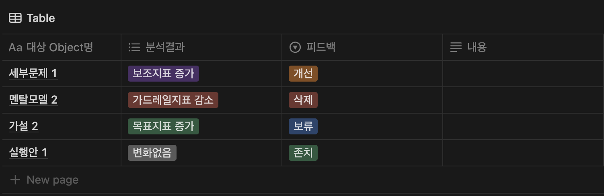
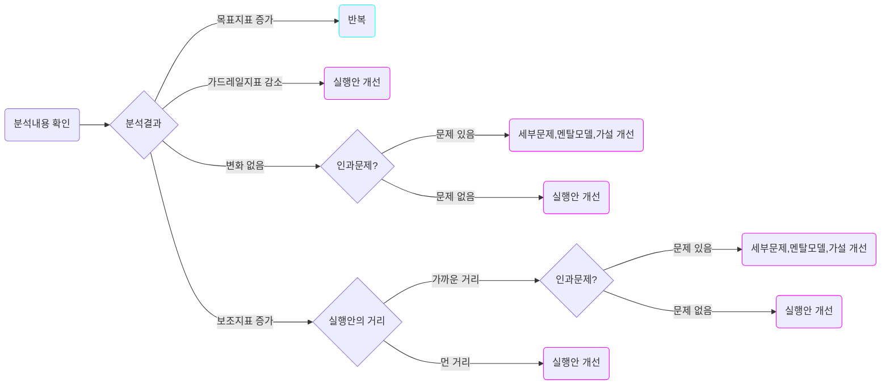

# 피드백

# 템플릿

# 가이드

# 피드백 가이드

피드백은 분석 내용을 토대로 어떤 문제, 세부문제, 멘탈모델, 가설, 실행안 Object가 1) 유효하다고 여겨져 존치되거나 2) 개선이 필요하다고 생각되어 개선되거나 3) 무효한 것으로 판명되어 삭제될지에 대한 내용을 담고 있는 Object입니다. 이는 분석 Object가 담고 있는 분석 결과에 기반하여 진행됩니다.

# 피드백 알고리즘

피드백 알고리즘에서 가장 먼저 진행되어야 할 것은 우선 분석내용과 결과를 확인하는 작업입니다. 우선 분석 내용을 확인하면 우선 다음과 같은 것들을 알 수 있습니다

- 목표지표는 어떻게 변화했는가?
- 보조지표는 어떻게 변화했는가?
- 가드레일 지표는 어떻게 변화했는가?

위의 내용에 따라 다음과 같이 피드백 내용을 작성할 수 있습니다.

| **분석내용** | **상황** | **대응** |
| --- | --- | --- |
| 목표지표 증가 | 가드레일지표가 부정적으로 변화하지는 않은 경우 | 동일한 멘탈모델, 가설, 발전된 다음 실행안을 토대로 반복을 진행합니다 |
| 보조지표 증가 | 실행안의 거리가 목표지표에 영향을 직접적으로 끼치기에는 너무 먼 거리였을 경우 | 다음 실행안은 목표지표와 좀 더 가까운 거리에서 실행을 진행하거나, 보조지표를 타겟하는 것이 맞다고 판단된다면 이를 타겟하는 실행안으로 개선합니다 |
|  | 실행안의 거리가 충분히 가까웠는데 목표지표와 세부문제의 지표간의 인과가 문제있어보이는 경우 | 가설의 기반이 되는 멘탈모델이나 멘탈모델을 기반으로 나온 가설의 문제일 수도, 혹은 이들 모두 위에 있는 세부문제의 문제일 수 있습니다. 이들 중에 문제가 있는 것을 찾고 개선합니다 |
|  | 실행안의 거리가 충분히 가까웠는데 목표지표와 세부문제의 지표간의 인과문제가 없어보이는 경우 | 가설이나 멘탈모델의 문제가 아니라 실행안이 충분히 인과를 반영하지 못하게 설계되었을 수 있습니다. 실행안을 개선합니다 |
| 가드레일지표 감소 | 목표지표는 증가헀는데 가드레일지표가 감소한 경우, 혹은 목표지표가 증가하지 못했고 가드레일지표가 감소한 경우 | 실행안이 충분히 가드레일 지표를 고려하여 설계되지 못했을 수 있습니다. 실행안을 개선합니다 |
| 변화없음 | 목표지표와 세부문제의 지표간의 인과가 문제있어보이는 경우 | 가설의 기반이 되는 멘탈모델이나 멘탈모델을 기반으로 나온 가설의 문제일 수 있습니다. 이들 중에 문제가 있는 것을 찾고 개선합니다. 혹은, 상위에 있는 세부문제의 정의가 잘못된 것은 아닌지 확인합니다 |
|  | 목표지표와 세부문제의 지표간의 인과문제가 없어보이는 경우 | 가설이나 멘탈모델의 문제가 아니라 실행안이 충분히 인과를 반영하지 못하게 설계되었을 수 있습니다. 실행안을 개선합니다 |

각각 상황과 대응에 따라 피드백 내용을 최종적으로 작성한 이후에 이 피드백 내용을 토대로 Proposal을 작성하도록 합니다. 이에 따라 개선되고 발전하는 문제, 세부문제, 멘탈모델, 가설, 실행안은 Dynamic이라는 프레임워크의 핵심가치를 반영하는 요소 중 하나입니다.