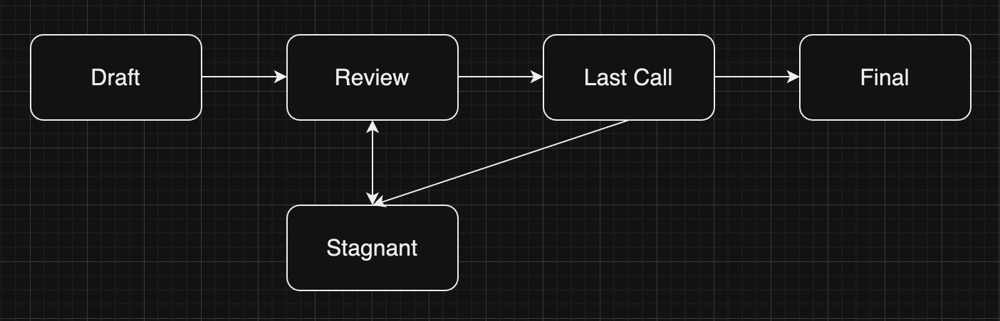

# Proposal

# 템플릿

아래는 예시를 토대로 템플릿을 작성해 본 내용입니다.

| **컨텐츠** | **설명** |
| --- | --- |
| **종류** | Conception Level Proposal |
| **대상** | **세부문제 Object**  - 검색을 통해 상품을 잘 발견하도록 한다  **멘탈모델 Object** - 고객의 상품발견 모델 **가설 Object** - 검색 페이지를 방문하는 고객들의 검색결과에서의 필터 사용율을 높여줄 경우 검색을 통한 상품 발견율이 증가할 것이다. **실행안 Object** - 필터를 쉽게 사용할 수 있는 버튼 형태로 제공 - 필터의 디폴트 값을 검색자 성별에 맞춰 제공 |
| **조치** | **세부문제 Object** - 개선 **멘탈모델 Object** - 존치 **가설 Object** - 삭제 & 생성 **실행안 Object** - 삭제 & 생성 |
| **동기 및 근거** | **세부문제 Object** - 세부문제를 해결하기 위한 가설, 실행안 Object의 잇다른 실패와 지표를 변화시키지 못하는 것으로 보았을 때 기존의 세부문제 Object로는 세부문제가 충분히 고객의 문제를 대변하지 못하고 있다고 판단. 이에 대한 개선을 진행  **멘탈모델 Object** - 멘탈모델 자체에는 크게 문제가 없는 것으로 생각되기에 우선은 존치 판단  **가설 Object** - ‘필터를 쉽게 사용할 수 있는 버튼 형태로 제공’과 ‘필터의 디폴트 값을 검색자 성별에 맞춰 제공’ 실행안들을 분석해 본 결과 둘 다 모든 지표에서 변화가 없던 상황. 결국 필터 사용율과 검색을 통한 상품 발견율은 인과가 없는 것으로 확인. 삭제를 진행하고 새롭게 개선된 세부문제에 맞는 가설 Object를 새로 생성  **실행안 Object** - 세부문제 개선과 가설의 삭제, 생성으로 인한 교체로 인해 새로운 가설에 맞는 실행안으로 교체 필요. 기존의 실행안 Object들을 삭제하고 새로운 실행안 Object들을 생성 |
| **사양** | **세부문제 Object** - ‘검색을 통해 상품을 잘 발견하도록 한다’ → ‘직접탐색을 통해 상품을 잘 발견하도록 한다’ 로 `개선`  **가설 Object** - 검색 페이지를 방문하는 고객들의 검색결과에서의 필터 사용율을 높여줄 경우 검색을 통한 상품 발견율이 증가할 것이다. → `삭제` - 직접 탐색을 진행하는 고객들에게 탐색 보조기능을 제공해줄 경우 직접 탐색을 통한 상품 발견율이 증가할 것이다 → `생성`  **실행안 Object** - 필터를 쉽게 사용할 수 있는 버튼 형태로 제공 → `삭제` - 필터의 디폴트 값을 검색자 성별에 맞춰 제공 → `삭제` - 검색결과페이지에 도달한 고객에게 가이드 UI를 제공 → `생성` - 검색결과페이지에 도달한 고객에게 검색결과별 섹션에 도달할 수 있는 숏컷 제공 → `생성` |

# 가이드

# Proposal의 작성

## 종류

어떤 Level의 Object에 대한 Proposal인지에 따라 Proposal의 종류가 나뉘게 됩니다. Proposal의 종류가 나뉜 이유는 Proposal의 대상이 되는 Level에 따라 작성할 대상, 타입, 동기 및 근거, 사양의 내용이 달라질 수 있기 때문입니다. Proposal의 자세한 종류는 아래와 같습니다.

### **Conception Level Proposal**

Conception Level에 있는 Object들인 문제, 세부문제 타입의 Object에 대한 피드백과 개선사항을 담고 있는 Proposal입니다. 이 Level의 Object가 바뀔 경우 해당 Object와 그 아래에 연결되어 있는 Execution Level의 Object가 함께 바뀌어야할 가능성이 매우 높기에 상대적으로 신중하고 정교하게 Proposal이 진행되어야 할 필요가 있는 종류의 Proposal입니다.

### **Execution Level Proposal**

실행과 직결된 Execution Level의 Object들인 멘탈모델, 가설, 실행안 Object에 대한 개선 및 수정 내용을 담고 있는 Proposal입니다. 상대적으로 영향범위가 좁기에 빠르게 Proposal을 통해 변화하는 것이 권장되는 종류의 Proposal입니다.

### **Feedback Level Proposal**

Feedback Level에 포함된 분석과 피드백 타입 Object를 대상으로 하는 Proposal입니다. 좋은 Proposal이 나오기 위해 분석과 피드백이 어떻게 발전해야할지에 대한 논의이기에 Proposal 자체의 퀄리티에 중요한 종류입니다. Object 자체에 대한 피드백, 즉 분석 내용이 타당한가 타당하지 않은가에 대한 내용을 담고 있을 수도, 내용을 작성하는 과정에 대한 내용을 담고 있을 수도 있습니다.

## 대상

정확하게 Proposal의 대상이 되는 Object를 기술합니다. 선택한 Proposal의 종류에 따라 선택할 수 있는 Object의 타입이 달라집니다. 이는 아래와 같습니다

- **Conception Level Proposal: 문제, 세부문제**
- **Execution Level Proposal: 멘탈모델, 가설, 실행안**
- **Feedback Level Proposal: 분석, 피드백**

## 조치

Object에 어떤 작업을 할지를 결정합니다. 존치/개선/삭제가 기술될 수 있으며 각 내용에 따라 아래와 같이 대상 Object에 대한 개선 및 피드백을 진행합니다.

- 존치: 해당 Object를 계속 유지하는 결정입니다. 일반적으로 하위 Object는 개선/삭제/생성되나 해당 Object는 잘못된 것이 없는 것으로 여겨질 경우의 조치입니다.
- 개선: 해당 Object에 일부 문제가 있는 것으로 보고 이를 개선하는 결정입니다.
- 삭제: 해당 Object에 큰 문제가 있어 개선보다는 제거하는 것이 더 합리적인 것으로 판단될 경우의 조치입니다.
- 생성: 고객의 문제를 풀기 위해 새로운 내용을 담은 Object가 필요하다고 판단될 경우의 조치입니다.

## 동기 및 근거

해당 Proposal을 진행하게 된 배경과 그 이유를 간략히 서술합니다. 이는 분석 Object와 피드백 Object를 기준으로 합니다. 분석 내용을 토대로 목표지표나 보조지표가 움직였는지, 그에 따라 가드레일 지표가 훼손되지는 않았는지를 확인합니다. 그에 따라 가설의 잘못인지, 세부 문제에 문제가 있는 것인지, 아니면 실행안이 충분치 않았는지를 알아봅니다. 동기 및 근거란에는 이러한 판단에 근거해서 왜 대상 Object, 혹은 Object들이 존치/개선/삭제/생성되어야 하는지를 서술합니다.

## 사양

마지막으로 사양에는 조치에 대한 세부 내용과 계획을 담습니다. 다만, 존치와 삭제의 경우는 따로 사양을 적을 필요는 없습니다. 예를 들어, 특정한 Object가 삭제되는 경우에는 삭제되는 대상에 대한 동기와 근거만 있으면 됩니다. 반면에, 새로운 Object가 생성되는 경우 해당 Object는 어떤 내용을 담고 있는지를 Object Guide의 템플릿에 따라 간단히 서술해줍니다.

# Proposal의 진행

Proposal은 아래와 같은 단계로 진행되며 이는 TDCC 소개에서 설명했던 내용과 동일합니다. 다만, Proposal의 종류에 따라 위 단계를 모두 진행하지 않고 일부 생략하여 진행할 수 있다는 점을 추가적으로 설명하고자 합니다.

1. Draft: 피드백 Object의 내용을 토대로 작성된 Proposal 초안입니다. 아직은 Draft 단계로 적용되려면 이후 단계를 거쳐야 합니다.
2. Review: Draft에 대한 리뷰를 진행합니다. 종류와 대상, 조치 등에 대해 모두가 동의하는지, 동기 및 근거나 사양에 대해 팀원이 공감하는지를 확인합니다. 일반적으로 회고 시점에 진행됩니다.
    1. Stagnant: Draft가 작성되었으나 Review나 Last Call에서 Consensus에 이르지 못한 Proposal이 가게 되는 단계입니다. 이후 논의를 거쳐 다시 Draft단계로 돌아가 리뷰를 다시 받아 다음 과정으로 나아가거나 영구히 삭제될 수 있습니다.
3. Last Call: 최종적으로 해당 Proposal을 수용하여 Object들의 소속 Layer를 변경시키거나 새로운 Object를 생성할지, 어떤 Object를 삭제할지 등을 결정하는 과정입니다. 회고 시점, 혹은 회고 이후에 진행될 수 있습니다. 
4. Final: Last Call에서 적용으로 결론이 난 Proposal의 내용에 따라 프레임워크를 업데이트하는 단계입니다. 

Conception Level Proposal은 제품 개선 과정의 근간을 이루는 문제와 세부문제 Object에 대한 Proposal입니다. 이에 따라 이는 팀의 방향성과 제품 개선의 미래 향방에 큰 영향을 끼칠 수 있습니다. 그렇기에 이는 다소 신중할 필요가 있으며 이에 따라 위 Proposal 진행의 전 과정을 거치는 것을 추천합니다. 반면에, Execution, Feedback Level Proposal은 신중함 보다는 빠른 Iteration과 이를 통해 신속한 개선이 이루어질 때 보다 큰 효과를 발휘할 수 있는 성질의 것들입니다. 그렇기에 이 경우에는 Review 단계를 생략하고 바로 Last Call을 거쳐 Final 단계로 진입하고 다음 Iteration을 진행하는 것을 권장합니다.

# Reference

[EIP Purpose and Guidelines](https://eips.ethereum.org/EIPS/eip-1). Ethereum Improvement Proposal 
